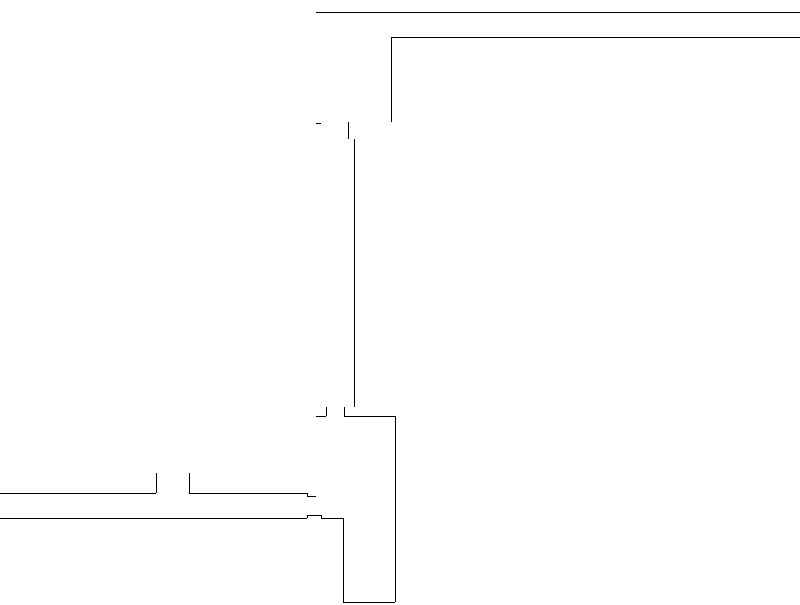

class: middle, center

#Behavioral Cloning Project

####Shuai Wang

####USTC, March 12, 2019

Copyright (c) 2019 Shuai Wang. All rights reserved.


---


# 1. Overview

## 1.1 Behavioral Cloning

***Synonyms:***

- Apprenticeship learning; 
- Behavioral cloning; 
- Learning by demonstration; 
- Learning by imitation;
- Learning control rules

.footnote[*Ref. Encyclopedia of Machine Learning*]

### 1.1.1 Defination

Behavioral cloning is a method by which **human sub-cognitive skills can be captured and reproduced** in a computer program. 

- As the human subject performs the skill, his or her **actions** are recorded along with the **situation** that gave rise to the action. 
- A log of these records is used as input to a learning program. 
- The learning program outputs **a set of rules** that reproduce the skilled behavior. 

This method can be used to construct automatic control systems for complex tasks for which classical control theory is inadequate. It can also be used for training.


### 1.1.2 Motivation and Background

Behavioral cloning (Michie, Bain, & Hayes-Michie, 1990) is a form of **learning by imitation** whose main
motivation is to **build a model of the behavior** of a human when performing a complex skill. 

**Experts** might be defined as people who know what they are doing not what they are talking about. 

- That is, once a person becomes highly skilled in some task, the skill becomes sub-cognitive and is no longer available to introspection. So when the person is asked to explain why certain decisions were made, the explanation is a *post hoc* justification rather than a true explanation. 

*Preferably, the model should be in a readable form. It is related to other forms of learning by imitation, such as **inverse reinforcement learning** (Abbeel & Ng, 2004; Amit & Matarić, 2002; Hayes & Demiris, 1994;
Kuniyoshi, Inaba, & Inoue, 1994; Pomerleau, 1989) and methods that use data from human performances to model the system being controlled (Atkeson & Schaal, 1997; Bagnell & Schneider, 2001).*


### 1.1.3 Structure of the Learning System

Behavioral cloning assumes that there is a plant of some kind that is under the control of a human operator. The plant may be a physical system or a simulation. 

- In either case, the plant must be **instrumented** so that it is possible to capture the state of the system, including all the control settings. 
- Thus, whenever the operator performs an action, that is, changes a control setting, **we can associate that action with a particular state**.

.center[]


---

Let us use a simple example of a system that has only one control action. 

- A pole balancer has **four state variables**: the angle of the pole, $\theta$, and its angular velocity, $\dot{\theta}$and the position, $x$, and velocity $\dot{x}$, of the cart on the track. The only action available to the controller is to apply a fixed positive or negative force, $F$, to accelerate the cart left or right.
- Whenever a control action is performed, we record the action as well as values of the four state variables at the time of the action. **Each of these records can be viewed as an example of a mapping from state to action.**

.center[]


---

#### 1.1.3.1 Learning Direct (Situation–Action) Controllers

A controller such as the one described above is referred to as a ***direct controller*** because it maps **situations** to **actions**.

**Limitations:** 

Direct controllers work quite well for systems that have a relatively **small state space**. However, for complex systems, behavioral cloning of direct situation–action rules tends to produce very brittle controllers. That is, they **cannot tolerate large disturbances**. 

- For example, when air turbulence is introduced into the flight simulator, the performance of the clone degrades very rapidly. This is because the examples provided by logging the performance of a human only cover a very small part of the state space of a complex system such as an aircraft in flight. Thus, the“expertise” of the controller is very limited. If the system strays outside the controller’s region of expertise, **it has no method for recovering and failure is usually catastrophic.**

More robust control is possible but only with a significant change in approach. The more successful methods decompose the learning task into **two stages**: 

- learning goals 
- and learning the actions to achieve those goals.

---

***Example:***

.center[]

A pilot of a fixed-wing aircraft can control the ailerons(副翼), elevators(升降舵), rudder(方向舵), throttle, and flaps(襟翼). To build an autopilot, the learner must build a system that can set each of the control variables. Sammut et al. (1992), viewed this as ***a multitask learning problem***.

------

**Solutions to multi-variable control:**

- Each training example is a feature vector that includes the position, orientation, and velocities of the
  aircraft as well as the values of each of the control settings: ailerons, elevator, throttle, and flaps. The rudder is ignored. 
- A separate decision tree is built for each control variable. For example, the aileron setting is treated as the dependent variable and **all the other variables, including the other controls**, are treated as the attributes of the training example. A decision tree is built for ailerons, then the process is repeated for the elevators, etc. 
- The result is a decision tree for each control variable.
- The autopilot code executes each decision tree in each cycle of the control loop. 

This method treats the setting of each control as a separate task. It may be surprising that this method works since it is often necessary to adjust more than one control simultaneously to achieve the desired result. For example, to turn, it is normal to use the ailerons to roll the aircraft while adjusting the elevators to pull it around. This kind of multivariable control does result from multiple decision trees. When, say, the aileron decision tree initiates a roll, the elevator’s decision tree detects the roll and causes the aircraft to pitch up and execute a turn.

------


#### 1.1.3.2 Learning Indirect (Goal-Directed) Controllers

The problem of learning in a large search space can partially be addressed by decomposing the learning into subtasks. A controller built in this way is said to be an ***indirect controller***. 

- A control is “indirect” if it does not compute the next action directly from the system’s current state but uses, in addition, some intermediate information. 
- An example of such intermediate information is a subgoal to be attained before achieving the final goal.

---

***Steps:***

1. Subgoals often feature in an operator’s control strategies and can be automatically detected from a
   trace of the operator’s behavior (Šuc & Bratko, 1997). 
   - The problem of subgoal identification can be treated as the inverse of the usual problem of controller design, that is, given the actions in an operator’s trace, find the goal that these actions achieve. 
   - The limitation of this approach is that it only works well for cases in which there are just a few subgoals, not when the operator’s trajectory contains many subgoals. 
2. In these cases, a better approach is to generalize the operator’s trajectory. The generalized trajectory can be viewed as defining a continuously changing subgoal (Bratko & Šuc, 2002; Šuc & Bratko, 1999a) (see also the use of flow tubes in dynamic plan execution (Hofmann & Williams, 2006)).

3. Subgoals and generalized trajectories are not sufficient to define a controller. A model of the systems dynamics is also required. Therefore, in addition to inducing subgoals or a generalized trajectory, this
   approach also requires learning approximate system dynamics, that is a model of the controlled system. 
   - Bratko and Šuc (2003) and Šuc and Bratko (1999b) use a combination of the Goldhorn (Križman & Džeroski, 1995) discovery program and locally weighted regression to build the model of the system’s dynamics. 
   - The next action is then computed “indirectly” by
     - computing the desired next state (e.g., next subgoal) 
     - and determining an action that brings the system to the desired next state. 
   - Bratko and Šuc also investigated building qualitative control strategies from operator traces (Bratko & Šuc, 2002).

---

An analog to this approach is **inverse reinforcement learning** (Abbeel & Ng, 2004; Atkeson & Schaal, 1997; Ng & Russell, 2000) where the reward function is learned. 

- Here, the learning the reward function corresponds to learning the human operator’s goals.

---

Isaac and Sammut (2003) uses an approach that is similar in spirit to Šuc and Bratko but incorporates classical control theory. Learned skills are represented by a two-level hierarchical decomposition with an **anticipatory goal level** and a **reactive control level**.

- The goal level models how the operator chooses goal settings for the control strategy and the control level models the operator’s reaction to any error between the goal setting and actual state of the system. 
  - For example, in flying, the pilot can achieve goal values for the desired heading, altitude, and airspeed by choosing appropriate values of turn rate, climb rate, and acceleration. 
  - The controls can be set to correct errors between the current state and the desired state of these goal-directing quantities. 
  - Goal models map system states to a goal setting. Control actions are based on the error between the output of each of the goal models and the current system state.
- The control level is modeled as a set of proportional integral derivative (PID) controllers, one for each
  control variable. A PID controller determines a control value as a linear function proportional to the error on a goal variable, the integral of the error, and the derivative of the error.

---

- Goal setting and control models are learned separately. The process begins be deciding which variables
  are to be used for the goal settings. For example, trainee pilots will learn to execute a “constant-rate turn,” that is, their goal is to maintain a given turn rate. A separate goal rule is constructed for each goal variable using a **model tree** learner (Potts & Sammut, 2005).
- A goal rule gives the setting for a goal variable and therefore, we can find the difference (error) between the current state value and the goal setting. The integral and derivative of the error can also be calculated. For example, if the set turn rate is $180^\circ$ min, then the error on the turn rate is calculated as the actual turn rate minus 180. The integral is then the running sum of the error multiplied by the time interval between time samples, starting from the first time sample of the behavioral trace, and the derivative is calculated as the difference between the error and previous error all divided by the time interval.
- For each control available to the operator, a model tree learner is used to predict the appropriate control setting. **Linear regression** is used in the leaf nodes of the model tree to produce linear equations whose coefficients are the P, I, and D of values of the PID controller. Thus the learner produces a collection of PID controllers that are selected according to the conditions in the internal nodes of the tree. In control theory, this is known as *piecewise linear control.*

---

Another indirect method is to learn a model of the dynamics of the system and use this to learn, in simulation, a controller for the system (Bagnell & Schneider, 2001; Ng, Jin Kim, Jordan, & Sastry, 2003).

- This approach does not seek to directly model the behavior of a human operator. A behavioral trace may be used to generate data for modeling the system but then a reinforcement learning algorithm is used to generate a policy for controlling the simulated system. The learned policy can then be transferred to the physical system. **Locally weighted regression** is typically used for system modeling, although model trees can also be used.


## 1.2 Behavioral Cloning Project

In this project,  we use deep neural networks and **convolutional neural networks** to **clone driving behavior.** We train, validate and test a model for **outputting a steering angle** to an autonomous vehicle.  

**Simulation:**

- We use image data and steering angles which are collected in the [Udacity simulator](https://github.com/udacity/self-driving-car-sim) to train a neural network and then use this model to drive the car autonomously **around the track in simulator.**

**Field Experiment:**

- A Pioneer robot equipped with ZED camera and NVIDIA TX2 controller.


## 1.3 Related Projects

- Open Source Self-Driving Car Project

#### 1.3.1 Open Source Self-Driving Car Project

***Project address:*** https://github.com/udacity/self-driving-car 

This project is maintained by Udacity and the aim of this project is to create a complete autonomous self-driving car **using deep learning and using ROS as middleware for communication.** 

---

**1. Sensors and components used in the Udacity self-driving car:**

- 2016 Lincoln MKZ : 

  This is the car that is going to be made autonomous. In other projects, we have saw the ROS interfacing of this car. We are using that project here too.

- Two Velodyne VLP-16 LiDARs

- Delphi radar

- Point Grey Blackfly cameras

- Xsens IMU

- Engine control unit ( ECU )

---

**2. dbw_mkz_ros package:**

This project uses the dbw_mkz_ros package to communicate from ROS to the Lincoln MKZ. In the previous section, we set up and worked with the dbw_mkz_ros package. 

- Here is the link to **obtain a dataset for training the steering model**: https://github.com/udacity/self-driving-car/tree/master/datasets . You will get a ROS launch file from this link to play with these bag files too.
- Here is the link to **get an already trained model** that can only be used for research purposes: https://github.com/udacity/self-driving-car/tree/master/steering-models . There is a ROS node for sending steering commands **from the trained model to the Lincoln MKZ.** Here, dbw_mkz_ros packages act as an intermediate layer between the trained model commands and the actual car.
- reference to implement the driving model using deep learning and the entire explanation for it are at https://github.com/thomasantony/sdc-live-trainer . 

---

**3. [Udacity Simulator](https://github.com/udacity/self-driving-car-sim)**

This simulator was built for [Udacity's Self-Driving Car Nanodegree](https://udacity.com/drive), to teach students how to train cars how to navigate road courses using deep learning. See more [project details here](https://github.com/udacity/CarND-Behavioral-Cloning-P3). All the assets in this repository require Unity. Please follow the instructions below for the full setup.

**Available Game Builds (Precompiled builds of the simulator)**

- Term 1
  - Instructions: Download the zip file, extract it and run the executable file.
  - Version 2, 2/07/17 [Linux](https://s3-us-west-1.amazonaws.com/udacity-selfdrivingcar/Term1-Sim/term1-simulator-linux.zip) [Mac](https://s3-us-west-1.amazonaws.com/udacity-selfdrivingcar/Term1-Sim/term1-simulator-mac.zip) [Windows](https://s3-us-west-1.amazonaws.com/udacity-selfdrivingcar/Term1-Sim/term1-simulator-windows.zip)
  - Version 1, 12/09/16 [Linux](https://d17h27t6h515a5.cloudfront.net/topher/2016/November/5831f0f7_simulator-linux/simulator-linux.zip) [Mac](https://d17h27t6h515a5.cloudfront.net/topher/2016/November/5831f290_simulator-macos/simulator-macos.zip) [Windows 32](https://d17h27t6h515a5.cloudfront.net/topher/2016/November/5831f4b6_simulator-windows-32/simulator-windows-32.zip) [Windows 64](https://d17h27t6h515a5.cloudfront.net/topher/2016/November/5831f3a4_simulator-windows-64/simulator-windows-64.zip)

- Term 2
  - Please see the [Releases](https://github.com/udacity/self-driving-car-sim/releases) page for the latest version of the Term 2 simulator (v1.45, 6/14/17).
  - Source code can be obtained therein or also on the [term2_collection branch](https://github.com/udacity/self-driving-car-sim/tree/term2_collection).

- Term 3
  - Please see the [Releases](https://github.com/udacity/self-driving-car-sim/releases) page for the latest version of the Term 3 simulator (v1.2, 7/11/17).
  - Source code can be obtained therein or also on the [term3_collection branch](https://github.com/udacity/self-driving-car-sim/tree/term3_collection).

- System Integration / Capstone
  - Please see the [CarND-Capstone Releases](https://github.com/udacity/CarND-Capstone/releases) page for the latest version of the Capstone simulator (v1.3, 12/7/17). Source code can be obtained therein.

---

**4. Unity Simulator User Instructions (for advanced development)**

1. Clone the repository to your local directory, please make sure to use [Git LFS](https://git-lfs.github.com/) to properly pull over large texture and model assets.
2. Install the free game making engine [Unity](https://unity3d.com/), if you dont already have it. Unity is necessary to load all the assets.
3. Load Unity, Pick load exiting project and choice the `self-driving-car-sim` folder.
4. Load up scenes by going to Project tab in the bottom left, and navigating to the folder Assets/1_SelfDrivingCar/Scenes. To load up one of the scenes, for example the Lake Track, double click the file LakeTrackTraining.unity. Once the scene is loaded up you can fly around it in the scene viewing window by holding mouse right click to turn, and mouse scroll to zoom.

---

5. Play a scene. Jump into game mode anytime by simply clicking the top play button arrow right above the viewing window.
6. View Scripts. Scripts are what make all the different mechanics of the simulator work and they are located in two different directories, the first is Assets/1_SelfDrivingCar/Scripts which mostly relate to the UI and socket connections. The second directory for scripts is Assets/Standard Assets/Vehicle/Car/Scripts and they control all the different interactions with the car.
7. Building a new track. You can easily build a new track by using the prebuilt road prefabs located in Assets/RoadKit/Prefabs click and drag the road prefab pieces onto the editor, you can snap road pieces together easily by using vertex snapping by holding down "v" and dragging a road piece close to another piece.

---

**5. Related Resources:**

- https://github.com/udacity/CarND-Behavioral-Cloning-P3

- https://github.com/csharpseattle/CarND-Behavioral-Cloning

- https://github.com/upul/Behavioral-Cloning

- https://zhuanlan.zhihu.com/p/33222613

- https://github.com/navoshta/behavioral-cloning

- https://github.com/jeremy-shannon/CarND-Behavioral-Cloning-Project

- https://github.com/UjjwalSaxena/Behavior-Cloning-DataSet-Ujjwal

- https://github.com/harveenchadha?tab=repositories

- https://github.com/mcarilli?tab=repositories

- https://github.com/darienmt/CarND-Behavioral-Cloning-P3


# 2. Related Work

## 2.1 ALVINN: AN AUTONOMOUS LAND VEHICLE IN A NEURAL NETWORK

***Dean A. Pomerleau. Technical report, Carnegie Mellon University, 1989.***

- In many ways, DAVE-2 was inspired by the pioneering work of Pomerleau [1] who in 1989 built the Autonomous Land Vehicle in a Neural Network (ALVINN) system. 
- It demonstrated that an **end-to-end trained neural network** can indeed steer a car on public roads.  ALVINN used a fully-connected network which is tiny by today’s standard.


### 2.1.1 Introduction

- ALVINN (Autonomous Land Vehicle In a Neural Network) is a **3-layer back-propagation network** designed for the task of **road following**. 
- Currently ALVINN takes images from a **camera** and a **laser range finder** as input and produces as output the **direction** the vehicle should travel in order to follow the road. 
- Training has been conducted using **simulated road images**. 
- Successful tests on the Carnegie Mellon autonomous navigation test vehicle indicate that **the network can effectively follow real roads under certain field conditions**. 
- The representation developed to perform the task differs dramatically when the network is trained under various conditions, suggesting the possibility of a novel adaptive autonomous navigation system capable of tailoring its processing to the conditions at hand.
  - *Autonomous navigation systems based on traditional image processing and pattern recognition techniques often perform well under certain conditions but have problems with others. Part of the difficulty stems from the fact that the processing performed by these systems remains fixed across various driving situations.*

### 2.1.2 Network Architecture

|                                                              |                                          |
| ------------------------------------------------------------ | ---------------------------------------- |
| 1. The activation level of each unit in the video input retina is proportional to the intensity in the **blue color band** of the corresponding patch of the image. The blue band of the color image is used because it provides the **highest contrast** between the road and the non-road. <br><br> 2. The activation level of each unit in the range finder input retina is proportional to the **proximity** of the corresponding area in the image.<br> <br> 3. The road intensity feedback unit indicates **whether** the road is lighter or darker than the non-road in the previous image. |  |

---

**The output layer consists of 46 units, divided into two groups:**

- The first set of 45 units is **a linear representation of the turn curvature** along which the vehicle should travel in order to head towards the road center. 
- The middle unit represents the "travel straight ahead" condition while units to the left and right of the center represent successively sharper left and right turns. 

- The network is trained with a desired output vector of all zeros except for **a "hill" of activation** centered on the unit representing the correct turn curvature, which is the curvature which would bring the vehicle to the road center 7 meters ahead of its current position. 

  - More specifically, the desired activation levels for the nine units centered around the correct turn curvature unit are:

    ```
    0.10, 0.32, 0.61, 0.89, 1.00, 0.89, 0.61, 0.32 0.10
    ```

  - During testing, the turn curvature dictated by the network is taken to be the curvature represented by the output unit with the **highest activation level**.

---

The final output unit is a road intensity feedback unit which indicates whether the road is lighter or darker than the non-road in the current image. 

- During testing, the activation of the output road intensity feedback unit is recirculated to the input layer in the style of Jordan [Jordan, 1988] to aid the network's processing by providing rudimentary information concerning the relative intensities of the road and the non-road in the previous image.
- Using this extra information concerning the **relative brightness of the road and the non-road**, the network **is better able to determine the correct direction** for the vehicle to travel.

### 2.1.3 Training and Performance

**Limitations:**

- Training on actual road images is logistically difficult, because in order to develop a general representation, the network must be presented with **a large number of training examples** depicting roads under a wide variety of conditions. 

- Collection of such a data set would be difficult, and **changes in parameters** such as camera orientation would require collecting an entirely new set of road images.

---

**Data Generator:**

- To avoid these difficulties we have developed a **simulated road generator** which creates road images to be used as training exemplars for the network. 
- Figure 2 depicts the video images of one real and one artificial road. Although not shown in Figure 2, the road generator also creates corresponding simulated range finder images. At the relatively low resolution being used it is difficult to distinguish between real and simulated roads.
- In addition, the network must not solely be shown examples of accurate driving, but also how to **recover** (i.e. return to the road center) once a mistake has been made.


---

**Training:**

- Training involves first creating a set of **1200 road snapshots** depicting roads with a wide variety of retinal orientations and positions, under a variety of lighting conditions and with realistic noise levels.
- After 40 epochs of training on the 1200 simulated road snapshots, the network correctly dictates a turn curvature **within two units of the correct answer** approximately 90% of the time on novel simulated road images.
- Specifically, the network can accurately drive the NAVLAB at a speed of **1/2 meter** per second along a **400 meter** path through a **wooded area** of the CMU campus under sunny fall conditions.

---

**Road intensity unit:**

- During the early stages of training, the input road intensity unit is given a **random activation level**. This is done to prevent the network from merely learning to copy the activation level of the input road intensity unit to the output road intensity unit, since their activation levels should almost always be identical because the relative intensity of the road and the non-road does not often change between two successive images. 
- Once the network has developed a representation that uses image characteristics to determine the activation level for the output road intensity unit, the network is given as input whether the road would have been darker or lighter than the non-road in the previous image. 
- Using this extra information concerning the relative brightness of the road and the non-road, the network is better able to determine the correct direction for the vehicle to travel.


### 2.1.4 Network Representation

The **representation** developed by the network to perform the road following task **depends** dramatically on the **characteristics of the training set**.

- When trained on examples of roads with a fixed width:


---

- The network develops a very different representation when trained on snapshots with widely varying road widths.


 

### 2.1.5 Discussion and Extensions

**1. Why not use real images？**（试图建立规则，并令机器学习规则：好or不好?）

- There are difficulties involved with **training "on-the-fly"** (不经过某种额外步骤而直接进行某项活动) with real images. 
- If the network is not presented with sufficient variability in its training exemplars to cover the conditions it is likely to encounter when it takes over driving from the human operator, **it will not develop a sufficiently robust representation and will perform poorly.** 
- In addition, the network must not solely be shown examples of accurate driving, but also **how to recover** (i.e. return to the road center) once a mistake has been made. 
- Partial initial training on **a variety of simulated road images** should help eliminate these difficulties and facilitate better performance.

---

**2. Is it necessary to use laser range finder?**

- Range data is in some sense **less important for the task of road following** than is the video data. 
  - The range data contains information concerning the **position of obstacles** in the scene, but nothing explicit about the location of the road. 
  - As a result, the range data is given less significance in the representation, as is illustrated by the relatively **small magnitude weights** from the range finder retina in the weight diagrams. 
- Figures 4 and 5 illustrate that the range finder connections do correlate with the connections from the video camera, and **do contribute to choosing the correct travel direction**. 
  - Specifically, in both figures, obstacles located outside the area in which the hidden unit expects the road to be located **increase** the hidden unit's activation level 
  - while obstacles located within the expected road boundaries **inhibit** the hidden unit. 
- However the contributions from the range finger connections **aren't necessary for reasonable performance.** 
  - When ALVINN was tested with normal video input but an **obstacle-free range finder** image as constant input, there was **no noticeable degradation** in driving performance. 
- Obviously under **off-road driving conditions** obstacle avoidance would become much more important and hence one would expect the range finder retina to play a much more significant role in the network's representation.

---

**Exploring different network architectures:**

1. Giving the network additional feedback information by using Elman's [Elman, 1988] technique of recirculating hidden activation levels.
2. Adding a second **hidden layer** to facilitate better internal representations.
3. Adding local connectivity to give the network a priori knowledge of the **two dimensional nature** of the input.

---> Deep CNN!

---

**Future work:**

- Road forks and intersections. 
  - Currently upon reaching a fork, the network may output **two widely discrepant travel directions**, one for each choice. The result is often an **oscillation** in the dictated travel direction and hence inaccurate road following. 
- Integrating a map into the system to enable **global point-to-point path planning**.

---


## 2.2 End to End Learning for Self-Driving Cars

*Mariusz Bojarski (NVIDIA Corporation), arXiv, 2016.*

PilotNet

### 2.2.1 Introduction

**Motivation:**

- The primary motivation for this work is to **avoid the need to recognize specific human-designated features**, such as lane markings, guard rails, or other cars, 
- and to avoid having to create a collection of **“if, then, else”** rules, based on observation of these features.


---

We trained a convolutional neural network (CNN) to **map raw pixels from a single front-facing camera directly to steering commands**.  The system operates at 30 frames per second (FPS).

- Compared to explicit decomposition of the problem, such as lane marking detection, path planning, and control, our **end-to-end** system **optimizes all processing steps simultaneously**. 
- We argue that this will eventually lead to better performance and smaller systems. 
  - Better performance will result because the internal components **self-optimize to maximize overall system performance**, instead of optimizing human-selected intermediate criteria, e. g., lane detection. *Such criteria understandably are selected for ease of human interpretation which doesn’t automatically guarantee maximum system performance.* 
  - **Smaller networks** are possible because the system learns to solve the problem with the minimal number of processing steps. 


### 2.2.2 Overview of the DAVE-2 System

**Data collection system:**

.center[]

1. In order to make our system independent of the car geometry, we represent the steering command as 1/r where r is the turning radius in meters. 1/r smoothly transitions through zero from left turns (negative values) to right turns (positive values).
2. Training data contains single images sampled from the video, paired with the corresponding steering command (1/r). 

---

**Training system**

.center[]

---

1. Training with data from only the human driver is not sufficient. **The network must learn how to recover from mistakes.** Otherwise the car will slowly drift off the road. 
   - **The training data is therefore augmented with additional images that show the car in different shifts from the center of the lane and rotations from the direction of the road.**
2. Additional shifts between the cameras and all rotations are simulated by **viewpoint transformation** of the image from the nearest camera. 
   - Precise viewpoint transformation requires 3D scene knowledge which we don’t have. We therefore approximate the transformation by assuming all points below the horizon are on flat ground and all points above the horizon are infinitely far away. 
   - This works fine for flat terrain but it introduces distortions for objects that stick above the ground, such as cars, poles, trees, and buildings. Fortunately these distortions don’t pose a big problem for network training. 
   - The steering label for transformed images is adjusted to one that would steer the vehicle back to the desired location and orientation in two seconds.


### 2.2.3 Data Collection

Training data was collected by driving on a wide variety of roads and in a diverse set of lighting and weather conditions. 

- Most road data was collected in central New Jersey, although highway data was also collected from Illinois, Michigan, Pennsylvania, and New York. 
- Other road types include 
  - two-lane roads (with and without lane markings), 
  - residential roads with parked cars, tunnels, and unpaved roads. 
- Data was collected in clear, cloudy, foggy, snowy, and rainy weather, both day and night. In some instances, the sun was low in the sky, resulting in glare reflecting from the road surface and scattering from the windshield.
- Drivers were encouraged to maintain full attentiveness, but otherwise **drive as they usually do**. As of March 28, 2016, about 72 hours of driving data was collected. (72x3600x10=2592000)

### 2.2.4 Network Architecture

.center[]

---

class: middle

1. The input image is split into **YUV planes** and passed to the network.
2. The first layer of the network performs image normalization. The normalizer is hard-coded and is not adjusted in the learning process. Performing normalization in the network allows the normalization scheme to be altered with the network architecture and to be accelerated via GPU processing.
3. The convolutional layers were designed to perform feature extraction and **were chosen empirically through a series of experiments that varied layer configurations.** We use strided convolutions in the first three convolutional layers with a 2×2 stride and a 5×5 kernel and a non-strided convolution (1 stride) with a 3×3 kernel size in the last two convolutional layers. 
4. The fully connected layers are designed to function as a controller for steering, but we note that by training the system end-to-end, **it is not possible to make a clean break between which parts of the network function primarily as feature extractor and which serve as controller.**
5. We train the weights of our network to minimize the mean squared error.


### 2.2.5 Training Details

**Data Selection：**

- Our collected data is labeled with **road type**, **weather condition**, and the **driver’s activity** (staying in a lane, switching lanes, turning, and so forth). 
- To train a CNN to do lane following we only select data where the driver was staying in a lane and discard the rest. 
- We then **sample that video at 10 FPS**. A higher sampling rate would result in including images that are highly similar and thus not provide much useful information.
- To remove a bias towards driving straight the **training data includes a higher proportion of frames that represent road curves.**

---

**Data Augmentation:**

- adding artificial shifts and rotations to teach the network how to recover from a poor position or orientation. **The magnitude of these perturbations is chosen randomly from a normal distribution.** 
- **The distribution has zero mean, and the standard deviation is twice the standard deviation that we measured with human drivers.** 
- Artificially augmenting the data does add undesirable artifacts as the magnitude increases (see Section 2).

### 2.2.6 Simulation


### 2.2.7 Evaluation

We estimate what percentage of the time the network could drive the car (autonomy). 

- The metric is determined by **counting simulated human interventions** (see Section 6). These interventions occur when the simulated vehicle departs from the center line by more than one meter.

- We assume that in real life an actual intervention would require a total of six seconds: this is the time required for a human to retake control of the vehicle, re-center it, and then restart the self-steering mode.

  .center[]

---

**Visualization of Internal CNN State:**

Figures 7 and 8 show the activations of the **first two feature map layers** for two different example inputs, an unpaved road and a forest.

 

This demonstrates that the **CNN learned to detect useful road features on its own**, i. e., with only the human steering angle as training signal. We never explicitly trained it to detect the outlines of roads, for example.

### 2.2.8 Conclusions

- We have empirically demonstrated that **CNNs are able to learn the entire task of lane and road following** without manual decomposition into 
  - road or lane marking detection, 
  - semantic abstraction, 
  - path planning, 
  - and control. 

- A small amount of training data from **less than a hundred hours** of driving was sufficient to train the car to operate in diverse conditions, on highways, local and residential roads in sunny, cloudy, and rainy conditions. 
- The CNN is able to learn meaningful road features from a very sparse training signal (steering alone).
  - The system learns for example to detect the outline of a road without the need of explicit labels during training. 
- More work is needed to improve the robustness of the network, to find methods to verify the robustness, and to improve visualization of the network-internal processing steps.


## 2.3 VisualBackProp: efficient visualization of CNNs for autonomous driving

*Mariusz Bojarski 2018 ICRA*

- We justify our approach with theoretical arguments and confirm that the proposed method **identifies sets of input pixels**, rather than individual pixels, **that collaboratively contribute to the prediction**. 
- It compares favorably to the layer-wise relevance propagation approach, i.e. it obtains similar visualization results and **achieves order of magnitude speed-ups**.

### 2.3.1 Introduction

**Motivation:**

One of the fundamental question that arises when considering CNNs as well as other deep learning models is:  **what made the trained neural network model arrive at a particular response?**

- This question is of particular **importance to the end-to-end systems**. The **interpretability** of such systems is limited. 
- Visualization tools aim at addressing this question by identifying parts of the input image that had the **highest influence** on forming the final prediction by the network. 
- It is also straightforward to think about visualization methods as **a debugging tool** that helps to understand if the network detects “reasonable” cues from the image to arrive at a particular decision. 

---

**Principle**

- The method relies on the intuition that when moving deeper into the network, **the feature maps contain less and less information which are irrelevant to the output**. 

  - Thus, the feature maps of the last convolutional layer should contain the most relevant information to determine the output. 

- At the same time, feature maps of **deeper layers have lower resolution**. 

  - The underlying idea of the approach is to **combine feature maps** containing only relevant information (deep ones) with the ones with higher resolution (shallow ones). 

- In order to do so, starting from the feature maps of the last convolutional layer, we “**backpropagate**” the information about the regions of relevance while simultaneously increasing the resolution, 

  - where the backpropagation procedure is not **gradient-based** (as is the case for example in sensitivity-based approaches [7, 8, 9]), but instead is **value-based**. We call this approach VisualBackProp.

  

---

**Advantages:**

- **real time:** Our visualization tool runs in real time and requires less computations than forward propagation. We empirically demonstrate that it is order of magnitude faster than the state-of-the-art visualization method, layer- wise relevance propagation (LRP) [10], while at the same time it leads to very similar visualization results. 
- **theoretical guarantees:** In the theoretical part of this paper we demonstrate that our algorithm finds for each pixel of the input image the approximated value of its contribution to the activations in the last convolutional layer of the network. To the best of our knowledge, the majority of the existing visualization techniques for deep learning, which we discuss in the Related Work section, lack theoretical guarantees, which instead we provide for our approach. 
- **general:** The visualization method for CNNs proposed in this paper was originally developed for CNN-based systems for steering autonomous cars, though it is highly general and can be used in other applications as well.


### 2.3.2 Related Work

- A notable approach [10] layer- wise relevance propagation, where the prediction is back- propagated without using gradients such that the relevance of each neuron is redistributed to its predecessors through a particular message-passing scheme relying on the conservation principle. 
  - The stability of the method and the sensitivity to different settings of the conservation parameters was studied in the context of several deep learning models [11]. 
  - The LRP technique was extended to Fisher Vector classifiers [12] and also used to explain predictions of CNNs in NLP applications [13]. 
  - An extensive comparison of LRP with other techniques, like the deconvolution method [14] and the sensitivity-based approach [8], which we also discuss next in this section, using an evaluation based on region perturbation can be found in [15]. This study reveals that **LRP provides better explanation of the CNN classification decisions than considered competitors.**

---

- Another approach [14] for understanding CNNs with max-pooling and rectified linear units (ReLUs) through visualization uses deconvolutional neural network [16] attached to the convolutional network of interest. 
  - This approach maps the feature activity in intermediate layers of a previously trained CNN back to the input pixel space using deconvolutional network, which performs successively repeated operations of i) unpooling, ii) rectification, and iii) filtering. 
  - Since this method identifies structures within each patch that stimulate a particular feature map, it differs from previous approaches [17] which instead identify patches within a data set that stimulate strong activations at higher layers in the model. 
  - The method can also be interpreted as providing an approximation to partial derivatives with respect to pixels in the input image [8]. 
  - One of the shortcomings of the method is that it enables the visualization of only a single activation in a layer (all other activations are set to zero). 

---

- There also exist other techniques for inverting a modern large convolutional network with another network, e.g. a method based on up- convolutional architecture [18], where as opposed to the previously described deconvolutional neural network, the **up- convolutional network is trained**. This method inverts deep image representations and obtains reconstructions of an input image from each layer.
  - The fundamental difference between the LRP approach and the deconvolution method lies in how the responses are projected towards the inputs. The latter approach solves the optimization problems to reconstruct the image input while the former one aims to reconstruct the classifier decision (the details are well-explained in [10]).
- Guided backpropagation [19] extends the deconvolution approach by combining it with a simple technique visualizing the part of the image that most activates a given neuron using a backward pass of the activation of a single neuron after a forward pass through the network. Finally, the recently published method [20] based on the prediction difference analysis [21] is a probabilistic approach that extends the idea in [14] of visualizing the probability of the correct class using the occlusion of the parts of the image. The approach highlights the regions of the input image of a CNN which provide evidence for or against a certain class.

---

- Understanding CNNs can also be done by visualizing output units as distributions in the input space via output unit sampling [22]. 
  - However, computing relevant statistics of the obtained distribution is often difficult. This technique cannot be applied to deep architectures based on auto-encoders as opposed to the subsequent work [23, 24], where the authors visualize what is activated by the unit in an arbitrary layer of a CNN in the input space (of images) via an activation maximization procedure that looks for input patterns of a bounded norm that maximize the activation of a given hidden unit using gradient ascent. 
  - This method extends previous approaches [25]. The gradient-based visualization method [24] can also be viewed as a generalization of the deconvolutional network reconstruction procedure [14]as shown in subsequent work [8]. The requirement of careful initialization limits the method [14]. The approach was applied to Stacked Denoising Auto-Encoders, Deep Belief Networks and later on to CNNs [8]. 
  - Finally, sensitivity-based methods [8, 7, 9]) aim to understand how the classifier works in different parts of the input domain by computing scores based on partial derivatives at the given sample.

---

- Some more recent gradient-based visualization techniques for CNN-based models not mentioned before include Grad- CAM [26], which is an extension of the Class Activation Mapping (CAM) method [27]. The approach heavily relies on the construction of weighted sum of the feature maps, where the weights are global-average-pooled gradients obtained through back-propagation. The approach lacks the ability to show fine-grained importance like pixel-space gradient visualization methods [19, 14] and thus in practice has to be fused with these techniques to create high-resolution class- discriminative visualizations.
- Finally, other approaches for analyzing neural networks include quantifying variable importance in neural networks [28, 29], extracting the rules learned by the decision tree model that is fitted to the function learned by the neural network [30], applying kernel analysis to understand the layer-wise evolution of the representation in a deep network [31], analyzing the visual information in deep image representations by looking at the inverse representations [32], applying contribution propagation technique to provide per-instance explanations of predictions [33] (the method relies on the technique of [34]), or visualizing particular neurons or neuron layers [2, 35]. Finally, there also exist more generic tools for explaining individual classification decisions of any classification method for single data instances, like for example [7].


### 2.3.3 Visualization Method

Our method combines feature maps from deep convolutional layers that contain mostly relevant information, but are low-resolution, with the feature maps of the shallow layers that have higher resolution but also contain more irrelevant information. (*The last layer has prediction information and the previous layer has position. back-activation*)

- This is done by “back- propagating” the information about the regions of relevance while simultaneously increasing the resolution. 


---

- The method utilizes the forward propagation pass, which is already done to obtain a prediction, i.e. we do not add extra forward passes. 
- The method then uses the feature maps obtained **after each ReLU layer** (thus these feature maps are already thresholded).   
- In the first step, the **feature maps** from each layer are averaged, resulting in **a single feature map per layer.** 

- Next, the averaged feature map of the deepest convolutional layer is scaled up to the size of the feature map of the previous layer. 
  - This is done using **deconvolution** with filter size and stride that are the same as the ones used in the deepest convolutional layer (for deconvolution we always use the same filter size and stride as in the convolutional layer which outputs the feature map that we are scaling up with the deconvolution). 
  - In deconvolution, all weights are set to 1 and biases to 0. 
- The obtained scaled- up averaged feature map is then **point-wise multiplied** by the averaged feature map from the previous layer. The resulting image is again scaled via deconvolution and multiplied by the averaged feature map of the previous layer exactly as described above. 

- In the end, we obtain a mask of the size of the input image, which we **normalize to the range [0, 1]**.

---

- On the left side the figure shows the averaged feature maps of all the convolutional layers from the input (top) to the output (bottom). 
- On the right side it shows the corresponding intermediate masks. Thus on the right side we show step by step how the mask is being created when moving from the network’s output to the input. 
- Comparing the two top images clearly reveals that **many details were removed** in order to obtain the final mask.

.center[]

---

**The implementation of deconvolution:**

- https://www.jianshu.com/p/f0674e48894c 


### 2.3.4 Theoretical Analysis 

We now present the theoretical guarantee for the algorithm (all proofs are skipped and are available upon request). We emphasize that our theoretical analysis does not rely on computing the sensitivity of any particular cost function with respect to the changes of values of particular input neurons. So we will not focus on computing the gradients. The reason for that is that even if the gradients are large, the actual contribution of the neuron might be small. Instead our proposed method is measuring the actual contribution that takes into account the “collaborative properties” of particular neurons. This is measured by the ability of particular neurons to substantially participate in these weighted inputs to neurons in consecutive layers that *themselves have higher impact on the form of the ultimate feature maps than others.*

Consider a convolutional neural network N with ReLU nonlinear mappings. We assume that no pooling mechanism is used and the strides are equal to one (the entire analysis can be repeated for arbitrary stride values). Furthermore:


- $\gamma(X)$ is the value of the input pixel X;
- $w_e$ stands for the weight of an edge $e$;
- let $e$ be an edge from some neuron $v'$ to $v$. Then $\gamma_e $ will denote the weighted input to neuron $v$ along edge $e$, $a_e$ will denate the activation of $v$, and $b_e$ will denote the bias of $v$.

***Lemma 1:*** Consider the general neural network architecture described above. Then the contribution of the input pixel X to the last layer of feature maps is given as:
$$
\phi^{N}(X) = \gamma(X) \sum_{P\in\textbf{P}}\prod_{e\in P}\frac{a_e}{a_e+b_e} w_e
$$
where $\gamma(X)$ is the value of pixel $X$ and $\textbf{P}$ is a family of paths from $X$ to the last layer of the network.

***Theorem 1***: For a fixed CNN N considered in this paper there exits a universal constant c >0 such that the values of the input neurons conputed by the VisualBackProp algorithm are of the form:
$$
\phi^{N}_{V BP}(X) = c \gamma(X) \sum_{P\in\textbf{P}}\prod_{e\in P}a_e
$$
The statement above shows that the values computed for pixels by the VisualBackProp algorithm are related to the flow contribution from that pixels in the corresponding graphical model and thus, according to our analysis, measure their importance. The formula on $\phi^{N}_{V BP}(X)$ is similar to the one on $\phi^{N}(X)$, but gives rise to a much more efficient algorithm and leads to tractable theoretical analysis. Note that the latter one can be obtained from the former one by multiplying each term of the inner products by $\frac{w_e}{a_e+b_e}$ and then rescaling by a multiplicative factor of $\frac{1}{c}$. Rescaling does not have any impact on quality since it is conducted in exactly the same way for all the input neurons. Finally, the following observation holds. 

***Remark 1:*** Note that for small kernels the number of paths considered in the formula on $\phi^{N}(X)$ is small (since the degrees of the corresponding multipartite graph are small) thus in practice the difference between formula on $\phi^{N}_{V BP}(X)$ and the formula on φN(X) coming from the re-weighting factor $\frac{w_e}{a_e+b_e}$ is also small. Therefore for small kernels the VisualBackProp algorithm computes very good approximations of input neurons’ contributions to the activations in the last layer. 


### 2.3.5 Experiments

- The codes of VisualBackProp are already publicly released at https://github.com/mbojarski/VisualBackProp. 

- The first set of experiments is conducted on the PilotNet and aims at validating whether VisualBackProp is able to **capture the parts of the image that are indeed relevant for steering the self-driving car.** 
- The next set of experiments were performed on the **Udacity self-driving car data set** (Udacity Self Driving Car Dataset 3-1: El Camino). 
  - We qualitatively compare our method with LRP, the state-of-the-art deep learning visualization technique, (we use implementation as given in Equation 6 from [15]; similarly to the authors, we use $ \epsilon= 100$) and we also compare their running times. 
- We finally show experimental results on the **task of the classification** of traffic signs on the German Traffic Sign Detection Benchmark data set (http://benchmark.ini.rub.de/?section=gtsdb&subsection=dataset) and also ImageNet data set (http://image-net.org/challenges/LSVRC/2016/).
- Therefore we demonstrate the applicability of the technique to a **wide-range of learning problems**.

#### A. PilotNet: a system for autonomous driving

.center[]

---

We segmented the input image that is presented to PilotNet into **two classes**.

- Class 1 is meant to include all the regions that have a significant effect on the steering angle output by PilotNet. These regions include all the pixels that correspond to locations **where the visualization mask is above a threshold.**(Fig.7c) (*These regions are then dilated by 30 pixels to counteract the increasing span of the higher-level feature map layers with respect to the input image. The exact amount of dilation was determined empirically.*) 
- The second class includes all pixels in **the original image minus the pixels in Class 1**. 

If the objects found by our method indeed dominate control of the output steering angle, we would expect the following: 

- if we create an image in which we uniformly **translate only the pixels in Class 1** while maintaining the position of the pixels in Class 2 and use this new image as input to PilotNet, we would **expect a significant change** in the steering angle output. 
- However, if we instead **translate the pixels in Class 2** while keeping those in Class 1 fixed and feed this image into PilotNet, then we would expect minimal change in PilotNet’s output.

---

Figure 7 illustrates the process described above:

- The top image is an original input image. 
- The next image shows highlighted regions that were identified using VisualBackProp. 
- The next image illustrates Class 1. 
- The bottom image shows the input image with a relevant region from the third image shifted.


---

Figure 8 shows plots of PilotNet steering output as a function of pixel shift in the input image:

- Shifting the pixels belonging to Class 1 results in a linear change in **steering angle that is nearly as large as that which occurs when we shift the entire image.** 

- Shifting just the background pixels has **a much smaller effect** on the steering angle. 

- We are thus confident that our method **does indeed find the most important regions** in the image for determining steering.

  


#### B. Udacity self-driving car data set

- NetHVF input image has approximately two times higher vertical field of view, but then is scaled down by that factor. 
- The networks are trained with stochastic gradient descent (SGD) and the mean squared error (MSE) cost function for 32 epochs.

.center[]

- Each layer except for the last fully-connected layer is followed by a RELU.
- Each convolution layer is preceded by a batch normalization layer.
- layer output size is nxhxw
- cropping and scaling the lower part of the images to a 640×135 size for network NetSVF and 351×135 size for network NetHVF.

---

Figures 10 illustrates that the CNN learned to recognize lane markings, the most relevant visual cues for steering a car. 

- It also shows that **the field of view affects the visualization results significantly**. 


---

Figure 11 shows two consecutive frames:

- On the second frame in Figure 11, the lane marking on the left side of the road disappears, which causes the CNN to change the visual cue it focuses on from the lane marking on the left to the one on the right. 


---

Figure 12 corresponds to sharp turns:

- The images in the top row of Figure 12 demonstrate the correlation between the high prediction error of the network and the low-quality visual cue it focuses on.


---

Finally, in Figure 13 we demonstrate that the CNN has learned to **ignore horizontal lane markings** as they are not relevant for steering a car, even though it was trained only with the images and the steering wheel angles as the training signal. 


---

Figure 14 similarly shows that the CNN learned to ignore the horizontal lines, however, as the visualization shows, it does not identify lane markings as the relevant visual cues but **other cars instead**.


---

**Time:**

- The average time of computing a mask for VisualBackProp was equal to **2.0 ms**. 
- It was **24.6 ms** for the LRP. 
- The VisualBackProp is therefore on average 12 times faster than LRP. 
- At the same time, as demonstrated in Figures 10–14, VisualBackProp generates visualization masks that are very similar to those obtained by LRP.


#### C. German Traffic Sign Detection benchmark data set and ImageNet data set

ARCHITECTURE OF THE NETWORK USED FOR SIGN CLASSIFICATION. 


- EACH LAYER EXCEPT FOR THE LAST FULLY-CONNECTED LAYER IS FOLLOWED BY A RELU. 
- THE LAST FULLY-CONNECTED LAYER IS FOLLOWED BY A LOGSOFTMAX.
- EACH CONVOLUTION LAYER IS PRECEDED BY A BATCH NORMALIZATION LAYER.

---

- We next (Figure 15) demonstrate the performance of VisualBackProp and LRP on German Traffic Sign Detection Benchmark data set. 


---

- Finally, we show the performance of VisualBackProp on ImageNet data set. The network here is a ResNet-200 [36].


# 3. Implementation

## 3.1 Simulation Dataset

*For more details of the simulator used in this project,  see Section 1.3.1.* 

### 3.1.1 Data Collection

Data collection was done using the simulator in 'Training Mode' :

1. At first, I gathered 1438 images from a full lap around track. But I can not always keep the car driving at the center line of the road. This is not a good dataset and previous experience have shown that this kind of data will make the car pull too hard in testing. So I discard it. 
2. Then I collected a new data set which contains 2791(x3) images by driving the car travel the full track two times. (backed up in carnd folder)
   - The total number of images is about 8000 if two side images are counted.

tips:

- Use left and right images and their corresponding steering angle is the original steering angle adding (left) or subtracting (right) a correction angle.
- Collecting more data at the easily failed place such as the turn track.
- Collecting the reverse driving data.
- After much trial and error I found that it was not necessary to gather images from a full lap around each track. For the first track I drove just past the bridge to the first dirt patch and for the mountain track I drove only half-way around.  

### 3.1.2 Preprocessing Images

Images were preprocessed before feeding to the neural network. 

#### A. Choosing Color Space

There are three types of color space for image representation.


- Please keep in mind that **the colorspace of training image loaded by cv2 is BGR**.  However, when the trained network predicts the steering angles at the testing stage,  `drive.py` **loads image with RGB** colorspace by PIL. 
- Therefore, in the training stage, we will convert the BGR image loaded by OpenCV to RGB before feeding the real image into the training network to ensure the consistency of the colorspace between the training stage and testing satge.

To Do List:

- [ ] *I tried different color spaces and found that the model generalized best using images in the BGR color space. -- need to be verified.* 
- [ ] Training with the **YUV color space** gave erratic steering corrections resulting in too much side-to-side movement of the car.  (test)
- [ ] In the **RGB color space** some areas of track required many more training images to navigate correctly, particularly the areas with dirt patches on the side of the road.  (test)

 

#### B. Image Cropping

- I crop the unnecessary portions of the image (background of sky, trees, mountains, hood of car) **taking 50 pixels off the top of the image and 20 pixels off the bottom.**  


```python
image = cv2.cvtColor(image, cv2.COLOR_BGR2RGB)
model = Sequential()
model.add(Cropping2D(cropping=((50, 20),(0,0)), input_shape=(160,320,3)))
# output the intermediate layer! 
## can be used to show learned features for any layer
layer_output = backend.function([model.layers[0].input], [model.layers[0].output])
# note that the shape of the image suited for the network!
cropped_image = layer_output([image[None,...]])[0][0]
# convert to uint8 for visualization
cropped_image = np.uint8(cropped_image)
```


#### C.  Image Resizing

testing...


### 3.1.3 Data Augmentation

There are four kinds of methods for data augmentation.  Images could be augmented by 

- flipping horizontally, 
- blurring, 
- changing the overall brightness, 
- or applying shadows to a portion of the image.  

***Remark:***

- When reading original data from CSV file,  flipped_flag, shadow_flag, bright_flag, blur_flag will be assigned to each image. The image processing will be done when generating practical data sets.

#### 1. Flipping horizontally

By adding a flipped image for every original image the data set size was effectively doubled. 

In the end, adding horizontally flipped images was the only augmentation that was necessary.  

***Remark:***

1. When reading original data from the CSV file, the path of the flipped image is the same as the original image. However, a flipped flag (equals to 1) will be assigned to the flipped image and the flag of the original image is 0. 
2. Meanwhile, we set the negative value of the corresponded original image label as the label of the flipped image.   
3. Finally, the corresponding flipping operation will be done for each image according to this flag. 

```python
image = cv2.flip(image, 1)
```

---

#### 2. Changing brightness


#### 3. Bluring


```python
kernel_size = (np.random.randint(1,5)*2) +1 
blur = cv2.GaussianBlur(rgb, (kernel_size,kernel_size), 0)
```


#### 4. Random shadow


***Remark:***

- See the functions `random_blur()`, `random_brightness()`, and `random_shadow()` in the file `data.py` for augmentation code. 
- Visualization of data augmentation can be found in the Jupyter notebooks `Visualization.ipynb` .

???

####5. Data Distribution

One improvement that was found to be particularly effective was to fix the poor distribution of the data.  A disproportionate number of steering angles in the data set are at or near zero.  To correct this:

- steering angles are separated into 25 bins. 
- Bins with a count less than the mean are augmented 
- while bins with counts greater than the mean are randomly pruned to bring their counts down. 

Those operations equalize the distribution of steering angles across all bins.  

  


## 3.2 Network Architecture

- Modified ALVINN
- PilotNet
- Modified PilotNet

### 3.2.1 Fully Connected Network

**A fully connected neural network with one hidden layer (100 units)：** 

- After many attempts, a normalization layer was added to the network.  The mse loss decreased to 8.8145 and the mae loss decreased to 1.9536. It is worth noting that the mae loss almost no longer reduced after 10 training epochs. Finally, the car can drive at the straight track but the steering angle is still too large at the turn of the track. 

- The parameter file is saved as `fcnet-normalize.h5`

```bash
   Epoch 19/20
   26/26 [==============================] - 13s 500ms/step - loss: 8.8145 - mean_absolute_error: 1.8013 - val_loss: 18.5598 - val_mean_absolute_error: 1.9536
   Epoch 20/20
   26/26 [==============================] - 13s 482ms/step - loss: 8.5064 - mean_absolute_error: 1.7278 - val_loss: 21.0641 - val_mean_absolute_error: 2.0854
```

```python
python drive.py fcnet-normalize.h5
```

---

2. Then i trained again with the same setup, The result seems very similar to the last training. However, the initial predicted steering angle is too large to drive the car out of the track.

```bash
   Epoch 15/20
   27/27 [==============================] - 12s 450ms/step - loss: 5.1247 - mean_absolute_error: 1.3832 - val_loss: 15.7272 - val_mean_absolute_error: 1.6583
   Epoch 16/20
   27/27 [==============================] - 12s 454ms/step - loss: 3.6974 - mean_absolute_error: 1.2955 - val_loss: 20.2050 - val_mean_absolute_error: 1.7890
   Epoch 20/20
   27/27 [==============================] - 12s 437ms/step - loss: 4.2537 - mean_absolute_error: 1.1959 - val_loss: 13.9532 - val_mean_absolute_error: 1.5473
  
```

---

3. Based on the above setup, the hidden layer units are increased to 1000 from 100. But the network converge more slowly and the final results is not good at all. The predicted steering angles is about 7.

---

class: middle, center

**Video:**

<video width="560" height="420" controls>
    <source src="videos/fc_10.mp4" type="video/mp4">
</video>

### 3.2.2 PilotNet

1. The model and training process are listed below. The final trained model works very well. 
2. All the saved model (even the model saved after 1 epoch)  can keep the car drving along the center line of the track for the full lap without any fails. 
3. The desired velocity of the car can be set arbitrary from 0 to 30 mph.

```bash
Reading data from csv file...
Reading is done.
EPOCHS: 20
Training Set Size: 6698
Valization Set Size: 1675
Batch Size: 256
/home/ubuntu16/Behavioral_Cloning/data.py:102: RuntimeWarning: divide by zero encountered in true_divide
  copy_times = np.float32((desired_per_bin-hist)/hist)
Training set size now: 6122
Using TensorFlow backend.
```

---

```bash
_________________________________________________________________
Layer (type)                 Output Shape              Param #   
=================================================================
cropping2d_1 (Cropping2D)    (None, 90, 320, 3)        0         
_________________________________________________________________
lambda_1 (Lambda)            (None, 90, 320, 3)        0         
_________________________________________________________________
conv2d_1 (Conv2D)            (None, 43, 158, 24)       1824      
_________________________________________________________________
conv2d_2 (Conv2D)            (None, 20, 77, 36)        21636     
_________________________________________________________________
conv2d_3 (Conv2D)            (None, 8, 37, 48)         43248     
_________________________________________________________________
conv2d_4 (Conv2D)            (None, 6, 35, 64)         27712     
_________________________________________________________________
conv2d_5 (Conv2D)            (None, 4, 33, 64)         36928     
_________________________________________________________________
flatten_1 (Flatten)          (None, 8448)              0         
_________________________________________________________________
dense_1 (Dense)              (None, 1164)              9834636   
_________________________________________________________________
dense_2 (Dense)              (None, 100)               116500    
_________________________________________________________________
dense_3 (Dense)              (None, 50)                5050      
_________________________________________________________________
dense_4 (Dense)              (None, 10)                510       
_________________________________________________________________
dense_5 (Dense)              (None, 1)                 11        
=================================================================
Total params: 10,088,055
Trainable params: 10,088,055
Non-trainable params: 0
_________________________________________________________________
```

---

**Training process:**

```bash
Training with 24 steps, 7 validation steps.
Epoch 1/20
24/24 [==============================] - 11s 438ms/step - loss: 0.2917 - mean_absolute_error: 0.4121 - val_loss: 0.0490 - val_mean_absolute_error: 0.1765
Epoch 2/20
24/24 [==============================] - 9s 395ms/step - loss: 0.0581 - mean_absolute_error: 0.1890 - val_loss: 0.0403 - val_mean_absolute_error: 0.1485
Epoch 3/20
24/24 [==============================] - 10s 402ms/step - loss: 0.0366 - mean_absolute_error: 0.1501 - val_loss: 0.0293 - val_mean_absolute_error: 0.1267
Epoch 4/20
24/24 [==============================] - 10s 404ms/step - loss: 0.0275 - mean_absolute_error: 0.1297 - val_loss: 0.0334 - val_mean_absolute_error: 0.1427
Epoch 5/20
24/24 [==============================] - 10s 401ms/step - loss: 0.0253 - mean_absolute_error: 0.1225 - val_loss: 0.0268 - val_mean_absolute_error: 0.1228
Epoch 6/20
24/24 [==============================] - 10s 406ms/step - loss: 0.0201 - mean_absolute_error: 0.1097 - val_loss: 0.0248 - val_mean_absolute_error: 0.1173
Epoch 7/20
24/24 [==============================] - 10s 405ms/step - loss: 0.0179 - mean_absolute_error: 0.1029 - val_loss: 0.0219 - val_mean_absolute_error: 0.1156
Epoch 8/20
24/24 [==============================] - 10s 406ms/step - loss: 0.0139 - mean_absolute_error: 0.0891 - val_loss: 0.0252 - val_mean_absolute_error: 0.1230
Epoch 9/20
24/24 [==============================] - 10s 407ms/step - loss: 0.0130 - mean_absolute_error: 0.0862 - val_loss: 0.0239 - val_mean_absolute_error: 0.1229
Epoch 10/20    (saved)
24/24 [==============================] - 10s 404ms/step - loss: 0.0114 - mean_absolute_error: 0.0803 - val_loss: 0.0201 - val_mean_absolute_error: 0.1115
Epoch 11/20
24/24 [==============================] - 10s 409ms/step - loss: 0.0104 - mean_absolute_error: 0.0764 - val_loss: 0.0229 - val_mean_absolute_error: 0.1213
Epoch 12/20
24/24 [==============================] - 10s 406ms/step - loss: 0.0097 - mean_absolute_error: 0.0743 - val_loss: 0.0276 - val_mean_absolute_error: 0.1307
Epoch 13/20
24/24 [==============================] - 10s 406ms/step - loss: 0.0093 - mean_absolute_error: 0.0729 - val_loss: 0.0240 - val_mean_absolute_error: 0.1216
Epoch 14/20
24/24 [==============================] - 10s 403ms/step - loss: 0.0084 - mean_absolute_error: 0.0676 - val_loss: 0.0219 - val_mean_absolute_error: 0.1159
Epoch 15/20
24/24 [==============================] - 10s 405ms/step - loss: 0.0067 - mean_absolute_error: 0.0606 - val_loss: 0.0206 - val_mean_absolute_error: 0.1129
Epoch 16/20
24/24 [==============================] - 10s 405ms/step - loss: 0.0066 - mean_absolute_error: 0.0616 - val_loss: 0.0284 - val_mean_absolute_error: 0.1347
Epoch 17/20
24/24 [==============================] - 10s 406ms/step - loss: 0.0059 - mean_absolute_error: 0.0581 - val_loss: 0.0203 - val_mean_absolute_error: 0.1136
Epoch 18/20
24/24 [==============================] - 10s 404ms/step - loss: 0.0053 - mean_absolute_error: 0.0531 - val_loss: 0.0206 - val_mean_absolute_error: 0.1141
Epoch 19/20
24/24 [==============================] - 10s 407ms/step - loss: 0.0049 - mean_absolute_error: 0.0522 - val_loss: 0.0223 - val_mean_absolute_error: 0.1164
Epoch 20/20
24/24 [==============================] - 10s 400ms/step - loss: 0.0043 - mean_absolute_error: 0.0484 - val_loss: 0.0203 - val_mean_absolute_error: 0.1128
```

---

<video width="560" height="420" controls>
    <source src="videos/PilotNet.mp4" type="video/mp4">
</video>

### 3.2.3 Modified PilotNet

Overall, The modified nvidia network is very similar to the original one.  

- In this version, all the strides of filters are set to be 1. The corresponding max pooling operation is added after the first three convolution layers to ensure the output is consistent with the original network.
- Dropout layers were used in between the fully connected layers to reduce overfitting.  

The final performance of the trained network is not as good as the original one.

---

**Model:**

|         Layer          |  Output Shape  | Param # |
| :--------------------: | :------------: | ------: |
| Normalization (Lambda) | (128, 128, 3)  |       0 |
| 1st Convolutional/ReLU | (124, 124, 24) |    1824 |
|      Max Pooling       |  (62, 62, 24)  |       0 |
| 2nd Convolutional/ReLU |  (58, 58, 36)  |   21636 |
|      Max Pooling       |  (29, 29, 36)  |       0 |
| 3rd Convolutional/ReLU |  (25, 25, 48)  |   43248 |
|      Max Pooling       |  (12, 12, 48)  |       0 |
| 4th Convolutional/ReLU |  (10, 10, 64)  |   27712 |
| 5th Convolutional/ReLU |   (8, 8, 64)   |   36928 |
|        Flatten         |     (4096)     |       0 |
|        Dropout         |     (4096)     |       0 |
|  1st Fully Connected   |     (1164)     | 4768908 |
|        Dropout         |     (1164)     |       0 |
|  2nd Fully Connected   |     (100)      |  116500 |
|  3rd Fully Connected   |      (50)      |    5050 |
|  4th Fully Connected   |      (10)      |     510 |
|  5th Fully Connected   |      (1)       |      11 |

---

**Training**

```bash
25/25 [==============================] - 13s 503ms/step - loss: 0.2863 - mean_absolute_error: 0.4376 - val_loss: 0.1224 - val_mean_absolute_error: 0.2843
Epoch 2/20
25/25 [==============================] - 10s 417ms/step - loss: 0.0728 - mean_absolute_error: 0.2170 - val_loss: 0.0419 - val_mean_absolute_error: 0.1532
Epoch 3/20
25/25 [==============================] - 11s 429ms/step - loss: 0.0437 - mean_absolute_error: 0.1646 - val_loss: 0.0278 - val_mean_absolute_error: 0.1239
Epoch 4/20
25/25 [==============================] - 10s 416ms/step - loss: 0.0368 - mean_absolute_error: 0.1506 - val_loss: 0.0297 - val_mean_absolute_error: 0.1264
Epoch 5/20
25/25 [==============================] - 10s 414ms/step - loss: 0.0327 - mean_absolute_error: 0.1429 - val_loss: 0.0325 - val_mean_absolute_error: 0.1338
Epoch 6/20
25/25 [==============================] - 10s 411ms/step - loss: 0.0302 - mean_absolute_error: 0.1376 - val_loss: 0.0253 - val_mean_absolute_error: 0.1191
Epoch 7/20
25/25 [==============================] - 11s 447ms/step - loss: 0.0284 - mean_absolute_error: 0.1322 - val_loss: 0.0267 - val_mean_absolute_error: 0.1253
Epoch 8/20
25/25 [==============================] - 10s 408ms/step - loss: 0.0257 - mean_absolute_error: 0.1258 - val_loss: 0.0301 - val_mean_absolute_error: 0.1353
Epoch 9/20
25/25 [==============================] - 11s 422ms/step - loss: 0.0242 - mean_absolute_error: 0.1223 - val_loss: 0.0301 - val_mean_absolute_error: 0.1328
Epoch 10/20
25/25 [==============================] - 10s 410ms/step - loss: 0.0231 - mean_absolute_error: 0.1192 - val_loss: 0.0230 - val_mean_absolute_error: 0.1184
Epoch 11/20
25/25 [==============================] - 11s 423ms/step - loss: 0.0221 - mean_absolute_error: 0.1167 - val_loss: 0.0280 - val_mean_absolute_error: 0.1290
Epoch 12/20
25/25 [==============================] - 10s 418ms/step - loss: 0.0225 - mean_absolute_error: 0.1171 - val_loss: 0.0274 - val_mean_absolute_error: 0.1286
Epoch 13/20
25/25 [==============================] - 10s 410ms/step - loss: 0.0215 - mean_absolute_error: 0.1139 - val_loss: 0.0269 - val_mean_absolute_error: 0.1265
Epoch 14/20
25/25 [==============================] - 10s 408ms/step - loss: 0.0198 - mean_absolute_error: 0.1097 - val_loss: 0.0238 - val_mean_absolute_error: 0.1191
Epoch 15/20
25/25 [==============================] - 10s 418ms/step - loss: 0.0190 - mean_absolute_error: 0.1087 - val_loss: 0.0284 - val_mean_absolute_error: 0.1319
Epoch 16/20
25/25 [==============================] - 10s 417ms/step - loss: 0.0178 - mean_absolute_error: 0.1041 - val_loss: 0.0277 - val_mean_absolute_error: 0.1280
Epoch 17/20
25/25 [==============================] - 10s 419ms/step - loss: 0.0181 - mean_absolute_error: 0.1052 - val_loss: 0.0230 - val_mean_absolute_error: 0.1175
Epoch 18/20
25/25 [==============================] - 10s 409ms/step - loss: 0.0165 - mean_absolute_error: 0.1006 - val_loss: 0.0228 - val_mean_absolute_error: 0.1164
Epoch 19/20
25/25 [==============================] - 10s 411ms/step - loss: 0.0157 - mean_absolute_error: 0.0977 - val_loss: 0.0238 - val_mean_absolute_error: 0.1204
Epoch 20/20
25/25 [==============================] - 10s 415ms/step - loss: 0.0152 - mean_absolute_error: 0.0967 - val_loss: 0.0250 - val_mean_absolute_error: 0.1219

```

---

**Remark:**

1. Two laps of track images are used. The distribution of the data was fixed duiring training. The data set did not flipped.

2. You must make the car driving along the center of the track. Otherwise, the car will drive out of the track will testing.

3. finall loss is 0.02 

4. Validation accuracy was not a good indicator of the performance of the network.  It was better to watch for overfitting by comparing the training mean squared error (MSE) with the validation MSE.  A climbing validation MSE while the training MSE was still decreasing was a sign that the model was overfitting.  Dropout was used to combat this but I also limited the number of epochs to get the best performing model.

------

<video width="560" height="420" controls>
    <source src="videos/modified_nvidia_model.mp4" type="video/mp4">
</video>
---

## 3.3 Model Visualization

### 3.3.1 Feature Representation

```python
model = Sequential()
model.add(Cropping2D(cropping=((50, 20),(0,0)), input_shape=(160,320,3)))

# output the intermediate layer! 
## can be used to show learned features for any layer
layer_output = backend.function([model.layers[0].input], [model.layers[0].output])

# note that the shape of the image suited for the network!
cropped_image = layer_output([image[None,...]])[0][0]

```


### Using Saved Model

h5 model

```python
import h5py
from keras.models import load_model

from PIL import Image
import numpy as np

# check that model Keras version is same as local Keras version
f = h5py.File(args.model, mode='r')
model_version = f.attrs.get('keras_version')
keras_version = str(keras_version).encode('utf8')

if model_version != keras_version:
    print('You are using Keras version ', keras_version,
          ', but the model was built using ', model_version)

# loading saved model (model_path)
model = load_model(args.model)

## Reciving image data and do prediction using saved model
def telemetry(sid, data):
    if data:
        # The current steering angle of the car
        steering_angle = data["steering_angle"]
        # The current throttle of the car
        throttle = data["throttle"]
        # The current speed of the car
        speed = data["speed"]
        
        # The current image from the center camera of the car
        imgString = data["image"]
        image = Image.open(BytesIO(base64.b64decode(imgString)))
        image_array = np.asarray(image)
        
        # Prediction
        steering_angle = float(model.predict(image_array[None, :, :, :], batch_size=1))

        throttle = controller.update(float(speed))

        print(steering_angle, throttle)
        send_control(steering_angle, throttle)

        # save frame (from the car's view)
        if args.image_folder != '':
            timestamp = datetime.utcnow().strftime('%Y_%m_%d_%H_%M_%S_%f')[:-3]
            image_filename = os.path.join(args.image_folder, timestamp)
            image.save('{}.jpg'.format(image_filename))
    else:
        # do something
        pass
  
```


# 4. Advanced Work

https://zhuanlan.zhihu.com/p/59197798?utm_source=wechat_session&utm_medium=social&utm_oi=615350629938368512

## 4.1 DroNet: Learning to Fly by Driving

*Antonio Loquercio∗, Ana I. Maqueda †, Carlos R. del-Blanco †, and Davide Scaramuzza ICRA2018 -RAL*

- For supplementary video see:https://youtu.be/ow7aw9H4BcA.
- The project’s code, datasets and trained models are available at: http://rpg.ifi.uzh.ch/dronet.html

### Abstract

**Background**:

- Civilian drones are soon expected to be used in **a wide variety of tasks**, such as aerial surveillance, delivery, or monitoring of existing architectures. 
- Nevertheless, their deployment in urban environments has so far been limited. **Indeed, in unstructured and highly dynamic scenarios**, drones face numerous challenges to navigate autonomously in a feasible and safe way. 

**Methodology**:

- In contrast to traditional **“map-localize-plan”** methods, this paper explores a **data-driven approach** to cope with the above challenges. 
- To accomplish this, we propose DroNet: a convolutional neural network that can safely drive a drone through the streets of a city. 
- Designed as **a fast 8-layers residual network**, DroNet produces **two outputs** for each single input image: a steering angle to keep the drone navigating while avoiding obstacles, and **a collision probability** to let the UAV recognize dangerous situations and promptly react to them. 

---

**Challenge**:

- The challenge is however to **collect enough data in an unstructured outdoor environment** such as a city.
- Clearly, having an expert pilot providing training trajectories is not an option given the large amount of data required and, above all, **the risk is that it involves for other vehicles or pedestrians** moving in the streets. 

**Contributions**:

- Therefore, we propose to **train a UAV from data collected by cars and bicycles**, which, already integrated into the urban environment, would not endanger other vehicles and pedestrians. 
- Although trained on city streets from the viewpoint of urban vehicles, the navigation policy learned by DroNet is **highly generalizable.** Indeed, it allows a UAV to successfully fly at relative high altitudes and even in indoor environments, such as parking lots and corridors. 
- To share our findings with the robotics community, we **publicly** release all our datasets, code, and trained networks.


### 4.1.1 Introduction

**Backgroud:**

- Safe and reliable outdoor navigation of autonomous systems, e.g. unmanned aerial vehicles (UAVs), is a challenging open problem in robotics. Being able to successfully navigate while avoiding obstacles is indeed crucial to **unlock many robotics applications**, e.g. 
  - surveillance,  construction monitoring, 
  - delivery, and emergency response [1], [2], [3]. 

- A robotic system facing the above tasks should simultaneously solve many challenges in **perception, control, and localization.** These become particularly difficult when working in urban areas, as the one illustrated in Fig. 1. In those cases, the autonomous agent is not only expected to navigate while avoiding collisions, but also to **safely interact with other agents** present in the environment, such as pedestrians or cars. 


  

---

**Traditional methods**:

- **Steps:** The traditional approach to tackle this problem is a **two step interleaved(交错) process** consisting of 
  - (i) automatic localization in a given map (using GPS, visual and/or range sensors), 
  - (ii) computation of control commands to allow the agent to avoid obstacles while achieving its goal [1], [4]. 
- **Disadvantages:**
  - Even though advanced SLAM algorithms enable localization under a wide range of conditions [5], visual aliasing(混叠), dynamic scenes, and strong appearance changes can drive the perception system to unrecoverable errors. 
  - Moreover, keeping the perception and control blocks **separated** not only hinders(阻碍) any possibility of positive feedback between them, but also introduces the challenging problem of **inferring control commands from 3D maps.**

---

**Deep learning Based methods:**

Recently, new approaches based on deep learning have offered a way to **tightly couple perception and control**, achieving impressive results in a large set of tasks [6], [7], [8]. 

- Challenges:
  - Among them, methods based on reinforcement learning (RL) suffer from significantly high sample complexity, hindering their application to UAVs operating in **safety-critical environments**. 
  - In contrast, supervised-learning methods offer a more viable way to learn effective flying policies [6], [9], [10], but they still leave the issue of collecting enough expert trajectories to imitate. 
  - Additionally, as pointed out by [10], collision trajectories avoided by expert human pilots are actually necessary to let the robotic platform learn how to behave in dangerous situations.

---

**Contributions of this paper:**

Clearly, a UAV successfully navigating through the streets should be able to follow the roadway as well as promptly react to dangerous situations exactly as any other ground vehicle would do. Therefore, we herein propose to use data collected from ground vehicles which are already integrated in environments as aforementioned. Overall, this work makes the following contributions: 

- We propose a residual convolutional architecture which, by predicting the steering angle and the collision probability, can perform a safe flight of a quadrotor in urban environments. To train it, we employ an outdoor dataset recorded from cars and bicycles.
- We collect a custom dataset of outdoor collision sequences to let a UAV predict potentially dangerous situations.
- Trading off performance for processing time, we show that our design represents a good fit for navigation-related tasks. Indeed, it enables real-time processing of the video stream recorded by a UAV’s camera.
- Through an extensive evaluation, we show that our system can be applied to new application spaces without any initial knowledge about them. Indeed, with neither a map of the environment nor retraining or fine-tuning, our method generalizes to scenarios completely unseen at training time including indoor corridors, parking lots, and high altitudes. 

---

**Remark:**

Even though our system achieves remarkable results, we do not aim to replace traditional “map-localize-plan” approaches for drone navigation, but rather investigate whether a similar task could be done with a single shallow neural network. Indeed, we believe that learning-based and traditional approaches will one day complement each other.


### 4.1.2 Related Work

**Background:**

- A wide variety of techniques for drone navigation and obstacle avoidance can be found in the literature. At high level, *these methods differ depending on the kind of sensory input and processing employed to control the flying platform.* 
- A UAV operating outdoor is usually provided with GPS, range, and visual sensors to estimate the system state, infer the presence of obstacles, and perform path planning [1], [4]. 
- Nevertheless, such works are still prone to fail in urban environments where the presence of high rise buildings, and dynamic obstacles can result in significant undetected errors in the system state estimate. 

**SLAM:**

The prevalent approach in such scenarios is SLAM, where the robot simultaneously builds a map of the environment and self-localizes in it [5]. 

**3D Reconstruction:**

- On the other hand, while an explicit 3D reconstruction of the environment can be good for global localization and navigation, 
- it is not entirely clear how to infer control commands for a safe and reliable flight from it. 


**Learning Based:**

Recently, there has been an increasing research effort in directly learning control policies from raw sensory data using Deep Neural Networks. These methodologies can be divided into two main categories: 

- methods based on reinforcement learning (RL) [7], [11] 
  - While RL-based algorithms have been successful in learning generalizing policies [7], [8], **they usually require a large amount of robot experience which is costly and dangerous to acquire in real safety-critical systems.** 

- methods based on supervised learning [6], [12], [9], [10], [13]. 
  - In contrast, supervised learning offers a more viable(可行) way to train control policies, but clearly depends upon the provided expert signal to imitate. 
  - This supervision may come from 
    - a human expert [6], 
    - hard- coded trajectories [10], 
    - or model predictive control [12]. 

- Disadvantages:
  - However, when working in the streets of a city, it can be both tedious(乏味的) and dangerous to collect a large set of expert trajectories, or **evaluate partially trained policies** [6]. 
  - Additionally, the domain-shift between expert and agent might hinder generalization capabilities of supervised learning methods. Indeed, previous work in [9], [13] trained a UAV from video collected by a mountain hiker but **did not show the learned policy to generalize to scenarios unseen at training time.** 


**Simulation based:**

- Another promising approach has been use simulations to get training data for reinforcement or imitation learning tasks, while testing the learned policy in the real world [14], [15], [11]. 

- Disadvantages:
  - Clearly, this approach suffers from the domain shift between simulation and reality and might require some real- world data to be able to generalize [11]. 
  - To our knowledge, current simulators still fail to model the large amount of variability present in an urban scenario and are therefore not fully acceptable for our task. 
  - Additionally, even though some pioneering work has been done in [14], it is still not entirely clear how to make policies learned in simulation generalize into the real world. 

**Methods of this paper:**

- To overcome the above-mentioned limitations, we propose to train a neural network policy by imitating expert behaviour which is generated from wheeled manned vehicles only. 

- Even though there is a significant body of literature on the task of steering angle prediction for ground vehicles [16], [17], ***our goal is not to propose yet another method for steering angle prediction, but rather to prove that we can deploy this expertise also on flying platforms.*** 
- The result is a single shallow network that processes all visual information concurrently, and directly produces control commands for a flying drone. The coupling between perception and control, learned end-to-end, provides several advantages:
  - such as a simpler and lightweight system 
  - and high generalization abilities. 

- Additionally, our data collection proposal does not require any state estimate or even an expert drone pilot, while it exposes pedestrians, other vehicles, and the drone itself to no danger.


### 4.1.3 Methodology

- Our learning approach aims at reactively predicting a steering angle and a probability of collision from the drone on-board forward-looking camera. 
- These are later **converted into control flying commands** which enable a UAV to safely navigate while avoiding obstacles. 
- Since we aim to **reduce the bare image processing time**, we advocate a single convolutional neural network (CNN) with a relatively small size. The resulting network, which we call DroNet, is shown in Fig. 2 (a). 

**Architecture:**

The architecture is partially shared by the two tasks to reduce the network’s complexity and processing time, but is then separated into two branches at the very end.

- Steering prediction is a regression problem, **while collision prediction is addressed as a binary classification problem.** 
- **Due to their different nature and output range**, we propose to separate the network’s last fully-connected layer. (如果只有一层全连接，分开有意义吗？--权重矩阵的两列不耦合啊)
- During the training procedure, we use only imagery recorded by manned vehicles. Steering angles are learned from images captured from a car, while probability of collision, from a bicycle.


***A. Learning Approach***

1. The part of the network that is shared by the two tasks consists of a **ResNet-8 architecture** followed by a dropout of 0.5 and a ReLU non-linearity. 
2. After the last ReLU layer, tasks stop sharing parameters, and the architecture splits into two different fully- connected layers. The first one outputs the steering angle, and the second one a collision probability. *Strictly speaking the latter is not a Bayesian probability but an index quantifying the network uncertainty in prediction. Slightly abusing the notation, we still refer to it as “probability”.* 
3. We use **mean-squared error** (MSE) and **binary cross-entropy** (BCE) to train the steering and collision predictions, respectively. 

**Issue:**

Although the network architecture proves to be appropriate to minimize complexity and processing time, a naive joint optimization poses serious convergence problems **due to the very different gradients’ magnitudes that each loss produces.** 

- More specifically, imposing no weighting between the two losses during training results in convergence to a very poor solution. 
- This can be explained by difference of gradients’ magnitudes in the classification and regression task at the initial stages of training, which can be problematic for optimization [19]. 

*二者共用一个前面的参数网络，因为MSE的loss梯度较大，故导致参数更新较大，这反之影响了分类loss的前向，而分类loss较小的梯度反向时几乎无法影响网络参数更新*

**Solution:**

- For the aforementioned reasons, imposing no or constant loss weight between the two losses would likely result in sub-optimal performance or require much longer optimization times. This can be seen as a particular form of **curriculum learning** [19]. 

- In detail, the weight coefficient corresponding to BCE is defined in (1), while the one for MSE is always 1. For our experiments, we set $decay = \frac{1}{10}$ , and $epoch_0 = 10$.
  $$
  L_{tot} = L_{MSE} + max(0, 1-e^{-decay(epoch-epoch_0)})L_{BCE}
  $$

  - Indeed, the gradients from the regression task are initially much larger, since the MSE gradients’ norms is proportional to the absolute steering error. 
  - Therefore, we give more and more weight to the classification loss in later stages of training. 
  - Once losses’ magnitudes are comparable, the optimizer will try to find a good solution for both at the same time. 

4. The Adam optimizer [20] is used with a starting learning rate of 0.001 and an exponential per-step decay equal to 10−5. We also employ **hard negative mining** for the optimization to focus on those samples which are the most difficult to learn. ????

   In particular, we select the k samples with the highest loss in each epoch, and compute the total loss according to Eq. (1). We define k so that it decreases over time. ????


**The reason of using Resbolck:**

The residual blocks of the ResNet, proposed by He et al. [18], are shown in Fig. 2 (b). Dotted lines represent skip connections defined as 1×1 convolutional shortcuts to allow the input and output of the residual blocks to be added. 

- Even though an advantage of ResNets is to tackle the vanishing/exploding gradient problems in very deep networks, its success lies in its learning principle. Indeed, the residual scheme has been primarily introduced to address the degradation problem generated by difficulties in networks’ optimization [18]. Therefore, since residual architectures are known to help generalization on both shallow and deep networks [18], we adapted this design choice to increase model performance.


***B. Datasets*** 

To learn steering angles from images, we use one of the publicly available datasets from `Udacity’s project [21]`. 

- This dataset contains over `70,000 images` of car driving distributed over 6 experiments, 5 for training and 1 for testing. 
- Every experiment stores time-stamped images from 3 cameras (left, central, right), IMU, GPS data, gear, brake, throttle, steering angles and speed. 

For our experiment, we only use images from the **forward-looking camera** (Fig. 3 (a)) and their associated steering angles. 


To our knowledge, **there are no public datasets that associate images with collision probability according to the distance to the obstacles.** 

- Therefore, we collect our own collision data by mounting a GoPro camera on the handlebars of a bicycle. 
- We drive along different areas of a city, trying to diversify the types of obstacles (vehicles, pedestrians, vegetation, under- construction sites) and the appearance of the environment (Fig. 3 (b)). 

- We start recording when we are far away from an obstacle and stop when we are very close to it. In total, we collect around 32,000 images distributed over 137 sequences for a diverse set of obstacles. 

- We **manually annotate the sequences**, so that frames far away from collision are labeled as 0 (no collision), and frames very close to the obstacle are labeled as 1 (collision), as can be seen in Fig. 3(b). 


**Remark:**

*Collision frames are the types of data that cannot be easily obtained by a drone but are necessary to build a safe and robust system.*


***C. Drone Control*** 

The outputs of DroNet are used to command the UAV to move on a plane with forward velocity $v_k$ and steering angle $\theta_k$. More specifically, we **use the probability of collision $p_t$ provided by the network to modulate the forward velocity:** 

- We use a **low-pass filtered** version of the modulated forward velocity $v_k$ to provide the controller with smooth, continuous inputs $(0 ≤ \alpha ≤ 1)$:
  $$
  v_k = (1−\alpha)v_{k−1} + \alpha (1− p_t)V_{max}
  $$


  - the vehicle is commanded to go at maximal speed Vmax when the probability of collision is null,
  - and to stop whenever it is close to 1.


- Similarly, we map the predicted scaled steering $s_k$ into a rotation around the body z-axis (yaw angle $\theta$), corresponding to the axis orthogonal to the propellers’ plane. Concretely, we convert $s_{k}$ from a [−1,1] range into a desired yaw angle $\theta_k$ in the range $[-\frac{\pi}{2}, \frac{\pi}{2}]$ and low-pass filter it: 
  $$
  \theta_k = (1-\beta)\theta_{k_1} + \beta \frac{\pi}{2} s_k
  $$

- In all our experiments we set α = 0.7 and β = 0.5, while Vmax was changed according to the testing environment. 

  - The above constants have been selected empirically **trading off smoothness for reactiveness** of the drone’s flight. 

- As a result, we obtain a **reactive navigation policy** that can reliably control a drone from a single forward-looking camera. 

- An interesting aspect of our approach is that we can produce a collision probability from a single image without any information about the platform’s speed. 

- Indeed, we conjecture the network to **make decision on the base of the distance to observed objects** in the field of view. 

- Convolutional networks are in fact well known to be successful on the task of monocular depth estimation [15]. 

- An interesting question that we would like to answer in future work is how this approach compares to an **LSTM [22] based solution, making decisions over a temporal horizon.**


### 4.1.4 Experimental Results

In this section, we show quantitative and qualitative results of our proposed methodology. 

- First, we evaluate the accuracy of DroNet with a set of **performance metrics**. 
- Then, we discuss its control capabilities comparing it against a set of **navigation baselines**.


**A. Hardware Specification**

- We performed our experiments on a Parrot Bebop 2.0 drone. Designed as an outdoor hobby platform, it has a basic and rather inaccurate, visual odometry system that allows the user to provide only high-level commands, such as body-frame velocities, to control the platform. 
- Velocity commands are produced by our network running on an **Intel Core i7 2.6 GHz CPU** that receives images at 30 Hz from the drone through Wi-Fi.


**B. Regression and Classification Results**

We first evaluate the regression performance of our model employing the testing sequence from the Udacity dataset [21]. 

- To quantify the performance on steering prediction, we use two metrics: root-mean-squared error (RMSE) and explained variance ratio (EVA). 

  - Explained Variance is a metric used to quantify the quality of a regressor, and is defined as

  $$
  EVA = \frac{Var[y_{true}-y_{pred}]}{Var[y_{true}]}
  $$

- To asses the performance on collision prediction, we use average classification accuracy and the F-1 score.

  - F-1 score is a metric used to quantify the quality of a classifier. It is defined as
    $$
    F-1 = 2\frac{precision \text{x} recall}{precision+recall}
    $$


Table I compares DroNet against a set of other architectures from the literature [18], [23], [9]. 

- Additionally, we use as weak baselines a constant estimator, which always predicts 0 as steering angle and “no collision”, and a random one. 
- From these results we can observe that our design, even though **80 times smaller than the best architecture (RseNet50)**, maintains a considerable prediction performance while achieving real-time operation (20 frames per second). 
- Furthermore, the positive comparison against the VGG-16 architecture indicates the advantages in terms of generalization due to the residual learning scheme, as discussed in Section III-A. 


- Our design succeeds at finding a good trade-off between performance and processing time as shown in Table I and Fig. 4. Indeed, in order to enable a drone to promptly react to unexpected events or dangerous situations, it is necessary to reduce the network’s latency(延迟) as much as possible.


*Fig. 4: Model performance: (a) Probability Density Function (PDF) of actual vs. predicted steerings of the Udacity dataset testing se- quence. (b) Confusion matrix on the collision classification evaluated on testing images of the collected dataset. Numbers in this matrix indicate the percentage of samples falling in each category.*

**C. Quantitative Results on DroNet’s Control Capabilities** 

We tested our DroNet system by autonomously navigating in a number of different urban trails including straight paths and sharp curves. Moreover, to test the generalization capabilities of the learned policy, we also performed experiments in indoor environments. An illustration of the testing environments can be found in Fig. 5 and Fig. 6. 


*Fig. 5: Testing environments: (a) Outdoor 1 is a 90◦ curve with a dead end. This scenario is also tested with the drone flying at high altitude (5 m), as shown in Fig. 6. (b) Outdoor 2 is a sharp 160◦ curve followed by a 30 m straight path. A closer view of this environment can be seen in (f). (c) Outdoor 3 is a series of 2 curves, each of approximately 60◦, with straight paths in between. Moreover, we also tested DroNet on scenarios visually different from the training ones, such as (d) an indoor parking lot, and (e) an indoor corridor.*

We compare our approach against two baselines: 

- ***Straight line policy:*** trivial baseline consisting in following a straight path in open-loop. This baseline is expected to be very weak, given that we always tested in environments with curves. 
- ***Minimize probability of collision policy***: strong baseline consisting in going toward the direction minimizing the collision probability. For this approach, we implemented the algorithm proposed in [10], which was shown to have very good control capabilities in indoor environments. We employ the same architecture as in DroNet along with our collected dataset in order to estimate the collision probability. 


As metric we use the average distance travelling before stopping or colliding. Results from Table II indicate that DroNet is able to drive a UAV the longest on almost all the selected testing scenarios. 


- Another interesting feature of our method is that DroNet usually drives the vehicle to a **random direction** **in open spaces and at intersections**. 

- In contrast, the baseline policy of minimizing the probability of collision was very often confused by intersections and open spaces, which resulted in a shaky **uncontrolled behaviour.** 

- This explains the usually large gaps in performance between our selected methodology and the considered baselines. 

- Interestingly, the policy learned by DroNet generalizes well to scenarios visually different from the training ones, as shown in Table II. 

- First, we noticed only a very little drop in performance when the vehicle was flying at relatively high altitude (5 m). Even though the drone’s viewpoint was different from a ground vehicle’s one (usually at 1.5 m), the curve could be successfully completed **as long as the path was in the field of view of the camera**. 

- More surprisingly was the generalization of our method to indoor environments such as a corridor or a parking lot. In these scenarios, the drone was still able to avoid static obstacles, follow paths, and stop in case of dynamic obstacles occluding its way. 

- Nonetheless, we experienced some domain-shift problems. In indoor environments, we experienced some drifts at intersections which were sometimes too narrow to be smoothly performed by our algorithm. In contrast, as we expected, the baseline policy of [10], specifically designed to work in narrow indoor spaces, outperformed our method. Still, we believe that it is very surprising that a UAV trained on outdoor streets can actually perform well even in indoor corridors.


The main strengths of the policy learned by DroNet are twofold: 

- the platform smoothly follows the road lane while avoiding static obstacles; 
- the drone is never driven into a collision, **even in presence of dynamic obstacles**, like pedestrians or bicycles, occasionally occluding its path. 


**D. Qualitative Results** 

In Fig. 8 and, more extensively in the supplementary video, it is possible to observe the behaviour of DroNet in some of the considered testing environments. Unlike previous work [9], **our approach always produced a safe and smooth flight.** In particular, the drone always reacted promptly to dangerous situations, e.g. sudden occlusions by bikers or pedestrians in front of it. 


To better understand our flying policy, we employed the technique outlined in [24]. 

- Fig. 7 shows which part of an image is the most important for DroNet to generate a steering decision.

  

- Intuitively, the network mainly concentrates on the **“line-like” patterns** present in a frame, which roughly indicate the steering direction. 

- Indeed, the strong coupling between perception and control renders perception **mainly sensitive to the features important for control**. This explains why DroNet generalizes so well to many different indoor and outdoor scenes that contain “line–like” features. 

- Conversely, we expect our approach to **fail in environments missing those kind of features.** This was for example the case for an experiment we performed in a forest, where no evident path was visible. However, placed in a forest surrounding with a clearly visible path, the drone behaved better. 

- Furthermore, the importance of our proposed methodology is supported by the difficulties encountered while carrying out outdoor city experiments. If we want a drone to learn to fly in a city, it is crucial to take advantage of cars, bicycles or other manned vehicles. As these are already integrated in the urban streets, they allow to collect enough valid training data safely and efficiently.


### 4.1.5 DISCUSSION 

Our methodology comes with the advantages and limitations inherent to both traditional and learning-based approaches. The advantages are that, using our simple learning and control scheme, we allow a drone to safely explore previously unseen scenes while requiring no previous knowledge about them. 

More specifically, in contrast to traditional approaches, there is no need to be given a map of the environment, or build it online, pre-define collision-free waypoints and localize within this map. 

An advantage with respect to other CNN- based controllers [13], [9], [12], [6], [11] is, that we can leverage the large body of literature present on steering angle estimation [16], [17] on both the data and the algorithmic point of view. As shown in the experiments, this gives our method high generalization capabilities. 

Indeed, the flying policy we provide can reliably fly in non-trivial unseen scenarios without requiring any re-training or fine-tuning, as it is generally required by CNN-based approaches [11]. 

Additionally, the very simple and optimized network architecture can make our approach applicable to resource constrained platforms. 

The limitations are primarily that the agile dynamics of drones is not fully exploited, and that it is not directly possible to explicitly give the robot a goal to be reached, as it is common in other CNN-based controllers [13], [9], [25]. There are several ways to cope with the aforementioned limitations. To exploit the drone agility, one could generate 3D collision-free trajectories, as e.g. in [25], when high probability of collision is predicted. 

To generalize to goal-driven tasks, one could either provide the network with a rough estimate of the distance to the goal [26], or, if a coarse 2D map of the environment is available, exploit recent learning-based approaches developed for ground robots [27]. 

Moreover, to make our system more robust, one could produce a measure of uncertainty, as in [28]. In such a way, the system could switch to a safety mode whenever needed.


## 4.2 DeepDriving: Learning Affordance for Direct Perception in Autonomous Driving

Chenyi Chen, ICCV, 2015


### Abstract

Today, there are two major paradigms for vision-based autonomous driving systems: 

- **mediated perception approaches** that parse an entire scene to make a driving decision, 
- and **behavior reflex approaches** that directly map an input image to a driving action by a regressor. 

In this paper, we propose a third paradigm: a direct perception approach to **estimate the affordance** for driving. 

- *The affordances of the environment are what it offers the animal, what it provides or furnishes, either for good or ill. The verb to afford is found in the dictionary, the noun affordance is not. I have made it up. I mean by it something that refers to both the environment and the animal in a way that no existing term does. It implies the complementarity of the animal and the environment.— Gibson (1979, p. 127)[[3\]](https://en.wikipedia.org/wiki/Affordance#cite_note-3)*

We propose to **map an input image to a small number of key perception indicators** that directly relate to the affordance of a road/traffic state for driving. 

- Our representation provides a set of compact yet complete descriptions of the scene to enable a simple controller to drive autonomously. 

Falling in between the two extremes of mediated perception and behavior reflex, we argue that our direct perception representation **provides the right level of abstraction**. 

- To demonstrate this, we train a deep Convolutional Neural Network using recording from 12 hours of human driving in a video game and show that our model can work well to drive a car in a very diverse set of virtual environments. 

- We also train a model for car distance estimation on the KITTI dataset. Results show that our direct perception approach can generalize well to real driving images. 

Source code and data are available on our project website.


### 4.2.1 Introduction

In the past decade, significant progress has been made in autonomous driving. To date, most of these systems can be categorized into two major paradigms: mediated perception approaches and behavior reflex approaches.


**Mediated perception approaches** [19]:

- involve multiple sub-components for recognizing driving-relevant objects, such as lanes, traffic signs, traffic lights, cars, pedestrians, etc. [6]. 
- The recognition results are then combined into a consistent world representation of the car’s immediate surroundings (Figure 1). 
- To control the car, an AI-based engine will take all of this information into account before making each decision. 

**Disadvantages:**

- Since only a small portion of the detected objects are indeed relevant to driving decisions, this level of total scene understanding may add unnecessary complexity to an already difficult task. 

- Unlike other robotic tasks, driving a car only requires manipulating the direction and the speed. This final output space resides in a very low dimension, while mediated perception computes a high-dimensional world representation, possibly including redundant information. 

- Instead of detecting a bounding box of a car and then using the bounding box to estimate the distance to the car, why not simply predict the distance to a car directly? 
- After all, the individual sub-tasks involved in mediated perception are themselves considered open research questions in computer vision. Although mediated perception encompasses the current state-of-the-art approaches for autonomous driving, most of these systems have to rely on laser range finders, GPS, radar and very accurate maps of the environment to reliably parse objects in a scene. 
- Requiring solutions to many open challenges for general scene understanding in order to solve the simpler car-controlling problem unnecessarily increases the complexity and the cost of a system. (但是不足够的理解环境，如何保证这种“简单控制”决策的可靠性？)


**Behavior reflex approaches：** 

construct a direct mapping from the sensory input to a driving action. 

This idea dates back to the late 1980s when [17, 18] used a neural network to construct a direct mapping from an image to steering angles. To learn the model, a human drives the car along the road while the system records the images and steering angles as the training data. 

**Disadvantages：**

Although this idea is very elegant, it can struggle to deal with traffic and complicated driving maneuvers for several reasons. 

- Firstly, with other cars on the road, even when the input images are similar, different human drivers may make completely different decisions, which results in an ill-posed problem that is confusing when training a regressor. 
  - For example, with a car directly ahead, one may choose to follow the car, to pass the car from the left, or to pass the car from the right. When all these scenarios exist in the training data, a machine learning model will have difficulty deciding what to do given almost the same images. (只要都是安全的，怎么决策很重要吗？--除非导致输出震荡)

- Secondly, the decision-making for behavior reflex is **too low-level**. The direct mapping cannot see a bigger picture of the situation. 
  - For example, from the model’s perspective, passing a car and switching back to a lane are just a sequence of very low level decisions for turning the steering wheel slightly in one direction and then in the other direction for some period of time. This level of abstraction fails to capture what is really going on, and it increases the difficulty of the task unnecessarily. （缺少时序信息，因此要把动作作为一个序列去看）

- Finally, because the input to the model is the whole image, the learning algorithm must determine which parts of the image are relevant. However, the level of supervision to train a behavior reflex model, i.e. the steering angle, may be too weak to force the algorithm to learn this critical information.（已经证明是可以的）


We desire a representation that directly predicts the affordance for driving actions, instead of visually parsing the entire scene or blindly mapping an image to steering angles. In this paper, we propose **a direct perception approach** [7] for autonomous driving – a third paradigm that falls in between mediated perception and behavior reflex. 

- We propose to learn a mapping from an image to several meaningful affordance indicators of the road situation, （但你这几项能估计准确吗）
  - including the angle of the car relative to the road, 
  - the distance to the lane markings, 
  - and the distance to cars in the current and adjacent lanes. 
- With this compact but meaningful affordance representation as perception output, we demonstrate that a very simple controller can then make driving decisions at a high level and drive the car smoothly.

- Our model is built upon the state-of-the-art deep Convolutional Neural Network (ConvNet) framework to automatically learn image features for estimating affordance related to autonomous driving. 

- To build our training set, we ask a human driver to play a car racing video game TORCS for 12 hours while recording the screenshots and the corresponding labels. 
- Together with the simple controller that we design, our model can make meaningful predictions for affordance indicators and autonomously drive a car in different tracks of the video game, under different traffic conditions and lane configurations. 
- At the same time, it enjoys a much simpler structure than the typical mediated perception approach. Testing our system on car-mounted smartphone videos and the KITTI dataset [6] demonstrates good real- world perception as well. 
- Our direct perception approach provides a compact, task-specific affordance description for scene understanding in autonomous driving.

#### Related work 

Most autonomous driving systems from industry today are based on mediated perception approaches. In computer vision, researchers have studied each task separately [6]. 

- Car detection and lane detection are two key elements of an autonomous driving system. 
- Typical algorithms output bounding boxes on detected cars [4, 13] and splines on detected lane markings [1]. However, these bounding boxes and splines are not the direct affordance information we use for driving. (为什么？)
- Thus, a conversion is necessary which may result in extra noise. Typical lane detection algorithms such as the one proposed in [1] suffer from false detections.
- Structures with rigid boundaries, such as highway guardrails or asphalt surface cracks, can be mis-recognized as lane markings. 
- Even with good lane detection results, critical information for car localization may be missing. 
  - For instance, given that only two lane markings are usually detected reliably, it can be difficult to determine if a car is driving on the left lane or the right lane of a two-lane road. （定位准的话可以靠地图解决）

To integrate different sources into a consistent world representation: 

- [5, 22] proposed a probabilistic generative model that takes various detection results as inputs and outputs the layout of the intersection and traffic details. 


For behavior reflex approaches, 

- [17, 18] are the seminal works that use a neural network to map images directly to steering angles. 
- More recently, [11] train a large recurrent neural network using a reinforcement learning approach. The network’s function is the same as [17, 18], mapping the image directly to the steering angles, with the objective to keep the car on track. Similarly to us, they use the video game TORCS for training and testing.


In terms of deep learning for autonomous driving, [14] is a successful example of ConvNets-based behavior reflex approach. 

- The authors propose an off-road driving robot DAVE that learns a mapping from images to a human driver’s steering angles. After training, the robot demonstrates capability for obstacle avoidance. [9] proposes an off-road driving robot with self-supervised learning ability for long-range vision. In their system, a multi-layer convolutional network is used to classify an image segment as a traversable area or not. 

For depth map estimation, DeepFlow [20] uses ConvNets to achieve very good results for driving scene images on the KITTI dataset [6]. 

For image features, deep learning also demonstrates significant improvement [12, 8, 3] over handcrafted features, such as GIST [16]. 

In our experiments, we will make a comparison between learned ConvNet features and GIST for direct perception in driving scenarios.


### 4.2.2 Learning Affordance for drving perception

To efficiently implement and test our approach, we use the open source driving game TORCS (The Open Racing Car Simulator) [21], which is widely used for AI research. 

- From the game engine, we can collect critical indicators for driving, e.g. speed of the host car, the host car’s relative position to the road’s central line, the distance to the preceding cars. 


**STEPS:**

- In the training phase, we manually drive a “label collecting car” in the game to collect screenshots (first person driving view) and the corresponding ground truth values of the selected affordance indicators. 

- This data is stored and used to train a model to estimate affordance in a supervised learning manner. 

- In the testing phase, at each time step, the trained model takes a driving scene image from the game and estimates the affordance indicators for driving. 

- A driving controller processes the indicators and computes the steering and acceleration/brake commands. 

- The driving commands are then sent back to the game to drive the host car. 

- Ground truth labels are also collected during the testing phase to evaluate the system’s performance. 

- In both the training and testing phase, traffic is configured by putting a number of preprogrammed AI cars on road.


#### Mapping from an image to affordance

We use a **state-of-the-art deep learning ConvNet** as our direct perception model to **map an image to the affordance indicators**. 

In this paper, we focus on highway driving with multiple lanes. From an **ego-centric point of view**, the host car only needs to concern the traffic in its current lane and the two adjacent (left/right) lanes when making decisions. Therefore, we only need to model these three lanes. 

We train a single ConvNet to handle three lane configurations together: a road of one lane, two lanes, or three lanes. Shown in Figure 2 are the typical cases we are dealing with. 


Occasionally the car has to drive on lane markings, and in such situations only the lanes on each side of the lane marking need to be monitored, as shown in Figure 2e and 2f. 

Highway driving actions can be categorized into two major types: 

- following the lane center line, 
- and changing lanes or slowing down to avoid collisions with the preceding cars. 

To support these actions, we define our system to have two sets of representations under two coordinate systems: 

- “in lane system”
- and “on marking system”. 

To achieve two major functions, lane perception and car perception, we propose three types of indicators to represent driving situations: 

- heading angle, 
- the distance to the nearby lane markings, 
- and the distance to the preceding cars. 

In total, we propose 13 affordance indicators as our driving scene representation, illustrated in Figure 3. 


A complete list of the affordance indicators is enumerated in Figure 4. 

```python
always: 
    1) angle: angle between the car’s heading and the tangent of the road
“in lane system”, when driving in the lane: 
    2) toMarking LL: distance to the left lane marking of the left lane 
    3) toMarking ML: distance to the left lane marking of the current lane 
    4) toMarking MR: distance to the right lane marking of the current lane 
    5) toMarking RR: distance to the right lane marking of the right lane 
    6) dist LL: distance to the preceding car in the left lane 
    7) dist MM: distance to the preceding car in the current lane 
    8) dist RR: distance to the preceding car in the right lane
“on marking system”, when driving on the lane marking: 
    9) toMarking L: distance to the left lane marking 
    10) toMarking M: distance to the central lane marking 
    11) toMarking R: distance to the right lane marking 
    12) dist L: distance to the preceding car in the left lane 
    13) dist R: distance to the preceding car in the right lane
```


- They are the output of the ConvNet as our affordance estimation and the input of the driving controller. 

- The “in lane system” and “on marking system” are activated under different conditions. 

- To have a smooth transition, we define an overlapping area, **where both systems are active**. The layout is shown in Figure 3f. 

- Except for heading angle, all the indicators may output an inactive state. There are two cases in which a indicator will be inactive: 

  - 1) when the car is driving in either the “in lane system” or “on marking system” and the other system is deactivated, then all the indicators belonging to that system are inactive. 
  - 2) when the car is driving on boundary lanes (left most or right most lane), and there is either no left lane or no right lane, then the indicators corresponding to the non-existing adjacent lane are inactive. 

- According to the indicators’ value and active/inactive state, the host car can be accurately localized on the road.


#### Mapping from affordance to action

The steering control is computed using the car’s position and pose, and **the goal is to minimize the gap between the car’s current position and the center line of the lane**. Defining $dist_center$ as the distance to the center line of the lane, we have:

```mathematica
steeCmd = C * (angle-dist_center/road_width)
```

where C is a coefficient that varies under different driving conditions, and angle ∈ [−π, π]. When the car changes lanes, the center line switches from the current lane to the objective lane. The pseudocode describing the logic of the driving controller is listed in Figure 5. 

```python
while (in autonomous driving mode)
    ConvNet outputs affordance indicators 
    check availability of both the left and right lanes 
    if (approaching the preceding car in the same lane) 
        if (left lane exists and available and lane changing allowable) 
            left lane changing decision made
        else if (right lane exists and available and lane changing allowable) 
            right lane changing decision made
        else slow down decision made
    if (normal driving) 
        center_line= center line of current lane
    else if (left/right lane changing) 
        center_line= center line of objective lane 
    compute steering command 
    compute desired_speed 
    compute acceleration/brake command based on desired_speed
```


At each time step, the system computes `desired_speed`. A controller makes the actual speed follow the `desired_speed` by controlling the acceleration/brake. The baseline `desired_speed` is 72 km/h. If the car is turning, a `desired_speed` drop is computed according to the past few steering angles. If there is a preceding car in close range and a slow down decision is made, the `desired_speed` is also determined by the distance to the preceding car. To achieve car-following behavior in such situations, we implement the optimal velocity car-following model [15] as:
$$
v(t)= v_{max}(1 − exp(− \frac{c}{v_{max}} dist(t) − d))
$$
where dist(t) is the distance to the preceding car, vmax is the largest allowable speed, c and d are coefficients to be calibrated. With this implementation, the host car can achieve stable and smooth car-following under a wide range of speeds and even make a full stop if necessary.


### 4.2.3 Implementation

Our direct perception ConvNet is built upon Caffe [10]: 

- we use the standard AlexNet architecture [12]. There are 5 convolutional layers followed by 4 fully connected layers with output dimensions of 4096, 4096, 256, and 13, respectively. 
- Euclidian loss is used as the loss function. 
- Because the 13 affordance indicators have various ranges, we normalize them to the range of [0.1, 0.9]. 


We select 7 tracks and 22 traffic cars in TORCS, shown in Figure 6 and Figure 7, to generate the training set. 

- We replace the original road surface textures in TORCS with over 30 customized asphalt(沥青) textures of various lane configurations and asphalt darkness levels. 
- We also program different driving behaviors for the traffic cars to create different traffic patterns. 


*Each track is customized to the configuration of one-lane, two-lane, and three-lane with multiple asphalt darkness lev- els. The rest of the tracks are used in the testing set.*


We manually drive a car on each track multiple times to collect training data. 

- While driving, the screenshots are simultaneously down-sampled to 280×210 and stored in a database together with the ground truth labels. 

- This data collection process can be easily automated by using an AI car. 

- Yet, when driving manually, we can intentionally create extreme driving conditions (e.g. off the road, collide with other cars) to collect more effective training samples, which makes the ConvNet more powerful and significantly reduces the training time. 

- In total, we collect 484,815 images for training. 


The training procedure is similar to training an AlexNet on ImageNet data. The differences are: 

- the input image has a resolution of 280×210 and is no longer a square image. 
- We do not use any crops or a mirrored version. 
- We train our model from scratch. We choose an initial learning rate of 0.01, and each mini-batch consists of 64 images randomly selected from the training samples. 
- After 140,000 iterations, we stop the training process. 


In the testing phase:

- when our system drives a car in TORCS, the only information it accesses is the front facing image and the speed of the car. 

- Right after the host car overtakes a car in its left/right lane, it cannot judge whether it is safe to move to that lane, simply because the system cannot see things behind. 

  - To solve this problem, we make an assumption that the host car is faster than the traffic. There- fore if sufficient time has passed since its overtaking (indicated by a timer), it is safe to change to that lane. 

- The control frequency in our system for TORCS is 10Hz, which is sufficient for driving below 80 km/h. A schematic of the system is shown in Figure 8.


### 4.2.4 TORCS evaluation

We first evaluate our direct perception model on the TORCS driving game. Within the game, the ConvNet output can be visualized and used by the controller to drive the host car. To measure the estimation accuracy of the affordance indicators, we construct a testing set consisting of tracks and cars not included in the training set. 

- In the aerial TORCS visualization (Figure 10a, right), we treat the host car as the reference object. As its vertical position is fixed, it moves horizontally with a heading computed from angle. 

- Traffic cars only move vertically. 

- We do not visualize the curvature of the road, so the road ahead is always represented as a straight line. 

- Both the estimation (empty box) and the ground truth (solid box) are displayed.

#### Qualitative assessment 

Our system can drive very well in TORCS without any collision. In some lane changing scenarios, the controller may slightly overshoot, but it quickly recovers to the desired position of the objective lane’s center. 

As seen in the TORCS visualization, the lane perception module is pretty accurate, and the car perception module is reliable up to 30 meters away. In the range of 30 meters to 60 meters, the ConvNet output becomes noisier. **In a 280 × 210 image, when the traffic car is over 30 meter away, it actually appears as a very tiny spot, which makes it very challenging for the network to estimate the distance.** 

*However, because the speed of the host car does not exceed 72 km/h in our tests, reliable car perception within 30 meters can guarantee satisfactory control quality in the game.*

To maintain smooth driving, our system can tolerate moderate error in the indicator estimations. The car is a continuous system, and the controller is constantly correcting its position. Even with some scattered erroneous estimations, the car can still drive smoothly without any collisions.


#### Comparison with baselines 

To quantitatively evaluate the performance of the TORCS-based direct perception ConvNet, we compare it with three baseline methods. We refer to our model as **“ConvNet full”** in the following comparisons.

**1) Behavior reflex ConvNet:** The method directly maps an image to steering using a ConvNet. We train this model on the driving game TORCS using two settings: 

- (1) The training samples (over 60,000 images) are all collected while driving on an empty track; the task is to follow the lane. 
- (2) The training samples (over 80,000 images) are collected while driving in traffic; the task is to follow the lane, avoid collisions by switching lanes, and overtake slow preceding cars. 

The video in our project website shows the typical performance. 

- For (1), the behavior reflex system can easily follow empty tracks. 
- For (2), when testing on the same track where the training set is collected, the trained system demonstrates some capability at avoiding collisions by turning left or right. However, the trajectory is erratic. The behavior is far different from a normal human driver and is unpredictable - the host car collides with the preceding cars frequently.

**2) Mediated perception (lane detection):** We run the **Caltech lane detector** [1] on TORCS images. Because only two lanes can be reliably detected, we map the coordinates of spline anchor points of the top two detected lane markings to the lane-based affordance indicators. 

We train a system composed of 8 Support Vector Regression (SVR) and 6 Support Vector Classification (SVC) models (using libsvm [2]) to implement the mapping (a necessary step for mediated perception approaches). The system layout is similar to the GIST-based system (next section) illustrated in Figure 9, but without car perception. 

Because the Caltech lane detector is a relatively weak baseline, to make the task simpler, we create a special training set and testing set. Both the training set (2430 samples) and testing set (2533 samples) are collected from the same track (not among the 7 training tracks for ConvNet) without traffic, and in a finer image resolution of 640×480. We discover that, even when trained and tested on the same track, the Caltech lane detector based system still performs worse than our model. 

We define our error metric as Mean Absolute Error (MAE) between the affordance estimations and ground truth distances. A comparison of the errors for the two systems is shown in Table 1.


**3) Direct perception with GIST:** 

We compare the handcrafted GIST descriptor with the deep features learned by the ConvNet’s convolutional layers in our model. A set of 13 SVR and 6 SVC models are trained to convert the GIST feature to the 13 affordance indicators defined in our system. The procedure is illustrated in Figure 9. 


<center> Procedure of mapping GIST de- scriptor to the 13 affordance indicators for driving using SVR and SVC. </center>

The GIST descriptor partitions the image into 4 × 4 segments. Because the ground area represented by the lower 2 × 4 segments may be more relevant to driving, we try two different settings in our experiments: 

- (1) convert the whole GIST descriptor, 
- and (2) convert the lower 2 × 4 segments of GIST descriptor. 

We refer to these two baselines as “GIST whole” and “GIST half” respectively. 

Due to the constraints of libsvm, training with the full dataset of 484,815 samples is prohibitively expensive. We instead use a subset of the training set containing 86,564 samples for training. Samples in the sub training set are collected on two training tracks with two-lane configurations. 

To make a fair comparison, we train another ConvNet on the same sub training set for 80,000 iterations (referred to as “ConvNet sub”). The testing set is collected by manually driving a car on three different testing tracks with two-lane configurations and traffic. It has 8,639 samples. 


The results are shown in Table 2. 


The `dist` (car distance) errors are computed when the ground truth cars lie within [2, 50] meters ahead. Below two meters, cars in the adjacent lanes are not visually present in the image. 

Results in Table 2 show that the ConvNet-based system works considerably better than the GIST-based system. By comparing “ConvNet sub” and “ConvNet full”, it is clear that more training data is very helpful for increasing the accuracy of the ConvNet-based direct perception system.


### 4.2.5 Testing on real-world data

#### Smartphone video

We test our TORCS-based direct perception ConvNet on real driving videos taken by a smartphone camera. Although trained and tested in two different domains, our system still demonstrates reasonably good performance. 

- The lane perception module works particularly well. The algorithm is able to determine the correct lane configuration, localize the car in the correct lane, and recognize lane changing transitions. 

- The car perception module is slightly noisier, probably because the computer graphics model of cars in TORCS look quite different from the real ones. 

- Please refer to the video on our project website for the result. A screenshot of the system running on real video is shown in Figure 10b. Since we do not have ground truth measurements, only the estimations are visualized.


#### Car distance estimation on the KITTI dataset 

To quantitatively analyze how the direct perception approach works on real images, we train a different ConvNet on the KITTI dataset [6]. The task is estimating the distance to other cars ahead. 

- The KITTI dataset contains over 40,000 stereo image pairs taken by a car driving through European urban areas. 

- Each stereo pair is accompanied by a Velodyne LiDAR 3D point cloud file. 

- Around 12,000 stereo pairs come with official 3D labels for the positions of nearby cars, so we can easily extract the distance to other cars in the image. 

The settings for the KITTI-based ConvNet are altered from the previous TORCS-based ConvNet. In most KITTI images, there is no lane marking at all, so we cannot localize cars by the lane in which they are driving. 

For each image, we define a 2D coordinate system on the zero height plane: 

- the origin is the center of the host car, the y axis is along the host car’s heading, while the x axis is pointing to the right of the host car (Figure 11a). 


We ask the ConvNet to estimate the coordinate (x, y) of the cars “ahead” of the host car in this system. 

There can be many cars in a typical KITTI image, but only those closest to the host car are critical for driving decisions. So it is not necessary to detect all the cars. 

We partition the space in front of the host car into three areas meters, according to x coordinate: 

- 1) central area, x ∈ [−1.6, 1.6] meters, where cars are directly in front of the host car. 
- 2) left area, x ∈ [−12, 1.6) meters, where cars are to the left of the host car.
- 3) right area, x ∈ (1.6, 12] meters, where cars are to the right of the host car. 
- We are not concerned with cars outside this range. 

We train the ConvNet to estimate the coordinate (x, y) of the closest car in each area (Figure 11a). Thus, this ConvNet has 6 outputs. 


Due to the low resolution of input images, cars far away can hardly be discovered by the ConvNet. We adopt a two-ConvNet structure. 

- The close range ConvNet covers 2 to 25 meters (in the y coordinate) ahead, and its input is the entire KITTI image resized to 497×150 resolution. 
- The far range ConvNet covers 15 to 55 meters ahead, and its input is a cropped KITTI image covering the central 497 × 150 area.

The final distance estimation is a combination of the two ConvNets’ outputs. 

We build our training samples mostly from the KITTI officially labeled images, with some additional samples we labeled ourselves. The final number is around 14,000 stereo pairs. This is still insufficient to successfully train a ConvNet. We augment the dataset by using both the left camera and right camera images, mirroring all the images, and adding some negative samples that do not contain any car. Our final training set contains 61,894 images. Both ConvNets are trained on this set for 50,000 iterations. We label another 2,200 images as our testing set, on which we compute the numerical estimation error.


#### Comparison with DPM-based baseline 

We compare the performance of our KITTI-based ConvNet with the state-of-the-art DPM car detector (a mediated perception approach). The DPM car detector is provided by [5] and is optimized for the KITTI dataset. 

We run the detector on the full resolution images and convert the bounding boxes to distance measurements by **projecting the central point of the lower edge to the ground plane (zero height) using the calibrated camera model.** 

The projection is very accurate given that the ground plane is flat, which holds for most KITTI images. 

DPM can detect multiple cars in the image, and we select the closest ones (one on the host car’s left, one on its right, and one directly in front of it) to compute the estimation error. 

Since the images are taken while the host car is driving, many images contain closest cars that only partially appear in the left lower corner or right lower corner. DPM cannot detect these partial cars, while the ConvNet can better handle such situations. 

To make the comparison fair, we only count errors when the closest cars fully appear in the image. The error is computed when the traffic cars show up within 50 meters ahead (in the y coordinate). When there is no car present, the ground truth is set as 50 meters. Thus, if either model has a false positive, it will be penalized. The Mean Absolute Error (MAE) for the y and x coordinate, and the Euclidian distance d between the estimation and the ground truth of the car position are shown in Table 3. A screenshot of the system is shown in Figure 11b.


From Table 3, we observe that our direct perception ConvNet has similar performance to the state-of-the-art mediated perception baseline. 

Due to the cluttered driving scene of the KITTI dataset, and the limited number of training samples, our ConvNet has slightly more false positives than the DPM baseline on some testing samples. If we do not penalize false positives, the ConvNet has much lower error than the DPM baseline, which means its direct distance estimations of true cars are more accurate than the DPM-based approach. From our experience, the false positive problem can be reduced by simply including more training samples. 

Note that the DPM baseline requires a flat ground plane for projection. If the host car is driving on some uneven road (e.g. hills), the projection will introduce a considerable amount of error. We also try building SVR regression models mapping the DPM bounding box output to the distance measurements. **But the regressors turn out to be far less accurate than the projection**.


### 4.2.6 Visualization 

To understand how the ConvNet neurons respond to the input images, we can visualize the activation patterns. 

On an image dataset of 21,100 samples, for each of the 4,096 neurons in the first fully connected layer, we pick the top 100 images from the dataset that activate the neuron the most and **average them** to get an activation pattern for this neuron. In this way, we gain an idea of what this neuron learned from training. 


Figure 12 shows several randomly selected averaged images. We observe that the neurons’ activation patterns have strong correlation with 

- the host car’s heading, 
- the location of the lane markings 
- and the traffi cars. 

Thus we believe the ConvNet has developed task-specific features for driving. 


For a particular convolutional layer of the ConvNet, a response map can be generated by displaying the highest value among all the filter responses at each pixel. 

Because location information of objects in the original input image is preserved in the response map, we can learn where the salient regions of the image are for the ConvNet when making estimations for the affordance indicators. 

We show the response maps of the 4th convolutional layer of the close range ConvNet on a sample of KITTI testing images in Figure 13. 


We observe that the ConvNet has strong responses over the locations of nearby cars, which indicates that it learns to “look” at these cars when estimating the distances. We also show some response maps of our TORCS-based ConvNet in the same figure. This ConvNet has very strong responses over the locations of lane markings.


### 4.3 End-to-end Learning of Driving Models from Large-scale Video Datasets

*Huazhe Xu Yang Gao Fisher Yu Trevor, Darrell University of California, Berkeley*

### Abstract

Robust perception-action models should be learned from training data with diverse visual appearances and realistic behaviors, 

yet current approaches to **deep visuomotor policy learning** have been generally limited to **in-situ models** learned from a single vehicle or simulation environment. 

We advocate learning a generic vehicle motion model from large scale crowd-sourced video data, and develop an end- to-end trainable architecture for learning to predict a distribution over future vehicle egomotion from instantaneous monocular camera observations **and previous vehicle state**. 

Our model incorporates a novel FCN-LSTM architecture, which can be learned from large-scale crowd-sourced vehicle action data, and leverages available scene segmentation side tasks to improve performance under a privileged learning paradigm. 

We provide a novel large-scale dataset of crowd-sourced driving behavior suitable for training our model, and report results predicting the driver action on held out sequences across diverse conditions.


### 4.3.1 Introduction

Learning perception-based policies to support complex autonomous behaviors, including driving, is an ongoing challenge for computer vision and machine learning. 

While recent advances that use rule-based methods have achieved some success, we believe that learning-based approaches will be ultimately needed to handle complex or rare scenarios, and scenarios that involve multi-agent interplay with other human agents. 

The recent success of deep learning methods for visual perception tasks has increased interest in their efficacy for learning action policies. 

Recent demonstration systems [1, 2, 12] have shown that simple tasks, such as a vehicle lane-following policy or obstacle avoidance, can be solved by a neural net. This echoes the seminal work by Dean Pomerleau with the CMU NavLab, whose ALVINN network was among the earliest successful neural network models [17].


These prior efforts generally formulate the problem as learning a mapping from pixels to actuation. This end- to-end optimization is appealing as it directly mimics the demonstrated performance, but is limiting in that it can only be performed on data collected with the specifically calibrated actuation setup, or in corresponding simulations (e.g., as was done in [17], and more recently in [23, 20, 3]). 

The success of supervised robot learning-based methods is governed by the availability of training data, and typical publicly available datasets only contain on the order of dozens to hundreds of hours of collected experience. 

We explore an alternative paradigm, which follows the successful practice in most computer vision settings, of exploiting large scale online and/or crowdsourced datasets. 

We advocate learning a driving model or policy from **large scale uncalibrated sources**, and specifically optimize models based on crowdsourced dashcam video sources. We release with our paper a curated(策划) dataset from which suitable models or policies can be learned. 

To learn a model from this data, we propose a novel deep learning architecture for learning-to-drive from uncalibrated large-scale video data. We formulate the problem as learning a generic driving model/policy; our learned model is generic in that it learns a predictive future motion path given the present agent state.

Presently we learn our model from a corpus of demonstrated behavior and evaluate on held out data from the same corpus. Our driving model is akin to(类似于) a language model, which scores the likelihood of character or word sequences given certain corpora(语料库); our model similarly is trained and evaluated in terms of its ability to score as highly likely the observed behavior of the held out driving sequence. It is also a policy in that it defines a probability distribution over actions conditioned on a state, with the limitation that the policy is never actually executed in the real world or simulation. 


Our paper offers four novel contributions. 

- First, we introduce a generic motion approach to learning a deep visuomotor action policy where actuator independent motion plans are learned based on current visual observations and previous vehicle state. 
- Second, we develop a novel FCN- LSTM which can learn jointly from demonstration loss and segmentation loss, and can output multimodal predictions. 
- Third, we curate and make publicly available a large-scale dataset to learn a generic motion model from vehicles with heterogeneous actuators. 
- Finally, we report experimental results confirming that “privileged” training with side task (semantic segmentation) loss learns egomotion prediction tasks faster than from motion prediction task loss alone. 
- The codebase and dataset can be found at <https://github.com/gy20073/BDD_Driving_Model/>


We evaluate our model and compare to various base-lines in terms of the ability of the model to predict held-out video examples; our task can be thought of that of predicting future egomotion given present observation and previous agent state history. 

While future work includes extending our model to drive a real car, and addressing issues therein involving policy coverage across undemonstrated regions of the policy space (c.f. [18]), we nonetheless(尽管如此，我们仍然) believe that effective driving models learned from large scale datasets using the class of methods we propose will be a key element in learning a robust policy for a future driving agent.


### 4.3.2 Related Work

ALVINN [17] was among the very first attempts to use a neural network for autonomous vehicle navigation. The approach was simple, comprised of a shallow network that predicted actions from pixel inputs applied to simple driving scenarios with few obstacles; nevertheless, its success suggested the potential of neural networks for autonomous navigation. 

Recently, NVIDIA demonstrated a similar idea that benefited from the power of modern convolution networks to extract features from the driving frames [1]. This framework was successful in relatively simple real-world scenarios, such as highway lane-following and driving in flat, obstacle-free courses. 


Instead of directly learning to map from pixels to actuation, [2] proposed mapping pixels to predefined affordance measures, such as the distance to surrounding cars. This approach provides **human-interpretable intermediate outputs**, but a complete set of such measures may be intractable to define in complex, real-world scenarios. Moreover, the learned affordances need to be manually associated with car actions, which is expensive, as was the case with older rule-based systems. Concurrent approaches in industry have used neural network predictions from tasks such as object detection and lane segmentation as inputs to **a rule-based control system [9].**

Another line of work has treated autonomous navigation as a visual prediction task in which future video frames are predicted on the basis of previous frames. 

- [21] propose to learn a driving simulator with an approach that combines a Variational Auto-encoder (VAE) [10] and a Generative Adversarial Network (GAN) [7]. 
- This method is a special case of the more general task of video prediction; there are examples of video prediction models being applied to driving scenarios [4, 14]. However, in many scenarios, video prediction is ill-constrained as preceding actions are not given as input the model. 
- [16, 6] address this by conditioning the prediction on the model’s previous actions. **In our work, we incorporate information about previous actions in the form of an accumulated hidden state.**


Our model also includes a side- or privileged-information learning aspect. This occurs when a learning algorithm has additional knowledge at training time; i.e., additional labels or meta-data. This extra information helps training of a better model than possible using only the view available at test time. 

- A theoretical framework for **learning under privileged information (LUPI)** was explored in [24]; 

- a max-margin framework for learning with side- information in the form of bounding boxes, image tags, and attributes was examined in [22] within the DPM framework. Recently [8] exploited deep learning with side tasks when mapping from depth to intensity data. Below we exploit a privileged/side-training paradigm for learning to drive, using semantic segmentation side labels.


Recent advances in recurrent neural network modeling for sequential image data are also related to our work. The Long-term Recurrent Convolutional Network (LRCN) [5] model investigates the use of deep visual features for sequence modeling tasks by applying a long short-term memory (LSTM) recurrent neural network to the output of a convolutional neural network. 

- We take this approach, but use the novel combination of a fully-convolutional network (FCN) [13] and an LSTM. 

- A different approach is taken by [25], as they introduce a convolutional long short-term memory (LSTM) network that directly incorporates convolution operations into the cell updates.
- 从这个思路改变


### 4.3.3 Deep Generic Driving Networks

We first describe our overall approach for learning a generic driving model from **large-scale driving behavior datasets**, and then propose a specific novel architecture for learning a deep driving network.

#### Generic Driving Models

We propose to learn a generic approach to learning a driving policy from demonstrated behaviors, and formulate the problem as predicting future feasible actions. 

Our driving model is defined as the admissibility of which next motion is plausible given the current observed world configuration. Note that the world configuration incorporates 

- **previous observation** 
- and **vehicle state**.
- 还能加点啥？ 

Formally, a driving model F is a function defined as:
$$
F(s,a): S \times A \rightarrow \mathbb{R}
$$


where $s$ denotes states, $a$ represents a potential motion action and $F(s, a)$ measures the feasibility score of operating motion action a under the state s. 


Our approach is generic in that it predicts egomotion, rather than actuation of a specific vehicle.

*Remark:*

- *Future work will comprise how to take such a prediction and cause the desired motion to occur on a specific actuation platform. The latter problem has been long studied in the robotics and control literature and both conventional and deep-learning based solutions are feasible (as is their combination).*

Our generic models take as input raw pixels and current and prior vehicle state signals, and predict **the likelihood of future motion**. This can be defined over a range of action or motion granularity, and we consider both discrete and continuous settings in this paper.

Remark:

- We leave the most general setting, of predicting directly arbitrary
  6DOF motion, also to future work.

For example, the motion action set A could be a set of coarse actions:
$$
A = \text{{straight, stop, left-turn, right-turn}}
$$


One can also define finer actions based on the car egomotion heading in the future. In that case, the possible motion action set is:
$$
A = \{ \vec{v}| \vec{v} \in \mathbb{R}^2 \}
$$


where, $\vec{v}$ denotes the future egomotion on the ground plane. 


We refer to $F(s, a)$ as a driving model inspired by its similarity to the classical N-gram language model in Natural Language Processing. Both of them take in the sequence of prior events, such as what the driver has seen in the driving model, or the previously observed tokens in the language model, and predict plausible future events, such as the viable physical actions or the coherent words. Our driving model can equivalently be thought of as a policy from a robotics perspective, but we presently only train and test our model from fixed existing datasets, as explained below, and consequently we feel the language model analogy is the more suitable one.


#### FCN-LSTM Architecture

Our goal is to predict the distribution over feasible future actions, conditioned on the past and current states, including visual cues and egomotions. To accomplish our goal, an image encoder is necessary to learn the relevant visual representation in each input frame, **together with a temporal network to take advantage of the motion history information.** We propose a novel architecture for time-series prediction which fuses an LSTM temporal encoder with a fully convolutional visual encoder. 

Our model is able to jointly train motion prediction and pixel-level supervised tasks. 

We can use semantic segmentation as a side task following “previleged” information learning paradigm. This leads to better performance in our experiments. 

Figure 2 compares our architecture (FCN-LSTM) with two related architectures[5, 25].


**Visual Encoder:**
Given a video frame input, a visual encoder can encode the visual information in a discriminative manner while **maintaining the relevant spatial information**. 

In our architecture, a dilated fully convolutional neural network [26, 5] is used to extract the visual representations. We take the ImageNet [19] pretrained AlexNet [11] model, remove POOL2 and POOL5 layers and use dilated convolutions for conv3 through fc7. 

To get a more discriminative encoder, we fine-tune it jointly with the temporal network described below. 

The dilated FCN representation has the advantage that it enables the network to be jointly trained with a side task in an end-to-end manner. This approach is advantageous when the training data is scarce(稀缺).


**Temporal Fusion**

We optionally concatenate the past ground truth sensor information, such as speed and angular velocity, with the extracted visual representation. 

- With the visual and sensor states at each time step, we use an LSTM to fuse all past and current states into a single state, corresponding to the state s in our driving model $$F(s, a)$$. 
- This state is complete, in the sense that it contains all historical information about all sensors. We could predict the physical viability from the state $s$ using a fully connected layer. 


We also investigate below another temporal fusion approach, **temporal convolution**, instead of LSTM to fuse the temporal information. A temporal convolution layer takes in multiple visual representations and convolves on the time dimension with an $n × 1$ kernel where n is the number of input representations.


#### Driving Perplexity 

*In information theory, perplexity is a measurement of how well a probability distribution or probability model predicts a sample. It may be used to compare probability models. A low perplexity indicates the probability distribution is good at predicting the sample.*


Our goal is to learn a future motion action feasibility distribution, also known as the driving model. However, in past work [17, 2, 1], there are few explicit quantitative evaluation metrics. 

In this section, we define an evaluation metrics suitable for large-scale uncalibrated training, based on sequence perplexity. Inspired by language modeling metrics, we propose to use perplexity as evaluation metric to drive training. For example, a bigram model assigns a probability of:
$$
p(w_1, · · · , w_m) = p(w_1)p(w_2|w_1) · · · p(w_m|w_{m−1})
$$
to a held out document. Our model assign: 
$$
p(a_1|s_1) · · · p(a_t|s_t) = F(s_1, a_1) · · · F(s_t, a_t)
$$


probability to the held out driving sequence with actions $a_1 · · · a_t$, conditioned on world states $s_1 · · · s_t$. We define the action predictive perplexity of our model on one held out sample as:
$$
perplexity = exp\{ -\frac{1}{t} \sum_{i=1}^t log F(s_i, a_i) \}
$$
To evaluate a model, one can take the most probable action predicted $a_{pred} = argmax_aF(s, a)$ and compare it with the action areal that is carried out by the driver. This is the accuracy of the predictions from a model. Note that mod- els generally do not achieve 100% accuracy, since a driving model does not know the intention of the driver ahead of time.


#### Discrete and Continuous Action Prediction 

The output of our driving model is a probability distribution over all possible actions. 

A driving model should have correct motion action predictions despite encountering complicated scenes such as an intersection, traffic light, and/or pedestrians. 

We first consider the case of discrete motion actions, and then investigate continuous prediction tasks, in both cases taking into account the prediction of multiple modes in a distribution when there are multiple possible actions. 

**Discrete Actions:**

In the discrete case, we train our network by minimizing perplexity on the training set. In practice, this effectively becomes minimizing the **cross entropy loss** between our prediction and the action that is carried out. 

In real world of driving, it’s more prevalent to go straight, compared to turn left or right. Thus the samples in the training set are highly biased toward going straight. **Inspired by [27], we investigated the weighted loss of different actions according to the inverse of their prevalence.** 


**Continuous Actions:**

To output a distribution in the continuous domain, one could either use a parametric approach, by defining a family of parametric distribution and regressing to the parameters of the distribution, or one can employ a non-parametric approach, e.g. discretizing the action spaces into many small bins. Here we employ the second approach, since it can be difficult to find a parametric distribution family that could fit all scenarios.


#### Driving with Privileged Information

Despite the large-scale nature of our training set, small phenomena and objects may be hard to learn in a purely end-to-end fashion. 

We propose to exploit privileged learning [24, 22, 8] to learn a driving policy that exploits both task loss and available side losses. 

In our model, we use semantic segmentation as the extra supervision. 

Figure 3 summarizes our approach and the alternatives: motion prediction could be learned fully end to end (Motion Reflex Approach), or could rely fully on predicted intermediate semantic segmentation labels (Mediated Perception Approach), in contrast, our proposed approach (Privileged Training Approach) adopts the best of both worlds, having the semantic segmentation as a side task to improve the representation, which ultimately performs motion prediction. Specifically, we add a segmentation loss after fc7, which enforces fc7 to learn a meaningful feature representation. 


Our results below confirm that even when semantic segmentation is not the ultimate goal, learning with semantic segmentation side tasks can improve performance, especially when coercing a model to attend to small relevant scene phenomena.


### 4.3.4 Dataset

The Berkeley DeepDrive Video dataset (BDDV) is a dataset comprised of real driving videos and GPS/IMU data. The BDDV dataset contains diverse driving scenarios including cities, highways, towns, and rural areas in several major cities in US. 

We analyze different properties of this dataset in the following sections and show its suitability for learning a generic driving model in comparison with sets of benchmark datasets including KITTI, Cityscapes, Comma.ai dataset, Oxford Dataset, Princeton Torcs, GTA, each of which varies in size, target, and types of data. A comparison of datasets is provided in Table 1.


**Scale** 

BDDV provides a collection of sufficiently large and diverse driving data, from which it is possible to learn generic driving models. The BDDV contains over 10,000 hours of driving dash-cam video streams from different locations in the world. The largest prior dataset is Robotcar dataset [15] which corresponds to 214 hours of driving experience. KITTI, which has diverse calibrated data, provides 22 sequences (less than an hour) for SLAM purposes. In Cityscapes, there are no more than 100 hours driving video data provided upon request. To the best of knowledge, BDDV is at least in two orders larger than any benchmark public datasets for vision-based autonomous driving.

**Modalities** 

Besides the images, our BDDV dataset also comes with sensor readings of a smart phone. The sensors are GPS, IMU, gyroscope and magnetometer. The data also comes with sensor-fused measurements, such as course and speed. Those modalities could be used to recover the trajectory and dynamics of the vehicle.


**Diversity** 

The BDDV dataset is collected to learn a driving model that is generic in terms of driving scenes, car makes and models, and driving behaviors. The coverage of BDDV includes various driving, scene, and lighting conditions. In Figure 5 we show some samples of our dataset in nighttime, daytime, city areas, highway and rural areas. As shown in Table 1, existing benchmark datasets are limited in the variety of scene types they comprise. In Figure 4 we illustrate the spatial distribution of our data across a major city.


### 4.3.5 Experiments 

For our initial experiments, we used a subset of the BDDV comprising 21,808 dashboard camera videos as training data, 1,470 as validation data and 3,561 as test data. Each video is approximately 40 seconds in length. Since a small portion of the videos has duration just under 40 seconds, we truncate all videos to 36 seconds. We downsample frames to **640 × 360** and temporally downsample the video to **3Hz** to avoid feeding near-duplicate frames into our model. After all such preprocessing, we have a total of 2.9 million frames, which is approximately 2.5 times the size of the ILSVRC2012 dataset. 

To train our model, we used stochastic gradient descent (SGD) with an initial learning rate of 10−4, momentum of 0.99 and a batch size of 2. The learning rate was decayed by 0.5 whenever the training loss plateaus. Gradient clipping of 10 was applied to avoid gradient explosion in the LSTM. 

The LSTM is run sequentially on the video with the previous visual observations. Specifically, the number of hidden units in LSTM is 64. 

Models are evaluated using predictive perplexity and accuracy, where the maximum likelihood action is taken as the prediction.

#### Discrete Action Driving Model 

We first consider the discrete action case, in which we define four actions: straight, stop, left turn, right turn. The task is defined as predicting the feasible actions in the next 1/3rd of a second. 

Following Section 3.2, we minimize perplexity on the training set and evaluate perplexity and accuracy of the maximum likelihood prediction on a set of held out videos. In Table 2, we do an ablation study to investigate the importance of different components of our model. Table 2 shows the comparison among a few variants of our method. 


- The Random Guess baseline predicts randomly based on the input distribution. 

- In the speed-only condition, we only use the speed of the previous frame as input, ignoring the image input completely. It achieves decent performance, since the driving behavior is largely predictable from the speed in previous moment. 
- In the “1-Frame” configuration, we only feed in a single image at each time step and use a CNN as the visual encoder. It achieves better performance than the two baseline models (random and speed- only). This is intuitive, since human drivers can get a good, but not perfect, sense of feasible motions from a single frame. 
- In the TCNN configuration we study using temporal convolution as the temporal fusion mechanism. We used a fixed length window of 3 (TCNN3) and 9 (TCNN9), which is 1 and 3 seconds in time respectively. TCNN models further improves the performance and **the longer the time horizon, the better the performance.** However, it needs a fixed size of history window and is more memory demanding than the LSTM based approach. 
- We also explore the CNN-LSTM approach, and it achieves comparable performance as TCNN9. 
- When changing the visual encoder from CNN to FCN, the performance is comparable. However, as we will show later 3.5, a FCN-based visual encoder is vital for learning from privileged segmentation information. We also found that the inverse frequency weighting of the loss function [27] encourages the prediction of rare actions, but it does not improve the prediction perplexity. Thus we do not use this in our methods above. 


In Figure. 6, we show some predictions made by our model. In the first pair of images (subfig. a&b), the car is going through an intersection, when the traffic light starts to change from yellow to red. Our model has predicted to go straight when the light is yellow, and the prediction changes to stop when the traffic light is red. This indicates that our model has learned how human drivers often react to traffic light colors. In the second pair (c& d), the car is approaching a stopped car in the front. In (c), there is still empty space ahead, and our model predicts to go or stop roughly equally. However, when the driver moves closer to the front car, our model predicts stop instead. This shows that our model has learned the concept of distance and automatically map it to the feasible driving action.


#### Continuous Action Driving Model 

In this section, we investigate the continuous action prediction problem, in particular, lane following. We define the lane following problem as predicting the angular speed of the vehicle in the future 1/3 second. As proposed above, we discretize the prediction domain into bins and turn the problem into a **multi-nomial prediction task**. 


We evaluated three different kinds of binning methods (Table 3). 


- First we tried a linear binning method, where we discretize [−90◦, 90◦] into 180 bins of width 1◦ . The linear binning method is reasonable under the assumption that constant controlling accuracy is needed to drive well. 
- Another reasonable assumption might be that constant relative accuracy is required to control the turns. This corresponds to the log bins method. We use a total of 180 bins that is evenly distributed in logspace(−90◦, −1◦) and logspace(1◦, 90◦). 
- We also tried a data-driven approach. We first compute the distribution of the drivers’ behavior (the vehicle’s angular velocity) in the continuous space. Then we discretize the distribution to 180 bins, by requiring each bin having the same probability density. Such data-driven binning method will adaptively capture the details of the driver’s action. 


During training we use a Gaussian smoothing with standard deviation of 0.5 to smooth the training labels in nearby bins. Results are shown in Table 3; The data-driven binning method performed the best among all of them, while the linear binning performed worst. 


Figure 7 shows examples of our prediction on video frames. Sub-figure (a) & (b) shows that our models could follow the curving lane accurately. The prediction has a longer tail towards the direction of turning, which is expected since it’s fine to have different degrees of turns. Sub- figure (c) shows the prediction when a car is starting to turn left at an intersection. It assigns a higher probability to continue turning left, while still assigning a small probability to go straight. The probability in the middle is close to zero, since the car should not hit the wall. Close to the completion of the turn (sub-figure (d)), the car could only finish the turn and thus the other direction disappears. This shows that we could predict a variable number of modalities appropriately. In sub-figure (e), when the car is going close to the sidewalk on its right, our model assigns zero probability to turn right. When going to the intersection, the model has correctly as- signed non-zero probability to turning right, since it’s clear by that time.


#### Learning with Privileged Information (LUPI) 

In this section, we demonstrate our LUPI approach on the discrete action prediction task. Following Section 3.5, we designed three approaches: 

- The Motion Reflex Approach refers to the FCN-LSTM approach above. The Privileged Training approach takes the FCN-LSTM architecture and adds an extra segmentation loss after the fc7 layer. We used BDD Segmentation masks as the extra supervision. Since the BDDV dataset only contains the car egomotion and the BDD Segmentation dataset only contains the segmentation of individual images, we pair each video clip with 10 BDD Segmentation images during training. The motion prediction loss (or driving loss) and the semantic segmentation loss are weighted equally. 
- For the Mediated Perception Approach, we first compute the segmentation output of every frame in the videos using the Multi-Scale Context Aggregation approach described in [26]. We then feed the segmentation results into an LSTM and train the LSTM independently from the segmentation part, mimicking stage-by-stage training. In theory, one would not need side task to improve the performance of a neural network with unlimited data. To simulate a scenario where we only have limited amount of training data, we run experiments on a common subset of 1000 video clips. 


As shown in Table 4, the Privileged Training approach achieves the best performance in both perplexity and accuracy. These observations align well with our intuition that training on side tasks in an end-to-end fashion improves performance. 


Figure 8 shows an example in which Privileged Training provides a benefit. 

- In the first column, there is a red light far ahead in the intersection. The Privileged Training approach has successfully identified that and predicted stop in (c), while the other two methods fail. 
- In the second column, the car is waiting behind another car. In the frame immediately previous to these frames, the vehicle in front had an illuminated brake light. The second column of images shows the prediction of the three methods when the brake light of the car goes out but the vehicle has not yet started to move. The Privileged Training approach in (c) predicts stop with high probability. The other two methods behave more aggressively and predict going straight with high probability.


### 4.3.6 Conclusion 

We introduce an approach to learning a generic driving model from large scale crowd-sourced video dataset with an end-to-end trainable architecture. It can learning from monocular camera observations and previous egomotion states to predict a distribution over future egomotion. The model uses a novel FCN-LSTM architecture to learn from driving behaviors. It can take advantage of semantic segmentation as side tasks improve performance, following the privileged learning paradigm. 

To facilitate our study, we provide a novel large-scale dataset of crowd-sourced driving behaviors that is suitable for learning driving models. 

We investigate the effectiveness of our driving model and the “privileged” learning by evaluating future egomotion prediction on held-out sequences across diverse conditions.


## 4.4 Deep Steering: Learning End-to-End Driving Model from Spatial and Temporal Visual Cues

### Abstract 

This represents a nascent research topic in computer vision. 

The technical contributions of this work are three-fold: 

- First, the model is learned and evaluated on real human driving videos that are time-synchronized with other vehicle sensors. This differs from many prior models trained from synthetic data in racing games. 
- Second, state-of-the-art models, such as PilotNet, mostly predict the wheel angles independently on each video frame, which contradicts common understanding of **driving as a stateful process**. Instead, our proposed model strikes a combination of **spatial and temporal cues**, jointly investigating instantaneous monocular camera observations and vehicle’s historical states. This is in practice accomplished by inserting carefully-designed recurrent units (e.g., LSTM and Conv-LSTM) at proper network layers. 
- Third, to facilitate the interpretability of the learned model, we utilize a visual back-propagation scheme for discovering and visualizing image regions crucially influencing the final steering prediction. 

Our experimental study is based on about 6 hours of human driving data provided by Udacity.

- Comprehensive quantitative evaluations demonstrate the effectiveness and robustness of our model, even under scenarios like drastic lighting changes and abrupt turning. 
- The comparison with other state-of-the-art models clearly reveals its superior performance in predicting the due wheel angle for a self-driving car.


### 4.4.1 Introduction

Compared with other sensors like LIDAR or ultra- sound, vehicle-mounted cameras are low-cost and can either independently provide actionable information or complement other sensors. 


Vision-based driver assist features have been widely supplied in modern vehicles. Typical features include collision avoidance by estimating front car distance, pedestrian / bicycle detection, lane departure warning, intelligent headlamp control etc. *This research targets autonomous steering, which is a relatively unexplored task in the fields of computer vision, robotics and machine learning.* （那控制速度就更是未开发的领域了）

- The goal is learning a vision- oriented model for autonomously steering a car. 
- Unlike most prior deep models that primarily output **static intermediate representations**, the models developed in this work directly produce **actionable steering commands** (accurate wheel angles, braking or acceleration etc.).


Generally, latest demonstration systems of autonomous steering adopt either a mediated perception approach [6] or behavior reflex approach [7], [8], both of which have notably profitted from recent advances in deep learning. This paper follows the paradigm of behavior reflex. Our proposed method, which we term Deep Steering, is motivated by the shortcomings in existing methods. The technical contributions offered by Deep Steering can be summarized as below: 

- First, most existing works train deep networks from images of a front-facing dashcam paired with the time-synchronized steering angle, which can be recorded from a human driver, electronic racing games [6] or estimated by IMU sensors [8]. 

  - We argue that training from real-life driving logs is crucial to ensure the vehicle’s safety when deploying the trained model in real cars. 

  - The data collected from racing game TORCS, for example, have biased distribution in visual background and road traffic and thus severely diverge from real driving scenarios. 
  - The work by Xu et al. [8] builds a deep model using a subset of recently-established BDD-Nexar Collective, which contains about 300-hour video data. However, BDD-Nexar Collective records limited information besides video, mainly GPS and IMU. The driver’s actions can be only indirectly estimated from the IMU information. The accuracy of wheel angle annotations and the synchronization of visual/non-visual information are not fully validated. Moreover, the major goal of Xu et al. is predicting discrete vehicle state (such as go straight or turn left) rather than continuous steering actions. 
  - In contrast, our work performs all training and model evaluation based on real high-quality human driving logs. (是你自己的数据集吗？)

- Second, existing methods mostly learn a model of steering actions from individual video frame. Intuitively, **previous vehicle states and temporal consistency of steering actions play a key role in autonomous steering task.** However, they are either completely ignored in the model-learning process [6], [7] or inadequately utilized [8]. 
  - In this work we explored different architectures of recurrent neural network. We empirically find that it is a better choice to simultaneously utilize temporal information at multiple network layers rather than any single layer. 
  - In practice, the idea is implemented by a combination of standard vector-based Long Short-Term Memory (LSTM) and convolutional LSTM at different layers of the proposed deep network.
- Last but not least, deep models are conventionally regarded as complicated, highly nonlinear “black box”. The prediction of these models, despite often highly accurate, is not understandable by human. In autonomous driving, safety is of highest priority. It is crucial to ensure the end users fully understand the mechanism of the underlying predictive models. There are a large body of research works on visualizing deep networks, such as the work conducted by Zeiler et al. [9] and global average pooling (GAP) [10]. This work adapts the visual back-propagation framework [11] for visually analyzing our model. Salient image regions that mostly influence the final prediction are efficiently computed and visualized in an human-readable way.


### 4.4.2 Related Work

To date, self-driving cars are no longer a rare sight on real roads. The research of autonomous driving has received tremendous governmental funding such as Eureka Prometheus Project and V-Charge Project, and was stimulated by competitions like DARPA Grand Challenge. 

Following the taxonomy used in [6], we categorize existing autonomous driving systems into two major thrusts: 

- mediated perception approaches 

  - For the former category, this difficult task is first decomposed into several atomic, more tractable sub-tasks of recognizing driving-relevant objects, such as road lanes, traffic signs and lights, pedestrians, etc. 

  - After solving each sub-task, the results are compiled to obtain a comprehensive understanding of the car’s immediate surroundings, and a safe and effective steering action can then be predicted. 

  - Indeed, most industrial autonomous driving systems can be labeled as mediated perception approaches. Vast literature on each afore-mentioned sub-tasks exists. 

  - Thanks to deep learning, we have witnessed significant advances for most sub-tasks. Particularly, object detection techniques [4], [12], which locate interested object with bounding boxes (and possibly 3-D orientation), are regarded as key enablers for autonomous driving, including vehicle / pedestrian detection [13], [14], [15], [16] and lane detection [17], [18], [19].

  - The Deep Driving work by Xiao et al. [6] represents novel research in this mediated perception paradigm. Instead of object detection on roads, the authors proposed to extract affordance more tightly related to driving. 
    - Examples of such affordance include the distance to nearby lane markings, distance to the preceding cars in the current / left / right lanes, and angle between the cars heading and the tangent of the road. This way aims no waste of task-irrelevant computations. The authors devise an end-to-end deep network to reliably estimate these affordances with boosted robustness. 

- and behavior reflex approaches. 

  - Regarding behavior reflex approaches, Dean Pomerleau developed the seminal work of ALVINN [20]. 
    - The networks adopted therein are “shallow” and tiny (mostly fully-connected layers) compared with the modern networks with hundreds of layers. The experimental scenarios are mostly simple roads with few obstacles. ALVINN pioneered the effort of directly mapping image pixels to steering angles using a neural network. 
  - The work in [21] trained a “large”, recurrent neural networks (with over 1 million weights) using a reinforcement learning method. Similar to Deep Driving [6], it also utilized TORCS racing simulator for data collection and model testing. 
  - The DARPA-seeding project known as DAVE (DARPA Autonomous Vehicle) [22] aims to build small **off-road robot** that can drive on unknown open terrain while avoiding obstacles (rocks, trees, ponds etc) solely from visual input. 
    - DAVE system was trained from hours of data by a human driver during training runs under a wide variety of scenarios. The network in [22] is a 6-layer convolutional network taking a left/right pair of low-resolution images as the input. It was reported that DAVE’s mean distance between crashes was about 20 meters in complex environments. 
    - DAVE-2 [7], [11] or PilotNet [23] were inspired by ALVINN and DAVE. The network consists of 9 layers, including a normalization layer, 5 convolutional layers and 3 fully connected layers. The trained data is collected from two-lane roads (with and without lane markings), residential roads with parked cars, tunnels, and unpaved roads. 

We would argue that temporal information has not been well utilized in all afore-mentioned work. 

- For instance, PilotNet learned to control the cars by solely looking into current video frame. The Deep Driving work adopts another different approach. The authors uses some physical rules to calculate the due speed and wheel angles to obtain a smooth driving experience. However, in the case of curved lanes, Deep Driving tends to predict inaccurate wheel angle from the physical rules. 

- The most relevant to ours is the work in [8]. The authors insert an LSTM unit in the penultimate layer. LSTM’s internal state is designed to summarize all previous states. The authors set 64 hidden neurons in LSTM, **which we argue is inadequate to effectively capture the temporal dependence in autonomous driving.** 

- Our work enhances temporal modeling by exploring a mix of several tactics, including residual accumulation, standard / convolutional LSTM [24] at multiple stages of the network forwarding procedure. 

- We validate on real data that the proposed network better captures spatial-temporal information and predicts more accurate steering wheel angle.


### 4.4.3 Problem Formulation

This section formally specifies the problem that we consider. 

- We use hours of human driving record for training and testing a model. The major input is a stream of video frames captured by the front-facing camera installed in a car. 

- In addition, during the training time, we are also provided with the instantaneous GPS, speed, torque and wheel angle. All above information is monitored and transmitted through the CAN (Controller Area Network) bus in a vehicle. 

- More importantly, information from different modalities is accurately synchronized according to time stamps. 

The central issue of this task is to measure the quality of a learned model for autonomous steering. 

- Following the treatment in prior studies [22], [23], we regard the behavior of human drivers as a reference for “good” driving skill. In other words, the learned model for autonomous steering is favored to mimic a demonstrated human driver. The recorded wheel angles from human drivers are treated as ground truth. (这个指标不好，如何能不降人类真值的影响，建立多权重因素组成的指标，如标准差，方差--在标准数据集上做大量的实验！)

- Multiple quantitative evaluation metrics that calculate the divergence between model-predicted wheel angles and the ground truth exist. 
  - For instance, the work of [8] discretized the real-valued wheel angles into a fixed number of bins and adopt multi-class classification loss. 
  - In PilotNet, the training loss / evaluation criterion are different: model training is based on per-frame angle comparison, and the testing performance is evaluated by the counts of human interventions to avoid road emergence. Specifically, each human intervention triggers a 6-second penalty, and the ultimate testing performance is evaluated by the percentage of driving time that is not affected by human intervention. The major problem with PilotNet lies in that the testing criterion does not distinguish different levels of bad predictions (e.g., a deviation from the ground truth by 1◦ or 20◦ does make a difference). -- 可以设定阈值，超过多少度才算失败。再统计失败次数；不一定计算总的误差，误差很大可能就只是一次失败造成的；结合失败次数与失败误差，失败次数越多，计入的误差越大，否则仅计入很小的误差，因为这有可能是由于坏数据造成的


We adopt a simple form of squared loss that is amenable to gradient back-propagation. The objective below is minimized:
$$
L_{steer} = \frac{1}{T} \sum_{t=1}^T || \tilde{s}_{t,steer} - s_{t,steer} ||^2
$$
where $s_{t,steer}$ denotes the wheel angle by human driver at time $t$ and $\tilde{s}_{t,steer}$ is the learned model’s prediction.

### 4.4.4 Network Design and Parameter Optimization

For statement clarity, let us conceptually segment the proposed network into **multiple sub-networks** with complementary functionalities. 


- As shown in Fig. 2, the input video frames are first fed into a feature-extracting sub-network, generating a fixed-length feature representation that succinctly models the visual surroundings and internal status of a vehicle.

- The extracted features are further forwarded to a steering-predicting sub-network. 
- Indeed, the afore-mentioned network decomposition is essentially conceptual - it is not very likely to categorize each layer as exclusively contributing to feature production or steering control.(所以可分可不分？但可以用预训练好的高级网络来进行迁移学习)

#### A. Feature-Extracting Sub-network 


Fig. 3 provides an anatomy of the sub-network which majorly plays the role of extracting features. The sub-network is specially devised for our interested task. Here we would highlight its defining features in comparison with off-the-shelf deep models such as AlexNet [3], VGG-Net [25] or ResNet [26]. 


**1) Spatio-Temporal Convolution (ST-Conv):** 

Consecutive frames usually have similar visual appearance, but **subtle per-pixel motions** can be observed when optical flow is computed. 

Conventional image convolutions, as those adopted by state-of-the-art image classification models, can shift along both spatial dimensions in an image, which implies that they are essentially 2-D. Since these convolutions operate on static images or multi-channel response maps, **they are incapable of capturing temporal dynamics in videos**. 

Prior research on video classification has explored compiling many video frames into a volume (multiple frames as multiple channels) and then applying 2-D convolution on the entire volume. 

- Though being able to encode temporal information, such a treatment has severe drawbacks in practice. 
- The learned kernels have fixed dimensions and are unable to tackle video clips of other sizes. 
- In addition, the kernels are significantly larger than ordinary 2-D convolution’s due to the expanded channels. This entails more learnable parameters and larger over-fitting risk.


Inspired by the work of C3D [27], we here adopt spatio-temporal convolution (ST-Conv) that shifts in both spatial and temporal dimensions. Fig. 4 illustrates how the first ST- Conv layer works.


-  As seen, the input are a compilation of 15 consecutive video frames. Each has RGB channels. 
- Because the road lanes are known to be key cues for vehicle steering, we utilize a relatively large spatial receptive field (16×16) in a kernel’s spatial dimensions. And similar to AlexNet, a large stride of 6 is used to quickly reduce the spatial resolution after the first layer. 
- To encode temporal information, convolutions are performed cross adjacent k frames, where k represents the parameter of temporal receptive field and here set to 3. We do not use any temporal padding. Therefore, apply a temporal convolution with width 3 will eventually shrink a 15-frame volume to 13.


**2) Multi-Scale Residual Aggregation:** 

In relevant computer vision practice, it is widely validated that response maps at many convolutional layers are informative and complementary to each other. 

Deep networks are observed to first detect low-level elements (edges, blobs etc.) at first convolutional layers, and gradually extend to mid-level object parts (car wheels, human eyes etc.), and eventually whole objects. 

To capitalize on cross-scale information, multi-scale aggregating schemes such as FCN [28]) or U-net [29] have been widely adopted. In this work, we adopt ResNet-style skip connections, as shows in Fig. 3. 

- Specifically, we set the target dimension of the feature-extracting sub-network to be 128. 
- Responses at ST-Conv layers are each fed into an FC (fully-connected) layer, which converts anything it received to a 128-d vector. 
- The final feature is obtained by adding these 128-d vectors at all scales. 

Since the above scheme utilizes skip connections from the final feature to all intermediate ST-Conv layers, **it is capable of mitigating the gradient vanishing issue**, similar to ResNet. (感觉更像DenseNet风格)


**3) Convolutional LSTM:** 

Autonomous steering is intrinsically a **sequential learning** problem. For each wheel angle, it is determined both by the current state and previous states that the model memorizes. 

Recurrent neural network (such as LSTM) is one of the major workhorses for tackling such scenarios. LSTM layer is often inserted right before the final loss. We also introduce recurrent layers in the early feature- extracting stage. 


For the problem we consider, the input and output of all ST-Conv layers are 4-D tensors: the first two dimensions chart the spatial positions in an image, the third indexes different feature channels and the fourth corresponds to video frames. 

Standard LSTM is not an optimal choice for this 4-D input. When fed to fully-connected (FC) or LSTM layers, the 4-D data need to first undertake tensor-to-vector transform, **which diminishes all structural information.** 

To avoid losing spatial information, we adopt a recently-proposed network design known as ConvLSTM [24]. 

- The key idea of ConvLSTM is to implement all operations, including state-to-state and input-to-state transitions, with kernel-based convolutions. 

- This way the 4-D tensors can be directly utilized with spatial structure sustained. 

In detail, the three gating functions in ConvLSTM are calculated according to the equations below,
$$
it = σ (Wx,i ⊗Xt +Wh,i ⊗H_{t−1}) , \\ 
ot = σ (Wx,o ⊗Xt +Wh,o ⊗H_{t−1}) , \\
ft = σ (Wx,f ⊗Xt +Wh,f ⊗H_{t−1}) , \\
$$
where we let $Xt$, $Ht$ be the input/hidden state at time $t$ respectively. $W’s$ are the kernels to be optimized. $⊗$ represents spatio-temporal convolution operator. 

Investigating previous H and current X, the recurrent model synthesizes a new proposal for the cell state, namely
$$
\tilde{C}_t = tanh (Wx,c ⊗Xt +Wh,c ⊗H_{t−1})
$$
The final cell state is obtained by linearly fusing the new proposal $\tilde{C}_t$ and previous state $C_{t−1}$:
$$
C_t = f_t \odot C_{t−1} + it \odot \tilde{C}_t,
$$
where $\odot$ denotes the Hadamard product. To continue the recurrent process, it also renders a filtered new H:
$$
Ht = ot \odot tanh(C_{t−1}) 
$$


We would emphasize that most variables are still 4-D tensors, whose sizes can be inferred from context. Because H is slightly smaller than X (14×8×64×10 v.s. 16×10×64×10), we pad H with zeros to equal their sizes before the computations.


#### B. Steering-Predicting Sub-network 

Fig. 6 depicts our proposed steering-predicting sub-network. It fuses several kinds of temporal information at multiple network layers. 


**1) Temporal Fusion and Recurrence:** 

As shown in Fig. 6, There are totally three recurrences during network forwarding computation. One may observe an LSTM unit in the core of this sub-network. It admits a 1-step recurrence, namely forwarding its time-t state to time t + 1. 

In fact, the input to this LSTM is not only the 128-d feature vector, which is extracted from the sub-network as described in Sec. IV-A. 

We propose to concatenate previous steering actions and vehicle status with this 128-d vector. 

To this end, we add another 1- step recurrence between the final output (namely the layer predicting vehicle speed, torque and wheel angle) and the “concat” layers right before / after LSTM. 

The concat layer before LSTM append previous vehicle speed, torque and wheel angle to the 128-d extracted feature vector, forming a 131- d vector. 

The concat layer right after the LSTM layer is comprised of 128-d extracted feature vector + 64-d LSTM output + 3-d previous final output. 

The major benefit of two concat layers is fully exploiting temporal information. 

**2) The Overall Multi-Task Objective:** 

We define a loss term for each of three kinds of predictions, namely $L_{steer}$, $L_{torque}$ and $L{speed}$. Each of them is an average of per-frame loss. Recall that $L_{steer}$ is defined in Eqn. (1). Likewise, we define L_torque and L_speed. The final objective function is as following:
$$
J = \gamma Lsteer + Lspeed + Ltorque
$$


where $\gamma$ is introduced to emphasize wheel angle accuracy and in practice we set γ = 10.

### 4.4.5 Experiments

#### A. Dataset Description 

Collecting experimental data for autonomous steering can be roughly cast into three methods:

- including the logs of human drivers, 
- synthetic data from racing games like Euro Truck or TORCS, 
  - The synthetic data from games come in large volume and with noise-free annotations. However, since the visual surroundings are rendered via computer graphics techniques, the visual appearance often apparently differs from real driving scenes. This may cause severe problem when the developed model is deployed in real cars. 
- or crowd-sourced data uploaded by commercial dash-cameras. 
  - crowd-sourced dash-cameras record ego-motion of the vehicles, rather than drivers’ steering actions. In other words, what the steering models learn from such data is some indirect indicator rather than the due steering action. In addition, the legal risk of personal privacy was not presently well addressed in such data collection. 

After assessing above methods, our evaluations stick to using human logging data. We adopt a bug-free subset of this Udacity dataset for experimental purpose. 

Table I summarizes the key information of the experimental dataset. 


In specific, videos are captured at a rate of 20 FPS. For each video frame, the data provider managed to record corresponding geo-location (latitude & longitude), time stamp (in millisecond) and vehicle states (wheel angle, torque, driving speed). Data-collecting cars have three cameras mounted at left / middle / right around the rear mirror. 

Only the middle-cam video stream is given for the testing sequences, we only use the mid-cam data. 

We draw a number of representative video frames from the experimental data. The frames are shown in Fig. 7. 


Moreover, our exposition also includes the GPS trajectories of selected video sequences in Table I, which is found in Fig. 8. 


As seen in above figures, the experimental data is mainly collected on diverse road types and conditions at California, U.S.A. 

The learned steering model is desired to tackle 

- road traffic, 
- lighting changes, 
- and traffic signs/lights. 

Recall that we include three losses in the final prediction (corresponding to driving speed, torque and wheel angle respectively) in the steering-predicting sub-network. This is motivated by the inter-correlation among them. To illustrate it, Fig. 9  

- plots the sequence of wheel angles,
- correlates torque v.s. wheel angle,
- and speed v.s. wheel angle, 

Wheel angles tend to zeros on straight roads. The dominating zeros may cause numerical issues when tuning the network parameters. As a step of data taming, **we standarize the wheel angles by enforcing a zero-mean and unit standard variation.**


#### B. Network Optimization 

The experiments are conducted on a private cluster with 11 computing nodes and 6 Titan X GPU. All code is written in Google’s TensorFlow framework. The following is some crucial parameters for re-implementing our method: 

- dropout with a ratio of 0.25 (in the terminology of TensorFlow, this implies only 25% neurons are active at specific layer) is used in FC layers. 

- Weight decaying parameter is set to 5 × 10−5. 
- Each mini-batch is comprised of 4 15-frame inputs. 
- The learning rate is initialized to 1 × 10−4 and halved when the objective is stuck in some plateau. 
- We randomly draw 5% of the training data for validating models and always **memorizes the best model on this validation set**. 
- For the stochastic gradient solver, we adopt ADAM. Training a model requires about 4-5 days over a single GPU.


To avoid gradient explosion for all recurrent units during training, we clap their stochastic gradients according to a simple rule below:
$$
global\_norm = \frac{1}{m} \sqrt{\sum_{i=1}^m ||g_i ||_2^2}
$$
where m denotes the total number of network parameters and let gi be the partial gradient of the i-th parameter. The real gradient is calculated by
$$
g_i = g_i \frac{\text{clip_norm}}{max(\text{clip_norm, global_norm})}
$$
where clip_norm is some pre-set constant. When global_norm is smaller than clip_norm, no gradient will be affected, otherwise all will be re-scaled to avoid gradient explosion.


#### C. Performance Analysis

**1) Comparison with Competing Algorithms:** 

We compare the proposed Deep Steering with several competing algorithms. Brief descriptions of these competitors are given as below: 

- Zero and Mean: these two methods represent blind prediction of the wheel angles. The former always predicts a zero wheel angle and the latter outputs the mean angle averaged over all video frames in training set.
- AlexNet: the network architecture basically follows the seminal AlexNet, with some parameters slightly tailored to the problem that we are considering. We borrow other’s AlexNet model pre-trained on the game GTA5 (Grand Theft Auto V), and fine-tune it on the Udacity data.
- PilotNet: this is the network proposed by NVIDIA. We re-implement it according to NVIDIA’s original technical report. All input video frames are resized to 200×88 (this is the recommended image resolution in NVIDIA’s paper) before feeding PilotNet.
- VGG-16: this network is known to be among the state-of- the-art deep models in the image classification domain. Following prior practical tactics, all convolutional layers are almost freezed during fine-tuning and fully-connected layers are the major target to be adjusted on the Udacity data. Note that both PilotNet and VGG-16 are not recurrent networks and thus ignoring the temporal information.


Since we mainly focus on predicting the wheel angle, hereafter the model performance will be reported in terms of RMSE (root mean squared error) of wheel angles (namely $\sqrt{L_{steer}}$) unless otherwise instructed. 


The model performance are shown in Table II, from which we have several immediate observations. 

- First, the design of network heavily correlates to the final performance. 
  - Particularly, deeper networks exhibit advantages in representing complex decision function. It is well-known that VGG-16 is a much deeper base network and tends to outperform shallower AlexNet when transferred to other image-related tasks. Our experiments are consistent to this prior belief. 
  - Note that the original paper of PilotNet did not report their RMSE value nor the data set used in the road test. Through our re-implementation of PilotNet, we find that PilotNet does not perform as well as other deep models, which may reveal that PilotNet has limitation in deep driving task. 

- Secondly, besides different base models, our model (the last row in Table II) clearly differs from others by incorporating temporal information. The experimental results show that ours dominates all other alternatives. We will later show more ablation analysis. 

To further investigate the experimental results, Fig. 10 plots the wheel angles in a testing video sequence. 


- Specifically, the ground truth collected from human driver and the predictions by VGG-16 and our model are displayed. 

- We also take a sub- sequence which corresponds to some abrupt turnings on the road, for which the wheel angles are plotted on the right sub- figure in Fig. 10. 

- Clearly, VGG-16’s predictions (the green curve) are highly non-smooth, which indicates that **temporal modeling is key to ensure a smooth driving experience.** 


In Fig. 11, we draw four representative testing video frames and impose the wheel angles of ground truth / our model’s prediction. 


**2) Data Augmentation via Mirroring:** 


We should be aware of the pitfalls caused by the mirroring operation. Though largely expanding the training set, it potentially changes the distribution of real data. 

- For example, Fig. 12(a) converts a right-turning to left-turning, which **violates the right-driving policy and may confuse the driving model.** 

- Likewise, the yellow lane marking in Fig. 12(b) changes to be on the right-hand side of the vehicle after mirroring. Since the yellow lane marking is an important cue in steering, the mirrored frame may adversely affect the performance. 

- In Fig. 12(c), the traffic sign of speed limit has a mirrored text which is not human understandable. 

To avoid potential performance drop, we adopt a three-phase procedure for tuning the network parameters. 

- In phase 1, the network is trained using the original data set. 
- Phase 2 fine- tunes the network on only the mirrored data. 
- And eventually the model is tuned on the original data again. 

The experimental results in terms of RMSE are shown in Table III. As seen, it is clearly validated that using augmented data can improve the learned deep model. 


**3) Keyframe reduction:** 

Video frames in the training set total more than one third million. Since each training epoch requires one pass of data reading, reducing the frame count or file size represents effective means for expediting the training process. To this aim, we have empirically exploited various alternatives, including 

- 1) No Reduction: the frames remain Udacity challenge 2 organizers. Deep network parameters are the original spatial resolution (640 × 480) as provided by properly adjusted if they are related to spatial resolution (such as convolutional kernel size), otherwise remain unchanged; 
- 2) its top 640 × 200 image region is observed to respond to Top-Region Cropping: for an original 640 × 480 video frame, mostly sky rather than road conditions. It is thus reasonable to crop this top image region, saving the memory consumption; 
- 3) Spatial Sub-sampling: we can uniformly resize all video frames to a much lower spatial resolution. The caveat lies in finding a good tradeoff between key image detail preservation and file size. In this experiment we resize all frames to 320 × 240; 
- 4) Temporal Sub-sampling: the original videos are 20 FPS. A high FPS is not computationally favored since consecutive frames often have similar visual appearance and encode redundancy. We try the practice of reducing FPS to 5 (namely a 1/4 temporal sub-sampling); 
- 5) Salient Keyframe Only: indeed, most human drivers exhibit conservative driving behaviors. Statistically, we find that most of wheel angles approach zeros during driving. It inspires our keeping only “salient” video frames (frames corresponding to 12 degree or larger wheel angles) and their neighboring frames. This reduces total frames from 404,916 to 67,714. 


The experimental evaluations are shown in Table IV. 

- Compared with not doing any reduction, **spatial sub-sampling with a proper resizing factor does not affect much the final performance.** 
- All other alternatives prove not good choices. Intuitively, top image region typically corresponds to far-sight view which may also contain useful information for driving. (真的吗) 
- And the failure of other two temporal reduction methods may be caused by changing data distribution along the temporal dimension. 


**4) Ablation Analysis:** （值得借鉴！！）

Our proposed model include several novel designs, such as residual aggregation and temporal modeling. To quantitatively study the effect of each factor, this section presents three ablative experiments, including 

1) removing residual aggregation (while keeping all other layers and using defaulted parameters for training). Specifically, we remove the skip connection around the first convolutional layer. The goal is to verify the effect of low-level features on the final accuracy; 

2) removing recurrences. In the steering- predicting sub-network, we remove the auto-regressive connection between two “concat” layers and the final output. This way the LSTM and FC layers have no information about previous vehicle speed, torque or wheel angles; 

3) removing ConvLSTM, namely we evaluate the performance without the ConvLSTM layer in the feature-extracting sub-network, which is supposed to spatially encode historic information. 


The results of these evaluation are shown in Table V. This table shows that low-level features (such as the edge of roads, are indispensable), previous vehicle state(speed, torque and wheel angle) and spatial recurrence are all providing crucial information for the task that we are considering. (但不是很明显啊！！)

-- 感觉还是残差比较重要，应该从DenseNet入手，然后和其他网络进行比较，在拟合方面我觉得应该效果最好。

#### D. Visualization 

understandable to human users. In the literature of deep learning, substantial efforts [9], [10] were devoted to visualize key evidences in the input image that maximally correlate to the network’s final output. 

In this work, we adopt the visual back- propagation (VBP) framework [11] proposed by NVIDIA. VBP represents a general idea and can be applied to a large spectrum of deep models. 

Briefly speaking, the computation of VBP consists of the following steps: 

- 1) for each convolutional layers, average over all channels, obtaining mean maps; 
- 2) up- sampling each mean map via de-convolution such that its new spatial resolution is the same to the lower layer; 
- 3) perform point-wise multiplication between the upsampled mean map and the mean map at current layer, obtaining mask map; 
- 4) add mask map and mean map to obtain residual map, which is exactly what we pursue; 
- 5) iterate above steps backwards until the first layer. 


We illustrate the VBP architecture used in this work in Fig. 13 and show the visualization in Fig. 14. It can be seen that key evidences discovered by VBP include lane markings, nearby vehicles, and informative surroundings (such as the silhouette of the valley in Fig. 14(c)). In addition, Fig. 15 visualizes the response maps for a randomly-selected video frame at all convolutional layers. It is observed that lane markings and nearby cars cause very strong responses, which indicates that the learned model indeed capture the key factor


### 4.4.6 Conclusion


## 4.5 End-to-End Learning of Driving Models with Surround-View Cameras and Route Planners

Simon Hecker, Dengxin Dai, and Luc Van Gool, 2018, ECCV

ETH Zurich, Zurich, Switzerland

### Abstract

For human drivers, having rear and side-view mirrors is vital for safe driving. They deliver a more complete view of what is happening around the car. Human drivers also heavily exploit their mental map for navigation. 

Nonetheless, several methods have been published that learn driving models with only a front-facing camera and without a route planner. This lack of information renders the self-driving task quite intractable. 

We investigate the problem in a more realistic setting, which consists of a surround-view camera system with eight cameras, a route planner, and a CAN bus reader. 

- In particular, we develop a sensor setup that provides data for a 360-degree view of the area surrounding the vehicle, the driving route to the destination, and low-level driving maneuvers (e.g. steering angle and speed) by human drivers. 

- With such a sensor setup we collect a new driving dataset, covering diverse driving scenarios and varying weather/illumination conditions. 

Finally, we learn a novel driving model by integrating information from the surround-view cameras and the route planner. 

Two route planners are exploited: 

- 1) by representing the planned routes on Open-StreetMap as a stack of GPS coordinates, 
- and 2) by rendering the planned routes on TomTom Go Mobile and recording the progression into a video. 

Our experiments show that: 

- 1) 360-degree surround-view cameras help avoid failures made with a single front-view camera, in particular for city driving and intersection scenarios; 
- and 2) route planners help the driving task significantly, especially for steering angle prediction. 


Code, data and more visual results will be made available at <http://www.vision.ee.ethz.ch/˜heckers/Drive360>


### 4.5.1 Introduction

Autonomous driving has seen dramatic advances in recent years, for instance 

- for road scene parsing [23,67,79,24], 
- lane following [46,37,17], 
- path planning [12,18,62,63], 
- and end-to-end driving models [77,22,21,56]. 

Yet, significant technical obstacles, such as 

- the necessary robustness of driving models to adverse weather/illumination conditions [67,79,24] 
- or the capability to anticipate potential risks in advance [58,35], 

must be overcome before assisted driving can be turned into full-fletched automated driving. 

At the same time, research on the next steps towards ‘complete’ driving systems is becoming less and less accessible to the academic community. We argue that this is mainly due to the lack of large, shared driving datasets delivering more complete sensor inputs. 

**Surround-view cameras and route planners.** Driving is inarguably a highly visual and intellectual task. Information from all around the vehicle needs to be gathered and integrated to make safe decisions. 

- As a virtual extension to the limited field of view of our eyes, side-view mirrors and a rear-view mirror are used since 1906 [1] and in the meantime have become obligatory. 
- Human drivers also use their internal maps [74,54] or a digital map to select a route to their destination. Similarly, for automated vehicles, a decision-making system must select a route through the road network from its current position to the requested destination [76,47,50]. 

As said, a single front-view camera is inadequate to learn a safe driving model. 

- It has already been observed in [64] that upon reaching a fork - and without a clearcut idea of where to head for - the model may output multiple widely discrepant travel directions, one for each choice. This would result in unsafe driving decisions, like oscillations in the selected travel direction. 

Nevertheless, current research often focuses on this setting because it still allows to look into plenty of challenges [37,9,77]. 

- This is partly due to the simplicity of training models with a single camera, both in terms of available datasets and the complexity an effective model needs to have. 

Our work includes 

- a surround-view camera system, 
- a route planner, 
- and a data reader for the vehicle’s CAN bus. 

The setting provides 

- a 360-degree view of the area surrounding the vehicle, 
- a planned driving route, 
- and the ‘ground-truth’ maneuvers by human drivers. 

Hence, we obtain a learning task similar to that of a human apprentice, where a (cognitive/digital) map gives an overall sense of direction, and the actual steering and speed controls need to be set based on the observation of the local road situation. 

**Driving Models.** In order to keep the task tractable, we chose to learn the driving model in an end-to-end manner, i.e. to map inputs from our surround-view cameras and the route planner directly to low-level maneuvers of the car. 

*The incorporation of detection and tracking modules for traffic agents (e.g. cars and pedestrians) and traffic control devices (e.g. traffic lights and signs) is future work.*

We designed a specialized deep network architecture which integrates all information from our surround-view cameras and the route planner, and then maps these sensor inputs directly to low-level car maneuvers. See Figure 1 and the supplemental material for the network’s architecture. 


*Fig. 1: An illustration of our driving system. Cameras provide a 360-degree view of the area surrounding the vehicle. The driving maps or GPS coordinates generated by the route planner and the videos from our cameras are synchronized. They are used as inputs to train the driving model. The driving model consists of CNN networks for feature encoding, LSTM networks to integrate the outputs of the CNNs over time; and fully-connected networks (FN) to integrate information from multiple sensors to predict the driving maneuvers.*
*towards*

The route planner is exploited in two ways: 

- 1) by representing planned routes as a stack of GPS coordinates, 
- and 2) by rendering the planned routes on a map and recording the progression as a video. 

Our main contributions are twofold: 

- 1) a new driving dataset of 60 hours, featuring videos from eight surround-view cameras, two forms of data representation for a route planner, low-level driving maneuvers, and GPS-IMU data of the vehicle’s odometry; 
- 2) a learning algorithm to integrate information from the surround-view cameras and planned routes to predict future driving maneuvers. 

Our experiments show that: 

- a) 360- degree views help avoid failures made with a single front-view camera; 
- and b) a route planner also improves the driving significantly


### 4.5.2 Related Work

Our work is relevant for 

- 1) driving models, 
- 2) assistive features for vehicles with surround view cameras, 
- 3) navigation and maps, and 
- 4) driving scene understanding. 


#### Driving Models for Automated Cars

Significant progress has been made in autonomous driving, especially due to the deployment of deep neural networks. Driving models can be clustered into two groups [17]: mediated perception approaches and end-to-end mapping approaches, with some exceptions like [17]. 

- Mediated perception approaches require the recognition of all driving- relevant objects, such as lanes, traffic signs, traffic lights, cars, pedestrians, etc. 
  - [32,23,19]. 
  - Excellent work [31] has been done to integrate such results. This kind of systems developed by the automotive industry represent the current state-of-the-art for autonomous driving. 
  - Most use diverse sensors, such as cameras, laser scanners, radar, and GPS and high-definition maps [4]. 

- End-to-end mapping methods construct a direct mapping from the sensory input to the maneuvers. 
  - The idea can be traced back to the 1980s, when a neural network was used to learn a direct mapping from images to steering angles [64]. 
  - Other end-to-end examples are [46,9,77,21,56]. In [77], the authors trained a neural network to map camera inputs directly to the vehicle’s ego-motion. 
  - Methods have also been developed to explain how the end-to-end networks work for the driving task [10] and to predict when they fail [35].  

- Recently, reinforcement learning for driving has received increasing attention [59,70,2]. The trend is especially fueled by the release of excellent driving simulators [69,27].

Most end-to-end work has been demonstrated with a front-facing camera only. To the best of our knowledge, we present the first end-to-end method that exploits more realistic input. Please note that our data can also be used for mediated perception approaches.

#### Assistive Features of Vehicle with Surround View Cameras

Over the last decades, more and more assistive technologies have been deployed to vehicles, that increase driving safety. Technologies such as lane keeping, blind spot checking, forward collision avoidance, adaptive cruise control, driver behavior prediction etc., alert drivers about potential dangers [13,71,41,38]. 

Research in this vein recently has shifted focus to surround-view cameras, as a panoramic view around the vehicle is needed for many such applications. Notable examples include object detection, object tracking, lane detection, maneuver estimation, and parking guidance. 

- For instance, a bird’s eye view has been used to monitor the surrounding of the vehicle in [48]. 
- Trajectories and maneuvers of surrounding vehicles are estimated with surround view camera arrays [28,42]. 
- Datasets, methods and evaluation metrics of object detection and tracking with multiple overlapping cameras are studied in [8,29]. 
- Lane detection with surround-view cameras is investigated in [45] and the parking problem in [80]. 
- Advanced driver assistance systems often use a 3-D surround view, which informs drivers about the environment and eliminates blind spots [30]. 

Our work adds autonomous driving to this list. Our dataset can also be used for all aforementioned problems; and it provides a platform to study the usefulness of route planners.


#### Navigation and Maps

In-car navigation systems have been widely used to show the vehicle’s current location on a map and to inform drivers on how to get from the current position to the destination. Increasing the accuracy and robustness of systems for positioning, navigation and digital maps has been another research focus for many years. 

- Several methods for high-definition mapping have been proposed [14,68], some specifically for autonomous driving [66,7]. 

- Route planning has been extensively studied as well [82,6,83,16,78], mainly to compute the fastest, most fuel-efficient, or a customized trajectory to the destination through a road network. 

Yet, thus far their usage is mostly restricted to help human drivers. Their accessibility as an aid to learn autonomous driving models has been limited. 

This work reports on two ways of using two kinds of maps: a s-o-t-a commercial map [TomTom Maps](https://www.tomtom.com/en_us/drive/maps-services/maps/) and the excellent collaborative project OpenStreetMaps [33]. 

While considerable progress has been made both in computer vision and in route planning, their integration for learning driving models has not received due attention in the academic community. A trending topic is to combine digital maps and street-view images for accurate vehicle localization [57,73,60,11].


#### Driving Scene Understanding

Road scene understanding is a crucial enabler for assisted or autonomous driving. Typical examples include 

- the detection of roads [5], traffic lights [40], cars and pedestrians [65,20,23,67], 
- and the tracking of such objects [72,44,55]. 

We refer the reader to these comprehensive surveys [39,61]. Integrating recognition results like these of the aforementioned algorithms may well be necessary but is beyond the scope of this paper.

### 4.5.3 The Driving Dataset

We first present our sensor setup, then describe our data collection, and finally compare our dataset to other driving datasets.

#### Sensors 

Three kinds of sensors are used for data collection in this work: cameras, a route planner (with a map), and a USB reader for data from the vehicle’s CAN bus. 

**Cameras.** We use eight cameras and mount them on the roof of the car using a specially designed rig with 3D printed camera mounts. The cameras are mounted under the following angles: 0°, 45°, 90°, 135°, 180°, 225°, 270°, 315° relative to the vehicle’s heading direction. We installed GoPro Hero 5 Black cameras, due to their ease of use, their good image quality when moving, and their weather-resistance. All videos are recorded at 60 frames per second (fps) in 1080p. As a matter of fact, a full 360-degree view can be covered by four cameras already. Please see Figure 2 for our camera configuration. 


**Route Planners.** Route planners have been a research focus over many years [6,83]. While considerable progress has been made both in computer vision and in route planning, their integration for learning to drive has not received due attention in the academic community.

Routing has become ubiquitous with commercial maps such as Google Maps, HERE Maps, and TomTom Maps, and on-board navigation devices are virtually in every new car. Albeit available in a technical sense, their routing algorithms and the underlying road networks are not yet accessible to the public. 

In this work, we exploited two route planners: one based on TomTom Map and the other on OpenStreetMap. 

TomTom Map represents one of the s-o-t-a commercial maps for driving applications. Similar to all other commercial counterparts, it does not provide open APIs to access their ‘raw’ data. We thus exploit the visual information provided by their Tom- Tom GO Mobile App [75], and recorded their rendered map views using the native screen recording software supplied by the smart phone, an iPhone 7. Since map rendering comes with rather slow updates, we capture the screen at 30 fps. The video resolution was set to 1280 × 720 pixels. 

Apart from the commercial maps, OpenStreetMaps (OSM) [33] has gained a great attention for supporting routing services. The OSM geodata includes detailed spacial and semantic information about roads, such as name of roads, type of roads (e.g. high-way or footpath), speed limits, addresses of buildings, etc. 

- The effectiveness of OSM for Robot Navigation has been demonstrated by Hentschel and Wagner [36]. 

- We thus, in this work, use the real-time routing method developed by Luxen and Vetter for OSM data [51] as our second route planner. 
  - The past driving trajectories (a stack of GPS coordinates) are provided to the routing algorithm to localize the vehicle to the road network, 
  - and the GPS tags of the planned road for the next 300 meters ahead are taken as the representation of the planned route for the ‘current’ position. 
  - Because the GPS tags of the road networks of OSM are not distributed evenly according to distance, we fitted a cubic smoothing spline to the obtained GPS tags and then sampled 300 data points from the fitted spline with a stride of 1 meter. 
  - Thus, for the OSM route planner, we have a **300 × 2 matrix** (300 GPS coordinates) as the representation of the planned route **for every ‘current’ position.** 

**Human Driving Maneuvers.** We record low level driving maneuvers, i.c. the steering wheel angle and vehicle speed, registered on the CAN bus of the car at 50Hz. 

- The CAN protocol is a simple ID and data payload broadcasting protocol that is used for low level information broadcasting in a vehicle. As such, we read out the specific CAN IDs and their corresponding payload for steering wheel angle and vehicle speed via a CAN-to-USB device and record them on a computer connected to the bus. 

**Vehicle’s Odometry.** We use the GoPro cameras’ built-in GPS and IMU module to record GPS data at 18Hz and IMU measurements at 200Hz while driving. This data is then extracted and parsed from the meta-track of the GoPro created video.


#### Data Collection

**Synchronization.** The correct synchronization amongst all data streams is of utmost importance. For this we devised an automatic procedure that allows for synchronization to GPS for fast dataset generation. 

- During all recording, the internal clocks of all sensors are synchronized to the GPS clock.
- The resulting synchronization error for the video frames is up to 8.3 milliseconds (ms), i.e. half the frame rate. If the vehicle is at a speed of 100 km/h, the error due to the synchronization for vehicle’s longitudinal position is about 23 cm. 
- We acknowledge that a camera which can be triggered by accurate trigger signals are preferable with respect to synchronization error. Our cameras, however, provide good photometric image quality and high frame rates, at the price of moderate synchronization error. 
- The synchronization error of the maps to our video frame is up to 0.5 s. This is acceptable, as the planned route (regardless of its representation) is only needed to provide a global view for navigation. 
- The synchronization error of the CAN bus signal to our video frames is up to 10 ms. This is also tolerable as human drivers issue driving actions at a relative low rate. For instance, the mean reaction times for unexpected and expected human drivers are 1.3 and 0.7 s [52]. 

**Drive360 dataset.** With the sensors described, we collect a new dataset Drive360. Drive360 is recorded by driving in (around) multiple cities in Switzerland. 

We focus on delivering realistic dataset for training driving models. 

- Inspired by how a driving instructor teaches a human apprentice to drive, we chose the routes and the driving time with the aim to maximize the opportunity of exposing to all typical driving scenarios. 
- This reduces the chance of generating a biased dataset with many ‘repetitive’ scenarios, and thus allowing for an accurate judgment of the performance of the driving models. 

Drive360 contains 60 hours of driving data. 

- The drivers always obeyed Swiss driving rules, such as respecting the driving speed carefully, driving on the right lane when not overtaking a vehicle, leaving the required shuai wangamount of distance to the vehicle in front etc. 
- We have a second person accompanying the drivers to help (remind) the driver to always follow the route planned by our route planner. 
- We have used a manual setup procedure to make sure that the two route planners generate the ‘same’ planned route, up to the difference between their own representations of the road networks. 
- After choosing the starting point and the destination, we first generate a driving route with the OSM route planner. For TomTom route planner, we obtain the same driving route by using the same starting point and destination, and by adding a consecutive sequence of waypoints (intermediate places) on the route. We manually verified every part of the route before each driving to make sure that the two planned routes are in deed the same. 
- After this synchronization, TomTom Go Mobile is used to guide our human drivers due to its high-quality visual information. The data for our OSM route planner is obtained by using the routing algorithm proposed in [51]. In particular, for each ‘current’ location, the ‘past’ driving trajectory is provided to localize the vehicle on the originally planned route in OSM. Then the GPS tags of the route for the next 300 meters ahead are retrieved.

#### Comparison to other datasets

In comparison to other datasets, see Table 1, ours has some unique characteristics. 


**Planned routes.** Since our dataset is aimed at understanding and improving the fallacies of current end-to-end driving models, we supply map data for navigation and offer the only real-world dataset to do so. 

It is noteworthy that planned routes cannot be obtained by post-processing the GPS coordinates recorded by the vehicle, because planned routes and actual driving trajectories intrinsically differ. 

- The differences between the two are resulted by the actual driving (e.g. changing lanes in road construction zones and over- taking a stopped bus), and are indeed the objectives meant to be learned by the driving models. 

**Surround views and low-level driving maneuvers.** 

Equally important, our dataset is the only dataset working with real data and offering surround-view videos with low-level driving maneuvers (e.g. steering angle and speed control). 

- This is particularly valuable for end-to-end driving as it allows the model to learn correct steering for lane changes, requiring ‘mirrors’ when carried out by human drivers, or correct driving actions for making turns at intersections. 

Compared with BDDV [77] and Ox-ford dataset [53], we offer low level driving maneuvers of the vehicle via the CAN bus, whereas they only supply the cars ego motion via GPS devices. This allows us to predict input control of the vehicle which is one step closer to a fully autonomous end-to-end trained driving model. 

Udacity [3] also offers low-level driving maneuvers via the CAN bus. It, however, lacks of route planners and contains only a few hours of driving data. 

**Dataset focus.** As shown in Table 1, there are multiple datasets compiled for tasks relevant to autonomous driving. These datasets, however, all have their own focuses. 

- KITTI, Cityscapes and GTA focus more on semantic and geometric understanding of the driving scenes. 
- Oxford dataset focus on capturing the temporal (seasonal) changes of driving scenes, and thus limited the driving to a ‘single’ driving route. 
- BDDV [77] is a very large dataset, collected from many cities in a crowd-sourced manner. It, however, only features a front-facing dashboard camera.

### 3.5.4 Approach

The goal of our driving model is to map directly from the planned route, **the historical vehicle states** and the current road situations, to the desired driving actions.

#### Our Driving Model 

Let us denote by $I $ the surround-view video, $P$ the planned route, $L$ the vehicle’s location, and $S$ and $V$ the vehicle’s steering angle and speed. We assume that the driving model works with discrete time and makes driving decisions every $1/f$ seconds. The inputs are all synchronized and sampled at sampling rate $f$. Unless stated otherwise, our inputs and outputs all are represented in this discretized form.

We use subscript $t$ to indicate the time stamp. For instance, the current video frame
is $I_t$, the current vehicle’s speed is $V_t$, the $kth$ previous video frame is $I_{t−k}$, and the $kth$ previous steering angle is $S_{t−k}$, etc. Then, the $k$ recent samples can be denoted by 
$$
V_{[t−k+1,t]} ≡ <V_{t−k+1}, ..., V_t>, \\
S_{[t−k+1,t]} ≡ <S_{t−k+1}, ..., S_t>
$$
respectively. Our goal is to train a deep network that predicts desired driving actions from the vehicle’s historical states, historical and current visual observations, and the planned route. 

The learning task can be defined as:
$$
F:(S_{[t−k+1,t]}, V_{[t−k+1,t]}, L_{[t−k+1,t]}, I_{[t−k+1,t]}, P_t) → S{t+1} × V_{t+1}
$$
where $S_{t+1}$ represents the steering angle space and $V_{t+1}$ the speed space for future time $t+1$. 

$S$ and $V$ can be defined at several levels of granularity. We consider the continuous values directly recorded from the car’s CAN bus, where $V = \{V|0 ≤ V ≤ 180\}$ for speed and $S = \{S| − 720 ≤ S ≤ 720\}$ for steering angle. Here, kilometer per hour (km/h) is the unit of $V$, and degree (◦) the unit of $S$. Since there is not much to learn from the historical values of $P$, only $P_t$ is used for the learning. $P_{t}$ is either a video frame from our TomTom route planner or a 300×2 matrix from our OSM route planner. 

Given $N$ training samples collected during real drives, learning to predict the driving actions for the future time $t + 1$ is based on minimizing the following cost: 
$$
L(θ) = \sum_{n=1}^N(l(S^n_{t+1}, F_s(S^n_{[t−k+1,t]},V^n_{[t−k+1,t]}, L^n_{[t−k+1,t]}, I^n_{[t−k+1,t]}, P_t)) \\
+\lambda l(V^n_{t+1}, F_v(S^n_{[t−k+1,t]},V^n_{[t−k+1,t]}, L^n_{[t−k+1,t]}, I^n_{[t−k+1,t]}, P_t)) ),
$$
where $λ$ is a parameter balancing the two losses, one for steering angle and the other for speed. We use $λ = 1$ in this work. $F$ is the learned function for the driving model. For the continuous regression task, $l(.)$ is the L2 loss function. Finding a better way to balance the two loss functions constitutes our future work. Our model learns from multiple previous frames in order to better understand traffic dynamics.

#### Implementation

Our driving system is trained with four cameras (front, left, right, and rear view), which provide a full panoramic view already. We recorded the data with all eight cameras in order to keep future flexibility. 

This work develops a customized network architecture for our learning problem defined in Section 4.1, which consists of deep hierarchical sub-networks. It comes with multiple CNNs as feature encoders, four LSTMs as temporal encoders for information from the four surround-view cameras, a fully-connected network (FN) to fuse information from all cameras and the map, and finally two FNs to output future speed and steering angle of the car. The illustrative architecture is show in Figure 1. During training, videos are all resized to 256 × 256 and we augment our data by using **227 × 227 crops**, without mirroring. For the CNN feature encoder, we take ResNet34 [34] model pretrained on the ImageNet [25] dataset. Our network architecture is inspired by the Long-term Recurrent Convolutional Network developed in [26]. A more detailed description about the network architecture is provided in the supplementary material.


### 3.5.5 Experiments

We train our models on 80% of our dataset, corresponding to 48 hours of driving time and around 1.7 million unique synchronized sequence samples. Our driving routes are normally 2 hours long. We have selected 24 out of the 30 driving routes for training, and the other 6 for testing. This way, the network would not overfit to any type of specific road or weather. Synchronized video frames are extracted at a rate of 10 fps, as 60 fps will generate a very large dataset. 

- A synchronized sample contains four frames at a resolution of 256 × 256 for the corresponding front, left, right and rear facing cameras, a rendered image at 256×256 pixels for TomTom route planner or a 300×2 matrix for OSM route planner, CAN bus data and the GPS data of the the ‘past’. 

- We train our models using the Adam Optimizer with an initial learning rate of 10−4
  and a batch size of 16 for 5 epochs, resulting in a training time of around 3 days. 

- For the four surround-view cameras, we have used four frames to train the network: 0.9s in the past, 0.6s in the past, 0.3s in the past, and the current frame. This leads to a sampling rate of f = 3.33. 
  - A higher value can be used at the price of computational cost. 
  - This leads to 4 × 4 = 16 CNNs for capturing street-view visual scene. 

We structure our evaluation into two parts: 

- evaluating our method against existing
  methods, 
- and evaluating the benefits of using a route planner and/or a surround-view camera system.

#### Comparison to other single-camera methods

We compare our method to the method of [77] and [9]. 

- Since BDDV dataset does not provide data for driving actions (e.g. steering angle) [77], we train their networks on our dataset and compare with our method directly. 
- For a fair comparison, we follow their settings, by only using a single front-facing camera and predicting the driving actions for the future time at 0.3s. 
- We use the mean squared error (MSE) for evaluation. 
- The results for speed prediction and steering angle prediction are shown in Table 2. 


We include a baseline reference of only training on CAN bus information (no image information given). 

- The table shows that our method outperforms [9] significantly and is slightly better than [77]. 
- [9] does not use a pre-trained CNN; this probably explains why their performance is a lot worse. 
- The comparison to these two methods is to verify that our frontal-view driving model represents the state of the art so that the extension is made to a sensible basis to include multiple-view cameras and to include route planners. 
- We note that the baseline reference performs quite well, suggesting that due to the inertia of driving maneuvers, the network can already predict speed and steering angle of 0.3s further into the future quite well, **solely based on the supplied ground truth maneuver of the past.** 
  - For instance, if one steers the wheels to the right at time t, then at t + 0.3s the wheels are very likely to be at a similar angle to the right. In a true autonomous vehicle the past driving states might not be always correct. Therefore, **we argue that the policy employed by some existing methods by relying on the past ‘ground- truth’ states of the vehicle should be used with caution.** 
  - For the real autonomous cars, the errors will be exaggerated via a feedback loop. Based on this finding, we remove S[t−k+1,t] and V[t−k+1,t], i.e. without using the previous human driving maneuvers, and learn the desired speed and steering angle only based on the planned route, and the visual observations of the local road situation. This new setting ‘forces’ the network to learn knowledge from route planners and road situations.

#### Benefits of Route Planners

We evaluate the benefit of a route planner by designing two networks using either our visual TomTom, or our numerical OSM guidance systems, and compare these against our network that does not incorporate a route planner. The results of each networks speed and steering angle prediction are summarized in Table 3. 


The evaluation shows that our visual TomTom route planner significantly improves prediction performance, **while the OSM approach does not yield a clear improvement**. Since, the prediction of speed is easier than the prediction of steering angle, using a route planner will have a more noticeable benefit on the prediction of steering angles. 

**Why the visual TomTom planner is better?** It is easy to think that GPS coordinates contain more accurate information than the rendered videos do, and thus provide a better representation for planned routes. This is, however, not case if the GPS coordinates are used directly without further, careful, processing. The visualization of a planned route on navigation devices such as TomTom Mobile Go makes use of accurate vehicle localization based on vehicle’s moving trajectories to provide accurate procedural knowledge of the routes along the driving direction. The localization based on vehicle’s moving trajectories is tackled under the name map-matching, and this, in itself, is a long-standing research problem [49,81,15]. For our TomTom route planner, this is done with TomTom’s excellent underlying map-matching method, which is unknown to the public though. This rendering process converts the ‘raw’ GPS coordinates into a more structural representation. Our implemented OSM route planner, however, encodes more of a global spatial information at a map level, making the integration of navigation information and street-view videos more challenging. Readers are referred to Figure S3 for exemplar representations of the two route planners. 

In addition to map-matching, we provide further possible explanations: 

- 1) raw GPS coordinates are accurate for locations, but fall short of other high-level and contextual information (road layouts, road attributes, etc.) which is ‘visible’ in the visual route planner. For example, raw GPS coordinates do not distinguish ‘highway exit’ from ‘slight right bend’ and do not reveal other alternative roads in an intersection, while the visual route planner does. It seems that those semantic features optimized in navigation devices to assist human driving are useful for machine driving as well. Feature designing/extraction for the navigation task of autonomous driving is an interesting future topic. 
- 2) The quality of underlying road networks are different from TomTom to OSM. OSM is crowdsourced, so the quality/accuracy of its road networks is not always guaranteed. It is hard to make a direct comparison though, as TomTom’s road networks are inaccessible to the public.

#### Benefits of Surround-View Cameras

Surround-view cameras offer a modest improvement for predicting steering angle on the full evaluation set. They, however, appear to reduce the overall performance for speed prediction. Further investigation has shown that surround-view cameras are especially useful for situations where the ego-car is required to give the right of way to other (potential) road users by controlling driving speed. Notable examples include 

- 1) busy city streets and residential areas where the human drives at low velocity; 
- and 2) intersections, especially those without traffic lights and stop signs. 

For instance, the speed at an intersection is determined by whether the ego-car has a clear path for the planned route. Surround-view cameras can see if other cars are coming from any side, whereas a front camera only is blind to many directions. In order to examine this, we have explicitly selected two specific types of scenes across our evaluation dataset for a more fine-grained evaluation of front-view vs. surround-view: 

- 1) low-speed (city) driving according to the speed of human driving; 
- and 2) intersection scenarios by human annotation. 

The evaluation results are shown in Table 3 and Table 4, respectively. 


The better-performing TomTom route planner models are used for the experiments in Table 4. 

- Surround-view cameras significantly improve the performance of speed control in these two very important driving situations. 

- For ‘high-speed’ driving on highway or countryside road, surround-view cameras do not show clear advantages, in line with human driving – human drivers also consult non-frontal views less frequently for highspeed driving. 

As a human driver, we consult our navigation system mostly when it comes to multiple choices of road, namely at road intersections. To evaluate whether route planning improves performance specifically in these scenarios, we select a subset of our test set for examples with a low speed by human, and report the results in this subset also in Table 3. Results in Table 3 supports our claim that route planning is beneficial to a driving model, and improves the driving performance especially for situations where a turning maneuver is performed. In future work, we plan to select other interesting situations for more detailed evaluation.


**Qualitative Evaluation** While standard evaluation techniques for neural networks such as mean squared error, do offer global insight into the performance of models, they are less intuitive in evaluating where, at a local scale, using surround view cameras or route planning improves prediction accuracy. To this end, we use our visualization tool to inspect and evaluate the model performances for different ‘situations’. 


Figure S3 shows examples of three model comparisons (TomTom, Surround, Surround+TomTom) row-wise, wherein the model with additional information is directly compared to our front-camera-only model, shown by the speed and steering wheel angle gauges. The steering wheel angle gauge is a direct map of the steering wheel angle to degrees, whereas the speed gauge is from 0km/h to 130km/h. Additional information a model might receive is ‘image framed’ by the respective color. Gauges should be used for relative model comparison, with the front-camera-only model prediction in orange, model with additional information in red and human maneuver in blue. Thus, for our purposes, we define a well performing model when the magnitude of a model gauge is identical (or similar) to the human gauge. Column-wise we show examples where: (a) both models perform well, (b) model with additional information outperforms , (c) both models fail. 

Our qualitative results, in Figure S3 (1,b) and (3,b), support our hypothesis that a route planner is indeed useful at intersections where there is an ambiguity with regards to the correct direction of travel. Both models with route planning information are able to predict the correct direction at the intersection, whereas the model without this information predicts the opposite. While this ‘wrong’ prediction may be a valid driving maneuver in terms of safety, it nonetheless is not correct in terms of arriving at the correct destination. Our map model on the other hand is able to overcome this. Figure S3 (2,b) shows that surround-view cameras are beneficial at predicting the correct speed. The frontal view supplied could suggest that one is on a country road where the speed limit is significantly higher than in the city, as such, our front-camera-only model predicts a speed much greater than the human maneuver. However, our surround-view system can pick up on the pedestrians on the right of the car, thus adjusts the speed accordingly. The surround-view model thus has a more precise understanding of its surroundings. 

**Visualization tool.** To obtain further insights into where current driving models perform well or fail, we have developed a visual evaluation tool that lets users select scenes in the evaluation set by clicking on a map, and then rendering the corresponding 4 camera views, the ground truth and predicted vehicle maneuver (steering angle and speed) along with the map at that point in time. These evaluation tools along with the dataset will be released to the public. In particular, visual evaluation is extremely helpful to understand where and why a driving model predicted a certain maneuver, as sometimes, while not coinciding with the human action, the network may still predict a safe driving maneuver.


### 4.5.6 Conclusion


### 4.5.7 Supplementary Material

#### Architecture

Figure S2 illustrates our architecture for our Surround-View + TomTom Route Planner model. A temporal image sequence of four sampled at 0.9s in the past, 0.6s in the past, 0.3s in the past, and the current frame is input into a pre-trained Resnet34 [34] for each of the four surround-view cameras (front, rear, left, right). Following two fully connected layers (FC) of size 1024, the temporal feature vectors (FV) are input into a four layer LSTM with a hidden size of 128. A TomTom route planner FV is extracted using Alexnet [43] and a single FC of size 128. The temporal FV, route planner FV and the front camera’s current frame FV are concatenated and used as input into two FC regressor components predicting the steering wheel angle and vehicle speed at a time 0.3 seconds into the future. We attribute our performance gains over [77] mainly due to the upgraded visual perception component. In particular changing the Alexnet architecture to Resnet34 to encode the surround-view camera images is an important factor.


#### Video

Our video has two sections. First we show our click-based visualization tool, followed by a driving model comparison between our front-camera-no-route-planner (Front) and our surround-view + TomTom route planner (Surround+TomTom) model. 

**Visualization Tool:** This tool renders the traversed route of the car onto a map, and allows the user to select points of interest for which the local camera frames, along with the model predictions at that point, are visualized. Using this tool, we are able to quickly analyze relative model performance for ’rarer’ cases such as intersections. 

**Model comparison:** We show five driving sequences comparing the human maneuver to our Front and our Surround+TomTom model predictions. The Front model lacks multiple cameras and a route planner. 

**Country Road:** both models can accurately predict the correct maneuver on a slightly right turning country road. 

**Village:** both models can navigate a more challenging sequence of following a winding road in a village setting. 

**Right turn:** our Surround+TomTom model is able to anticipate the right turn maneuver, whereas the Front model only commences the turn once the vehicle has significantly turned.

**Left turn:** our Surround+TomTom model is able to anticipate the left turn maneuver, it reduces the speed and engages in a left turn. The Front model predicts a continuing straight maneuver. 

**Roundabout with Pedestrians:** both models can adjust their speed to the pedestrians crossing the road. Our Surround+TomTom model is able to take the correct, second exit out of the roundabout, whereas our Front model predicts taking the first exit, due to no route planning information.


## 4.6 End-to-end Multi-Modal Multi-Task Vehicle Control for Self-Driving Cars with Visual Perceptions

### Abstract

- In this work, we propose a **multi-task learning framework** to predict the steering angle and speed control simultaneously in an end-to-end manner. 

- We propose a multi-modal multi-task network to predict speed values and steering angles by taking previous **feedback speeds and visual recordings as inputs**. 
- Experiments are conducted on the public Udacity dataset and a newly collected SAIC dataset. 
- Furthermore, we improve the failure data synthesis methods to solve the problem of error accumulation in real road tests.


### 4.6.1 Introduction

In this work, we propose to predict the steering angle and speed command simulta- neously with a multi-task learning approach. 

Intuitively, it is challenging to predict an accurate speed value with only visual inputs. 

- A correct turning angle can be predicted with sufficient training data on the road, since there is only one correct way to keep the vehicle on the road. 
- However, the driving speed is determined by a number of other factors including driver’s driving habits, surrounding traffic conditions, road conditions and so on. Many factors cannot be reflected solely through front-view cameras. 
- Therefore, we start with an easier task of discrete speed command prediction. 
  - The task is to predict discrete speed control commands of accelerating, decelerating and maintaining speed. The discrete speed control commands can be adequately inferred from front-view cameras. For example, a decelerating command is predicted when there are obstacles in the front, and an accelerating command may be predicted when the road is clear and the vehicle speed is low.

Although discrete speed commands provide a preliminary version of vehicle speed control, there exist two shortcomings. 

- First, the levels of accelerating and decelerating are prefixed, which limit the smoothness [11] of the vehicle control. 

- Second, using only the visual inputs limits the command prediction accuracy under certain circumstances. For example, when the vehicle is already fast enough or at the speed limit, the accelerating command should not be made even if the road is clear. 

In the initial model, the speed is inferred automatically from the input image sequences, and the prediction may be inaccurate. To achieve a better vehicle control, we propose to take previous feedback speeds as an extra modality, and predict speeds and steering angles simultaneously. 

The proposed model is evaluated on the public Udacity dataset [12] and the newly collected SAIC dataset. Experiment results show that the multi-modal multi-task network provides an accurate speed prediction while further improves the state-of-the-art steering angle prediction. 

Furthermore, we conduct real car tests on roads similar to the SAIC dataset’s testing data. We also improve the failure case data synthesis methods to solve the problem of error accumulation. 

Our main contributions include the following: 

- We propose a multi-modal multi-task framework that predicts steering angles and speeds simultaneously in an end-to-end manner.

- We collect a new SAIC dataset containing the driving records during the day and night. The dataset will be released upon the publication of this work.
- We improve the failure case data synthesis methods to solve the problem of error accumulation in real car tests.


### 4.6.2 Related Work
There exist three main approaches: behavior reflex CNN, mediated perception and privileged training. 

- Behavior reflex CNN [6], [8], [10], [16], [17], [18], [19] directly predict the steering angle from the visual inputs. The system has a low model complexity and can be robust with enough training data. Furthermore, it has a good generalization ability. However, the performance is limited in complicated environments and the results are difficult to interpret. 
- Some systems propose visualization methods [9], [10] and include attention mechanisms [8], [20], [21] to better interpret the results. 
- Mediated perception [1] first maps visual inputs into several pre-defined parameters to depict the surroundings. Rule based methods then produce control commends with the estimated parameters. Such methods have a better vehicle control smoothness [11] but can only work in limited scenarios. Designing ideal control rules is also difficult. 
- Privileged training [7], [22] is a multi-task approach that understands the scene and predicts vehicle commands simultaneously. The main limitation is the large amount of training data required. 
- Recent works [23], [24] propose to **synthesize driving data with GANs under certain road conditions.** 

### 4.6.3 Method

#### A. Base Steering Model


Inspired by previous end-to- end steering angle prediction systems, we propose an improved CNN structure for this task with two improvements. 

- As shown in Figure 1 (a), the model consists of 9 layers including 5 convolutional layers and 4 fully connected layers. Unlike previous work [6], the convolutional layers are designed based on AlexNet [15], [25] and a large kernel size is adopted in the first few layers. *Experiments show that larger kernels are suitable for front-view cameras and can better capture the environment features.* --真的吗？
- Another improvement is changing the aspect ratio of the input image to 1:1. Previous methods [6], [8] resize the input with a fixed aspect ratio of around 2.5:1. The convolutional kernels with a same width and height are then adopted. 
  - According to human intuitions though, visual content distributed along the x-axis is more informative for steering angle prediction. This implies that CNN kernels should have a larger width than height. For simplicity, we squeeze the input images in width to an aspect ratio of 1:1 and continue using the square kernels. -- 让卷积核在宽度上感受更多像素。--待验证
- Experiments show that the two improvements, the larger kernel size and reshaped aspect ratio, improve the performance of the end-to-end steering angle prediction. 
- We further combine these two improvements with larger networks like VGG [26] and ResNet [27]. Although the model tends to overfit on all the evaluated datasets, the combination is promising in the future when larger datasets are available. 


The mean absolute error is adopted as the training loss function. In addition, We apply different loss weights to alleviate the problem of data imbalance, as going straight appears more frequently than turning. 

- The data with a small steering angle has a small training loss weight and the turning data has a larger weight. This technique is applied to all steering angle prediction models in this paper.


#### B. Discrete Speed Command Network

Unlike the steering angle though, predicting the vehicle speed solely from a front view camera is counterintuitive, because even human drivers drive at different speeds given a similar road condition. 

Therefore, it is more reasonable to predict the **speed control command** from visual information, instead of directly predicting the desired speed values. For example, all drivers should slow down when the vehicle is too close to other cars or obstacles, and most drivers speed up when the road is clear. 

Based on this observation, we first propose a multi-task framework that predicts discrete speed commands and steering angles simultaneously. The model is called the speed command network.

As shown in Figure 1 (b), the speed command network takes an image sequence as the input and predicts discrete speed commands and steering angles simultaneously. 

- The convolutional layers have a same structure as in the base steering model. 
- The encoded visual features are fed into an LSTM layer for temporal analysis. 
- The output image sequence feature is used for both steering angle regression and **speed command classification.** 
  - As a first step, the speed commands contain three classes: ”accelerating”, ”decelerating” and ”maintaining speed”. 
  - The cross entropy loss is used for speed command classification and the mean absolute error is calculated for steering angle prediction. 
  - A weighting term is added as a hyper-parameter to adjust the importance of the two tasks.

#### C. Multi-modal Multi-task Network 

The visual contents from the front view cameras alone are not sufficient for accurate speed command prediction. For example, in most cases it is reasonable to speed up when the road is clear, but it is not the case when the vehicle is already at a high speed. Similarly, there is no need to slow down when the vehicle is already slow enough. These failure cases are observed in the experiments and vehicle speeds are necessary for making a good speed command prediction. 

Theoretically, the vehicle speed can be predicted from image sequences, but the prediction is difficult and inaccurate. --这是一个很好地思路，做一下结合。

A more reasonable solution is to directly adopt the feedback speeds. Therefore, we propose a multi-modal multi-task network to predict the values of steering angles and speeds simultaneously by taking previous feedback speeds as an extra modality.


The model structure is shown in Figure 2. The network contains a visual encoder and a speed encoder. 

- The visual encoder takes only one frame as inputs instead of using multiple frames with a CNN + LSTM structure. This greatly reduces the amount of computation, therefore guarantees a high FPS and a real-time performance even with low performance GPUs. 

- The speed encoder encodes the pattern of previous feedback speed sequences. The encoded visual features are used for steering angle prediction, and the concatenation of visual features and feedback speed features are adopted for speed prediction. 

- Both steering angle prediction and speed prediction apply mean absolute loss as a loss function, and a weighting parameter is tuned to adjust the weight between the two loss terms. 


### 4.6.4 Dataset

#### A. Dataset

**1) Udacity:** The Udacity dataset [12] is originally provided for an online challenge. The dataset contains six video clips with a total duration of around 20 minutes. Speed values, steering angles and video streams from three front view cameras are recorded. 

**2) SAIC:** In order to obtain a larger data size and find regions for real road test, we record and build the SAIC dataset. 

- The dataset includes five hours of driving data in north San Jose area, mostly on urban roads. The dataset contains the driving data in both day and night. The vehicle goes between several nodes and each trip between the nodes has a duration of around ten minutes. Parking, waiting at traffic lights and some other conditions are considered as noisy parts and filtered out. 

- After filtering out the noisy videos, two hours’ data is split into training, validation and testing set. A whole video of a certain trip between two nodes is atomic in set splits. 
- Three drivers are included to avoid biasing towards a specific driving behavior. 

- Similarly, video streams, speed values and steering angles are recorded. The video streams contain videos from one center and two side front view cameras with a frame rate of 30 frames per second.

#### B. Data Pre-Processing 

**1) Image Pre-Processing:** 

- The robustness under various lighting conditions is a major challenge for camera-based systems. We show that converting frames into different color spaces can improve the robustness towards lighting changes. The input frames are converted from RGB color space to HSV. 
- A small rotation angle is randomly added to simulate the camera vibrations on vehicles. For data augmentation, random horizontal flips are first adopted. 
- Another important technique is data synthesis with side cameras, which generates simulated failure cases for training.


**2) Speed Command Generating:** We introduce the methods for generating discrete speed commands. We first calculate acceleration from speed sequences with the following equation:
$$
acce =\frac{speed_e − speed_s}{interval}
$$
where $acce$ is the calculated acceleration, $speed_e$ is the speed at the end of the interval, $speed_s$ is the speed at the start of the interval. The interval is set to **one second** in our experiment. 

Two acceleration thresholds are then selected to generate the labels for the three classes: 

- ”accelerating”, 
- ”decelerating” 
- and ”maintaining speed”. 

According to manual visual observations and domain experts’ suggestions, 0.25m/s2 and -0.25m/s2 are selected as the upper and lower thresholds, respectively. The accelerations larger than 0.25m/s2 are labeled as ”Accelerating”, and the values smaller than -0.25m/s2 is tagged with ”Decelerating”. Remaining minor speed changes are labeled as ”Maintaining Speed”.


### 4.6.5 Experiment

#### A. Steering Angle Prediction 

We first evaluate the performance of end-to-end steering angle prediction. The proposed multi-modal multi-task model is compared with several state-of-the-art models and the proposed **improved single task network**. Nvidia’s PilotNet[6] and the Cg Network [28] proposed in the Udacity Self-Driving challenge is reimplemented and selected for comparison. As a regression task, the performance is reported in terms of **MAE (Mean Absolute Error)** in degree. 

***Furthermore, we discard low speed data that is slower than 4m/s. It is observed that steering angles tend to be much larger when vehicles are almost stopped, which are considered as noise in steerings.*** 

The models are first evaluated on the Udacity dataset. As shown in Table I, the propose model is compared to the reimplemented Nvidia’s PilotNet[6] and the Cg Network [28] from the Udacity Self-Driving challenge. Nvidia’s PilotNet has five convolutional layers and five fully connected layers with an input of 200 ∗ 66. The Cg Network is even simpler with three convolutional layers and two fully connected layers. Furthermore, the proposed base steering model and the speed command network are compared in order to protrude the advantage of the proposed Multi-modal Multi-task network. 


As shown in Table I, the improved base steering mode outperforms the reimplemented Nvidia’s PilotNet[6] and the Cg Network [28]. This proves the effectiveness of the proposed CNN structure with larger kernel sizes and adjusted aspect ratios. (也有可能是网络层数与卷积核的数量啊！) PilotNet is proposed to work on other unpublished datasets, which might limit its performance in our evaluations.

By comparing the multi-task speed command model to the base steering model, we observe a further improvement in the steering accuracy from 2.84◦ to 1.85◦. This shows that the multi-task model provides additional speed prediction while further improves the performance of the steering angle prediction task. 

The multi-modal multi-task model further improves the steering accuracy from 1.85◦ to 1.26◦. As an extension, the multi-modal multi-task model takes previous feedback speeds as an extra modality of inputs and predict the speed and steering angle simultaneously. The extra modality and task help the model better understand the vehicle condition and thus generate a more accurate steering angle prediction. 

Furthermore, we apply single exponential smoothing with thresholds [29], [8] on the final steering angle output. The intuition is to improve the vehicle control smoothness. The smoothing process adopts the following equation: 
$$
\hat{θ}_t = \alpha ∗ θ_t + (1 − \alpha) ∗ \hat{θ}_{t−1}
$$
where ˆθt is the smoothed steering angle output at the current frame, θt is the steering angle prediction at the current frame and ˆθt−1 is the smoothed steering angle at the last timestamp. α is the smoothing factor and is set to 0.2. 

Experiments are also conducted on the newly collected SAIC dataset. We achieve a steering angle prediction accuracy of 0.17◦ with the multi-modal multi-task network.


#### B. Discrete Speed Command Prediction 

As introduced in Section III-B, we first simplify the speed prediction problem into a multi-class classification problem where the classes are discrete speed commands. Experiments are conducted on the Udacity dataset and the SAIC dataset with the model structure shown in Figure 1 (b). 

We convert acceleration value sequences into discrete speed command sequences containing the labels of ‘accelerating’, ‘decelerating’ and ‘maintaining speed’. All discrete command labels are transferred into one-hot vectors. 

- On the Udacity dataset, we achieve a speed command classification accuracy of 65.0%. 
- Furthermore, the multi-task model improves the steering angle prediction accuracy from 2.84◦ to 1.85◦. 

Despite the improvements in steering angle prediction, the results are limited. After observing the error classes, we find two major reasons for the failure cases. 

- First, the generated speed commands are noisy with the human factors-related speed changes. Increasing the interval in calculating the acceleration can alleviate the problem, but it leads to a delay in generating the speed command. 
- Another problem is that it is inherently difficult to predict the speed command with only the visual inputs. As mentioned earlier, there is no need to slow down when the vehicle is already slow enough even if the obstacles are close to the vehicle. To solve these problems, we further propose the multi-modal multi-task network.

#### C. Speed Control Value Prediction 

The multi-modal multi-task network, shown in Figure 2, directly predicts the speed value of the next frame by utilizing both visual inputs and feedback speed inputs. Different from speed command prediction, the ground truth labels of speed values are numerical values in unit of m/s and the problem is now modeled as a regression task. 

- For inputs, the visual input is one single frame and the feedback speeds contain the speeds of 10 previous timestamps. (前10步如何处理？)

- Similar to steering angle prediction, the low speed data (less than 4m/s) is discarded to ensure a consistent driving condition. 


Experiments are conducted on both the Udacity and the SAIC datasets. The speed prediction performance of the multi-modal multi-task model is shown in Table II. 


We achieve an MAE of 0.19m/s on the Udacity dataset and an MAE of 0.45m/s on the SAIC dataset. Since the speed prediction task is novel, we did not find any baselines for comparison. The speed prediction results are plotted in Figure 5 and the predicted values match well with the ground truth. Furthermore, an improvement in steering angle prediction is observed with the multi-modal multi-task model.


#### D. Road Tests and Data Synthesis 

Despite the good simulation results, we further discuss the challenges and corresponding solutions used in road tests. The major challenge in road tests is error accumulation. The accumulated error in the steering angle reflects as a shift vertical to the road and finally leads to the drift away of the vehicle. Similar error accumulation is also observed in speed control, as the feedback speeds have been used for future speed predictions. 

Therefore, the input data should contain adequate samples of recovering from failures. However, failure case data collection is dangerous and infeasible, since human drivers would have to frequently drive off the road and recover. 

Inspired by [6], we use side cameras to synthesize the failure case data for steering angle prediction. An artificial recovering angle is added with the following equation:
$$
θ_f = θ_r + \text{arctan}(\frac{d_y}{s*t_r})
$$

where $θ_f$ is the simulated steering angle with a recovering angle added, $θ_r$ is the driver’s steering angle corresponding to the center camera, $d_y$ is the distance between the side and
center cameras, $s$ is the current speed and $t_r$ is the time of the whole recovering process. 

In our experiments, the camera offset dy is 20 inches (50.8 cm). Based on expert knowledge, we adopt a recovering time of one second in our experiments. 

Furthermore, we extend the data synthesis methods to speed data synthesis. Experiments on real cars show that vehicles would drift away without the data synthesis method. With the synthesized failure cases added, vehicles manage to drive autonomously on the road under a similar condition in SAIC.


# 速度和角度同时训练是当前主要任务

- 直接使用DenseNet 训练速度角速度，把他们弄到同一区间
- 添加角速度或速度反馈
- 训练两个子网络，然后合起来


# 图像加深度

既然深度对判断有用处，那能不能用一个估计深度的子网络和分割任务最好的子网络来共同实现预测

# Self-Driving with collision avoidance

刚开始不一定收集新的数据集，可以在标准数据集上进行训练和评测，来确定自己的网络模型

**Contribution:**

1. 结合超声波图像，使得小车能够避障
2. 超声波数据集咋仿真中采集，采用分类任务实现
3. 设计新的网络架构，结合densenet，加速超声波图像传播

说白了就是PolitNet+Dronet+DenseNet!!!

4. 能不能用共有数据集训练，然后建立一个数据集标签到角速度的映射关系（最好是通用的），然后训练之后尝试一下能不能在实际中跑，因为现在缺少机器人专用的数据集合


# Sonar-Based End to End Learning for a Low-Cost Self-Driving Car

## Dataset

### Wall-Following Robot Navigation Data Data Set

https://www.kaggle.com/uciml/wall-following-robot


https://archive.ics.uci.edu/ml/datasets/Wall-Following+Robot+Navigation+Data

https://www.openml.org/d/1497 包含数据统计信息

https://www.kaggle.com/uciml/wall-following-robot#sensor_readings_24.csv


## Contribution:

- A Low Cost Road Following Task
- there are no public datasets that associate images with collision probability according to the distance to the obstacles.
- 如何解决交叉路口的问题
- LSTM [22] based solution, making decisions over a temporal horizon.
- For example, from the model’s perspective, passing a car and switching back to a lane are just a sequence of very low level decisions for turning the steering wheel slightly in one direction and then in the other direction for some period of time. This level of abstraction fails to capture what is really going on, and it increases the difficulty of the task unnecessarily. （缺少时序信息，因此要把动作作为一个序列去看）--对动作序列进行分析，如果动作一致，则输出均值，如果不一致，输出标记信号；-- 找出三到4个控制信号，如果一致，仅执行一个，如果不一致，都执行；
- 没准直接用LSTM可能更好，
- In our work, we incorporate information about previous actions in the form of an accumulated hidden state. 类似这个做法，但要有点不一样
- 图片高度通过速度来确定及反应时间来确定
- Because the 13 affordance indicators have various ranges, we normalize them to the range of [0.1, 0.9]. 
- 列出自己的实验各种配置组合表格，供他人参考；比如实验不同的时间序列长度，看效果
- Compared with other sensors like LIDAR or ultra- sound, vehicle-mounted cameras are low-cost and can either independently provide actionable information or complement other sensors. 放到超声波上同样适用
- 计算角速度的均值和方差，方差过大，代表产生了连续动作，打一个连续动作的标签

将图像和超声波数据作为输入（可以当作一个一维图像显示），记录转向，加减速（超声波数据为0加速，有数据减速）和刹车（数据大刹车）

左右超声波数据用来辅助 转向

C

contribution:

Vmax was changed according to the testing environment. women 

## original Dateset

提供有史以来最大的超声波数据集

- esay -baseline
- medium
- hard

### 人类驾驶行为



路线：从左下角行驶至右上角

1. 直行阶段：速度打满，角速度基本不调整
2. 进入狭窄区域，减速，主要调整速度，行驶出狭窄区域后左转
3. 稍微加速，然后减速通过狭窄区域
4. 然后加速，沿中线行驶
5. 减速通过狭窄区域
6. 继续直行，然后减速慢慢右转
7. 直行加速


阶段二：

1. 从侧墙边出发，前后无障碍，偏转，然后移动到中线，加速
2. 面对墙，左右无障碍，转入直线，加速
3. 左侧有障碍，前方很远无障碍，大角度转向
4. 从墙边出发，前方有障碍，然后转向


人类驾驶经验：

1. 速度角速度越快，控制难度越大，反之越简单；
2. 转向时应尽量减速，一次转向不可过久，避免回调，回调易引发控制“震荡”
3. 遇到转向过大时应立即减速甚至停车，而不是大角度回调；


初始配置：

1. 速度角速度均为0.3，视线到拐角处开始转向，但不要一次打满，车头即将调正时便要松开转向，不要淞晚了，尽量后期补充也不要回调
2. 失败后停止记录，然后油门为0，开始记录，转向调正后加油门


## test baseline

因为各种可能的组合太多了，首先要通过建立评价指标来一步步选择最优方案

比如是否使用图片比使用原始数据好？

如果使用图片好，图片的尺寸是多大合适？

- 测试集误差能反应实际效果吗？

- 走完全程的时间- 修正一次累积时间

--重要问题：拟合到什么时候是合适的？


基于原始数据分布，概率产生控制量，计算误差


或者先大致训练出一个基本work的模型，看到底哪一个指标对于衡量训练效果是有效的

## image dataset

- 1x16 -原始数据-一维的分类模型
- 16x16 - 仍用一维，确认输入参数增多是否对回归有用
- 16x16 - 图片卷积，确认卷积是否比全连接要好
- 32x16 确定纵轴增加是否有效
  - 如果有效：32x32 确认横轴重复是否有效
    - 如果有效，再次增大 48x48看是否有效
    - 或者每次递增，直到128x128;看评测指标
- 如果无效：16x32

32x32

首先分为

- 训练集
- 验证集：用来模型调参

- 测试集：用来与不同算法比较


### 模型评估

#### 交叉验证

**5次5折交叉验证**

- 将数据集划分为5个大小相似的互斥子集
- 每个子集要保证数据分布的一致性（画出分布图，均值，偏差，方差）--分层采样得到
- 交叉验证
- 随机使用不同的划分重复5次，减小因样本划分不同而引入的差别


## 模型耦合问题

- 两种模型是否分开训练更好？
- Since we aim to reduce the bare image processing time, we advocate a single convolutional neural network (CNN) with a relatively small size.  --如果训练两个模型，时间和参数都会增加
- 如果分开训练，就能较好的何时结束训练的问题；
- 关键是转向动作与速度控制是否是强耦合的，二者能否分开来看
  - 应该不能，同样的转弯动作，我角速度大了，速度就要大一些，角速度小，速度也要小一些，甚至停止等待转向完成；而不是仅仅转弯时减速就可以解决
- 或者只要数据集够大就可以？


或者采用角速度与一个刹车系数，在基础速度上加速减速，这样大部分是1也可以保证车辆是运行的

还有损失函数的定义应该也很重要

现在不好训练我觉得还是因为数据集数据分布的问题


while collision prediction is addressed as a binary classification problem.

- 分开训练，采用不同的全连接层；多个全连接层；
- 如果没效果，也改成二分类问题；加速，减速，
- 观察训练过程，自己定义loss function -- 要仔细分析损失函数是如何变化的；以及参数更新过程
- 还是要自己定义loss, 因为你不知道你传入的标签列表是如何定义损失的


## 新模型

1. 直接输入16个深度，采用多层感知机
2. 16个深度，采用LSTM
3. 图片，卷积


首要的还是要好好处理数据集；如何解决同时训练速度角速度的问题；主要还是由于的速度是否有一定的规则，如果没有，将很容易干扰角速度的训练；

- 采集时固定速度，只拟合角速度
- 尝试固定速度，速度是一个分类，只有加速，减速两个选项；速度是一个分类问题；


1x1卷积升维 densenet

全部1x1卷积然后全连接

1x1 与3x3


其实也不用纠结，直接用最好的模型，然后在此模型上改进


## 比较

用原始模型和我的模型比较还是用类似模型和我的模型比较？

- 图片输入不匹配，是重复扩大还是reseize还是

还是要根据前面的实验结果来确定


年少不知曲中意， 再听已是曲中人。
曲终人散梦已醒， 梦中之人何处寻。
回首已是曲中人， 何须在意曲中意。
莫非在等梦初醒， 再去寻那梦中人。
不愿再做曲中人， 奈何越听越沉沦。
既然已成曲中人， 何必在听曲中曲。
曲中人唱曲中曲 ，曲中人非曲中人。