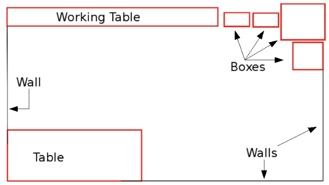

# 2. Related Work

## 2.1 Wall-following 

### 2.1.1 Short-Term Memory Mechanisms in Neural Network Learning of Robot Navigation Tasks: A Case Study

*A. L. Freire, G. A. Barreto, M. Veloso, A. T. Varela, “Short-Term Memory Mechanisms in Neural Network Learning of Robot Navigation Tasks: A Case Study,” In: proc. 6th Latin American Robotics Symposium (LARS'2009), Valparaíso-Chile, pages 1-6*

#### I. Abstract & Introduction

This paper reports results of an investigation on *the degree of influence* of short-term memory mechanisms on the performance of neural classifiers when applied to robot navigation tasks. 

- In particular, we deal with *the well-known strategy of navigating* by “wall-following”. 
- For this purpose, four standard neural architectures (Logistic Perceptron, Multilayer Perceptron, Mixture of Experts and Elman network) are used to associate different spatiotemporal sensory input patterns with four predetermined action categories. 

- All stages of the experiments - data acquisition, selection and training of the architectures in a simulator and their execution on a real mobile robot - are described. 

The obtained results suggest that 

- the wall-following task, formulated as a pattern classification problem, is nonlinearly separable, a result that favors the MLP network if no memory of input patters are taken into account. 
- If short-term memory mechanisms are used, then even a linear network is able to perform the same task successfully.


This paper reports the results performed with the SCI-TOS G5 mobile robot on navigation tasks. Basically, using sensor data collected after navigating in a room by following walls, four neural networks architectures are trained to take four decisions that determine its movement. 

- The data are collected by a **heuristic classifier** based on **IF-THEN rules**, specifically designed to guide the robot along the walls of a room. 

- Thus, the ultimate goal of the neural classifiers is to mimic the performance of the heuristic classifier as faithfully as possible. 

- The influence of short- term memory (STM) mechanisms on the performance of the classifiers are also investigated in this paper. 

The main contribution of this paper comprises 

- the empirical verification that the traditional navigation task via wall-following [1], [2], formulated as a problem of pattern recognition, is a non-linearly separable problem, 
- the verification of the hypothesis that STM mechanisms improve the performance of classifiers in the aforementioned task. 

STM is introduced in two different ways in this work: 

- for static neural networks (e.g. Logistics Perceptrons and MLP), the STM is introduced in the input units through **the time-lagged sensory observations**, 
- and in the case of dynamic neural networks (e.g. Elman’s network), the STM is intrinsic to the architecture itself through recurrent connections.


#### II. Evaluated Neural Classifiers

**Logistic Perceptron:**

The logistic perceptron (LP) is a single-layered neural network architecture, differing from the simple perceptron network because of the activation function, which is a logistic sigmoid function [3]. 

- Input patterns are represented by the vector $x(t) \in R^p$, 
- the weights vector of the i-th output neuron is denoted by $w_i(t) \in R^p$, 
- $0 <\eta < 1$ is the rate of learning 
- and $e_i(t)= d_i(t)−y_i(t)$ is the error of i-th neuron for the desired output $d_i(t)$. 
- The matrix transposition is represented by the superscript $T$, while $t$ denotes the current time step. 

The activation and output rules of the i-th neuron are given, respectively, by 
$$
u_i(t)= w^T_i(t)x(t) − θ_i(t),\\
y_i(t)= \phi(u_i(t)) = \frac{1}{1+exp(−u_i(t))}
$$
where $θ_i(t)$ is the threshold of the i-th neuron and $\phi(u_i(t))$ is the logistic activation function.

Thus, the learning rule of the i-th neuron of the LP network is
$$
w_i(t+1) = w_i(t)+ \eta e_i(t)[y_i(t)(1 − y_i(t)] x(t)
$$
where the factor $\phi'(u_i(t))=y_i(t)(1-y_i(t))$ is the derivative of the activation function with respect to $u_i(t)$.

*Remark:*

The i-th neuron in the output layer only determined by the i-th neuron in the hidden layer. This is the biggest difference to the one layer perceptron.
$$
J=\frac{1}{2}||e(t)||^2 \\
\frac{\partial J}{\partial w_i} = \frac{\partial J}{\partial e_i}*\frac{\partial e_i}{\partial y_i} * \frac{\partial y_i}{\partial u_i} *\frac{\partial u_i}{\partial w_i}\\
= e_i(t)*(-1)(y_i(t)(1 − y_i(t)) x(t)
$$
**Multilayer Perceptron (MLP):**

In this paper we use the MLP network with only one hidden layer [3]. Both, the hidden and the output layers make use of the logistic sigmoid function. Thus, the output of i-th neuron $y_i(t)$, $i =1,...,c$, is given by
$$
y_i(t)= \phi [\sum_{k=1}^q m_{ik}(t) \phi (w^T_k(t)x(t) − θ_k(t)) − θ_i(t)]
$$
where 

- $x(t) ∈ R^p$ is the current input vector, 
- $w_k =[w_{k1},w_{k2},...,w_{kp},]^T$ is the weight's vector of the k-th hidden neuron, 
- $m_{ik}$ is the weight that connects the k-th hidden neuron to i-th output neuron. 
- The parameters $θ_k(t)$ and $θ_i(t)$ represent, respectively, the activation thresholds of the k-th hidden neuron and the i-th output neuron.

The weights and thresholds of the output neurons, $m_i =[m_{i0} m_{i1} ··· m_{iq}]^T$, are adjusted by the rule shown in Eq. (3). Weights and thresholds of the hidden layer are  adjusted by classical backpropagation procedure of local errors’ gradients of output to the hidden layer.


**Mixture of Local Experts:**

In a sum, the objective of the Mixture of Experts (ME) approach is to model the probability distribution of the training patterns, {x, d} using a modular architecture with **K network experts** and a gating network [4], [5]. 

The gating network determines the output given by the K experts, according to their probabilities $g_i$, $i =1, ...,K$, subject to the following constraints: $0 ≤ g_i ≤ 1$and $\sum_{i=1}^K g_i = 1$. 

The design of a ME architecture, whose modules consist of LP networks and a single-layered gating network with a softmax activation function, is summarized below. 

1. Initialization: assign small random values to the weights of the experts and gating networks: $w_i^{(m)}(n)$ and $a_i(n)$, where $i =1, 2, ...,K$ denotes the i-th module and $m =1, 2, ..., c$ denotes the m-th output neuron.

2. Adapting the Experts and the Gate: present the current input pattern $\textbf{x(t)}$ and the corresponding desired response $\textbf{d(t)}$ to the ME architecture. Then, execute the following operations:
   $$
   u_i(t)= x^T(t)a_i(t) \\
   g_i(t)= \frac{exp(u_i(t))}{\sum_{j=1}^K exp(u_j(t))} \\
   -- \\
   y^{(m)}_i (t)= x^T(t)w^{(m)}_i (t), \\
   y_i(t)=[y^{(1)}_i(t), y^{(2)}_i(t),···,y^{(c)}_i(t)]^T \\
   -- \\
   h_i(t) = \frac{g_i(t)exp(-\frac{1}{2}||d(t) - y_i(t)||^2)}{\sum_{j=1}^Kg_i(t)exp(-\frac{1}{2}||d(t) - y_i(t)||^2)}
   $$

update:
$$
e^{(m)}_i(t)= d^m(t) − y^{(m)}(t)\\
δ^{(m)}_i(t)= e^(m)_i(t)(y^{(m)}_i(t)(1 − y^{(m)}_i(t)) \\
w^{(m)}_i(t+1) = w^{(m)}_i(t)+ ηh_i(t)δ^{(m)}_i(t)x(t) \\
a_i(t+1) = a_i(t)+ η[h_i(t) − g_i(t)]x(t)
$$

3. Repeat step 2 for all training patterns, i.e. t = 1, 2, ...,N.
4. Repeat steps 2 and 3 until the process converges.


**Elman Recurrent Network:** 

This dynamic neural architecture is obtained from the MLP network by redefining the input layer of the network, which is divided into two parts: 

- the first comprises the usual input vector x(t), 
- and the second, called units of context, is a copy of the hidden neurons’ output at previous time t − 1.

The weights are adjusted according to the standard backpropagation rule. 


#### III. SCITOS-G5 Mobile Robot


#### IV. Data Collection Procedure

The data collection for training the neural networks has followed the same procedure as [6] and [7]. 

```python
# the car will move along the left wall
if leftDist > 0.9:
    if frontDist <= 0.9:
        Stop and turn to the right
    else:
        Slow down and turn to the left
else:
    if frontDist <=0.9:
        then Stop and turn to the right
    elif leftDist < 0.55:
        Slow down and turn to the right
    else:
        Move foward
```

- The navigation algorithm makes use of heuristic rules IF-THEN, acting on measures of the variables front distance and left distance, but also calculates the distances to the right and behind. 

- Each of these distances is not calculated by a single sensor, but by a number of them, that together span 60◦, **and the distance used is the smallest found by those sensors that are part of the set.** 
- These four distances are referred throughout this paper as simplified distances. 

This information is collected as the SCITOS G5 navigate through the room, during four rounds. The arrangement of objects located in the test room can be seen in Figure 2 and the trajectory executed by the robot is shown in Figure 3.

The data collection was performed at a rate of 9 samples per second and generated a database with 5456 examples. These data are used to train the neural classifiers presented earlier in order to evaluate which one **“mimics” the Algorithm IV.1** better.




#### V. Experiments and Results

**Static Classification:** 

The first experiments are performed without the use of STM mechanisms, so that the task of navigation can be formulated as a static classification problem. 

- In this case, the LP network consists of a single layer with c = 4 output neurons, each one representing a different action (class): 

  - move forward (Class 1), 
  - slight right-turn (class 2), 
  - sharp right-turn (class 3) 
  - and slight left-turn (class 4).

  The LP network is trained for 200 epochs, the learning rate is set to η =0.02. 

- The ME architecture is a network formed by a LP gating network of four neurons, K = 4 LP experts, each expert with four output neurons. The training of the ME architecture is carried out for 35 epochs with the learning rate set to η =0.02. 

- For the MLP network, preliminary tests were made with different numbers of hidden neurons to find out the minimum value that enables a suitable class separation. It was found that q = 6 is that minimum value. The output layer consists of c = 4 neurons with logistics activation function. The MLP is trained for 500 epochs with a learning rate set to η =0.05. 

For the rest of this paper, we use the following notation:

- LP (I, O) - logistic perceptron network with I inputs and O output neurons; 
- ME (I, K, O) - mixture of experts network, in which K is the number of experts; 
- MLP (I, q, O) - multilayer perceptron network with q hidden neurons; 
- and Elman(I+q, q, O) - Elman network with I+q inputs and q hidden neurons. 

For the static classification task, we used only 2 input units, corresponding to the simplified distance ahead and to the left of the robot SCITOS-G5. The offline training/testing results are shown in Tables I and II. 


- In the experiment with the network LP(2,4) without STM, the trajectory performed by the robot is shown in Figure 4. One can observe that there was no collision, but the robot was not able to execute the left-turn. A reduced discrimination ability was expected because of the low number of samples correctly classified in the corresponding confusion matrix (Table II). 

  

- With the architecture ME(2,4,4) without STM, the robot was able to almost complete a round in the room before colliding (Figure 5). The robot was repositioned from the local it collided, but when it was supposed to turn left, he turned right and remained in that movement. Analyzing the actions stored in the database, we noted that the robot used, mostly, the action slight right-turn and, in a very few attempts, a sharp right-turn. 

  

- The MLP network achieved the best performance, as shown in Figure 6. Its recognition rates are shown in Table II.

  

**Spatiotemporal Classification:** 

Once the robot behavior is assessed on a static classification task (i.e. without STM), additional experiments are conducted to evaluate 

- (1) if the use of STM improves the performance of the classifiers that performed poorly in the previous experiments, 
- and (2) if the use of STM allows a reduction in the number of hidden neurons in the MLP architecture, thus reducing its computational cost. 

The first network to be tested is the LP architecture, 

- which is fed not only with the current simplified distances, measured by the ultrasound sensors, **but also by their recent past values.** 
- Except for the change in the dimensionality of the input vector, the training parameters remain the same as the experiments conducted without STM. 
- The LP network was tested with 1, 2, 3, 5, 9, 34 and 49 past samples (observations) of the simplified distances. Only the results with 9 past samples of these distances are presented in this paper, since it was the best configuration found. Thus, the input vector is composed by the current values and the past nine values of each of the two simplified distances, resulting in an input vector with **20 components**. 

Analyzing the results shown in Figure 7 and Tables III and IV, 


- we find a clear improvement in the performance of the LP network with the inclusion of STM mechanisms. 

  

- For the ME architecture, the use of time-lagged observations did not improved the performance of the robot navigation at all and hence the results are not shown in this paper. 

- An alternative STM mechanism can be implemented through recorrent connections [8]. To determine whether this type of STM improves the performance of multilayered neural architectures, the Elman network was evaluated in the robot navigation task. As input, the Elman network uses only the current readings of ultrasound sensors together with q context units. The training parameters are the same the MLP network used for the static classification task, except the rate of learning (η =0.05). After several tests varying the number of hidden neurons, it was found that the minimum value for the robot to successfully perform the required task is q = 4, 2 less neurons than the MLP network used in static classification problem. 

  - **It is important to emphasize that the network MLP(2,6,4) was already able to solve the task without STM; however, the inclusion of STM through recurrent loops as in Elman network, allowed the optimal classifier to have less hidden neurons.**

    

**Decision Surfaces:** 

A method to evaluate the performances of the classifiers in the navigation task of interest is through **visualization of the decision regions** implemented by each one. 

- In Figures 9(a) and 9(b) one can note that the inclusion of STM allowed a better separation of classes by the classifiers, in the case of LP network. Each point in figures corresponds to a pair of measurements of simplified distances in a given moment of time along the trajectory executed by the robot. The colors help differentiating the sensory readings belonging to each of the four classes defined for the navigation task (class 1 - red; class 2 - green; class 3 - blue; class 4 - yellow). 
- In short, we find an improvement in the distinction of four classes by LP network with STM if we compare with LP without STM. 
- The MLP and Elman’s networks, which achieved the best performances in the navigation task, produced similar decision surfaces (Figures 9(c) and 9(d)), although the Elman network achieved its result with two neurons less in the hidden layer.


#### V. Conclusion

This study compared the performance of four neural classifiers used as controllers in the wall-following navigation task in a real mobile robot. 

- For this, the navigation task is formulated as a pattern recognition problem, in which the patterns are the sensor readings and classes are actions to be taken by the robot. 
- We evaluated the logistic perceptron network, the mixture of experts architecture (with experts trained with logistic perceptron networks), the multilayer perceptron network and the Elman recurrent network. 
- In general, the MLP network achieved the best performance among the four classifiers evaluated. 
- The experiments showed that an apparently simple navigation task is indeed a complex decision-making task. The use of short-term memory mechanisms by the logistic perceptron classifier allowed it to successfully accomplish a nonlinear separable classification task. The use of short- term memory also allows, via recurrent loops, a multilayered neural architecture to reduce the number of hidden neurons, without compromising the discriminative ability of the classifier. 

In future works, we aim at investigating the performance of SVM classifiers on the wall-following navigation task as well as evaluating other types of short-term memory mechanisms, such as the one implemented by the Echo- state network recurrent architecture [6].


### Real-time navigational control of mobile robots using an artificial neural network

*D. R. Parhi, M. K. Singh, "Real-time navigational control of mobile robots using an artificial neural network", Proceedings of the Institution of Mechanical Engineers Part C: Journal of Mechanical Engineering Science*, vol. 223, pp. 1713-1725, 2009.*


#### I. Introduction 

One of the most important issues in the design and development of an intelligent mobile system is the navigation problem. This consists of the ability of a mobile robot to plan and execute collision- free motions within its environment. However, this environment may be imprecise, vast, dynamical, and either partially structured or non-structured. Robots must be able to understand the structure of this environment [1–5].

To reach their targets without colliding, robots must be endowed with perception, data processing, recognition, learning, reasoning, interpreting, and decision-making and action capacities.

Service robotics today require synthesizing robust automatic systems able to cope with a **complex and dynamic environment** [6]. 

- To demonstrate this kind of autonomy Muñiz et al.[7] introduced a neural controller for a mobile robot that learns both forward and inverse odometry of a differential drive robot through unsupervised learning. They introduced an obstacle-avoidance module that is integrated into a neural controller. However, generally, the evolved neural controllers could be fragile in inexperienced environments, especially in real worlds, because the evolutionary optimization processes are executed in idealized simulators. This is known as the gap problem between simulated and real worlds. 

- To overcome this, Kondo [8] focused on an evolving on-line learning ability instead of weight parameters in a simulated environment. Based on this, a neuromodulatory neural network model was proposed by them and is utilized as a mobile robot controller. 

- Corradini etal.[9] used a neural network approach for the solution of the tracking problem of mobile robots. 

- Racz and Dubrawski [10] presented a neural network-based approach for mobile robot localization in front of a certain local object. 

- Yang and Meng [11] proposed a biologically inspired neural network approach for real-time collision-free motion planning of mobile robots or robot manipulators in a non-stationary environment. 

- Braganza et al.[12] described a controller for continuum robots, which utilizes a neural network feed-forward component to compensate the dynamic uncertainties. 

This article has proposed a neural network-based approach for the solution of the path and time optimization problem of mobile robots. A biologically inspired neural network has been used for real-time collision-free motion planning of mobile robots in an unknown environment. 

- A four-layer perceptron neural network has been used to design the controller. The first layer is used as an input layer, which directly reads from the arrays of sensors of the robot. The neural network consists of two hidden layers, which adjust the weight of the neuron, and an output layer, which provides the heading angle of the robot. 

- The back- propagation method has been used to minimize the error and optimize the path and time of the mobile robot to reach the target. 


#### II. Kinematics Analysis of the Mobile Robot

The kinematics analysis of the Khepra-III mobile robot has been worked out in this section. The kinematics model of the Khepra-III mobile robot is shown in Fig. 1. 


It consists of a vehicle chassis with two driving wheels mounted on the same axis and a front point sliding support. The two driving wheels are independently driven by two actuators to achieve the motion and orientation. 


Both wheels have the same diameter denoted by 2r (Fig. 2). The two driving wheels are separated by distance W. The center of gravity (COG) of the mobile robot is located at point ‘C’. Point ‘P’ is located at the intersection of a straight line passing through the middle of the vehicle and a line passing through the axis of the two wheels. The distance between points P and C is d. 

A motion controller based on a neural network technique has been proposed for navigation of the mobile robot. The main component in the motion controller is the **low-level inverse neural controller**, which controls the dynamics of the mobile robot. The kinematics of the differential drive mobile robot is based on the assumption of pure rolling and there is no slip between the wheel and surface.
$$
v_t = \frac{1}{2}(v_r + v_l) \\
w_t = \frac{v_r − v_l}{W} \\
v_r = rw_r \\
v_l = rw_l
$$


where v is the linear velocity and ω is the angular velocity of the vehicle. Superscript r, l, and t stand for right wheel, left wheel, and tangential (with respect to its COG point ‘C’ measured in a right wheel), respectively

The position of the robot in the global coordinate
frame [OX Y] is represented by the vector notation as q =[Xc Yp
θ]T (4)
where Xc and Yp are the coordinates of point P in the global coordinate frame (Fig. 2). The variable θ is the orientation of the local coordination of the local coor- dinate frame [PXc Yp] attached on the robot platform measured from the horizontal axis. Three generali- zed coordinates can describe the configuration of the robot as equation (4). The mobile robot system considered here is a rigid
body and the wheels are pure rolling and no slippage. This states that the robot can only move in the direc- tion normalto the axis ofthe driving wheels.Therefore, thecomponentofthe velocityofthe contact point with the ground, orthogonal to the plane of the wheel, is zero [15, 16], i.e.
[ ˙yp cos θ − ˙xc sin θ − d ˙θ]= 0 (5)
All kinematics constraints are independent of time, and can be expressed as
AT(q) ˙q = 0 (6)
where A(q) is the input transformation matrix associ- ated with the constraints
CTA(q) = 0 (7)
where C(q) is the full rank matrix formed by a set of smooth and linearly independent vector fields spanning the null space ofAT(q). From equations (6) and (7) it is possible to find an auxiliary vector time functionV(t) for all time t
q˙ = C(q)V(t) (8)
The constraint matrix in equation (6) for a mobile robot is given by
AT(q) =[−sin θ cos θ −d]
The C(q) matrix is given by C(q) =
⎡
cos θ −d sin θ sin θ d cos θ
⎣
01
⎤ ⎦
and
(9) (10) Therefore, the kinematics equation in (8) can be
described as
x˙c
q˙ =
⎣ ⎦ =
⎢ ⎡
y˙p
⎥ ⎤
⎡
cos θ −d sin θ sin θ d cos θ
v
(12) θ˙
⎣
01
⎦ ⎤
? ?
ω
Equation (12) is called the steering system ofthe vehi- cle. The control problem is to find a suitable control law so that the system can track desired reference tra- jectories. The control laws are designed to produce suitable left and right wheel velocities for driving the mobile robot to follow required path trajectories.
3 ANALYSIS OF ANEURAL NETWORK FOR NAVIGATION
Artificial neural networks consist of a set of simple, densely interconnected processing units. These units transformsignals in a non-linearway.Neural networks are non-parametric estimators that can fit smooth functions based on input–output examples [17]. The neural network designed in this article is a four-layer perceptron. The number of layers is set empirically to facilitate the training. The input layer has four neu- rons, three for receiving the values of the distances from obstacles (i.e. in front and to the left and right of the robot) and one for the target bearing. If no tar- get is detected, the input to the fourth neuron is set to ‘zero’. The output layer has a single neuron, which produces the steering angle to control the direction of movement of the robot. The first hidden layer has ten neurons and the second hidden layer has three neurons. These numbers of hidden neurons were also found empirically. Figure 3 depicts the neural network with its input and output signals. Theneural network is trained to navigatebypresent- ing it with 200 patterns representing typical scenarios,
V(t) =[v ω]T
(11)
where v is the linear velocityofpoint ‘p’ along the robot axis and ω is the angular velocity