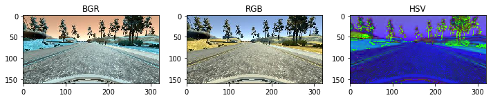
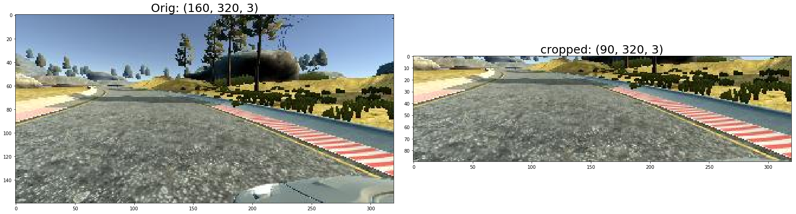
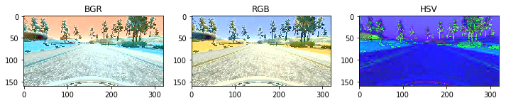
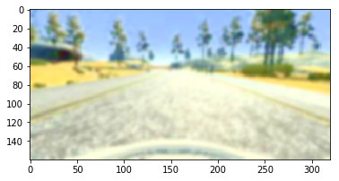
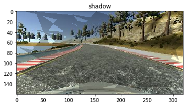
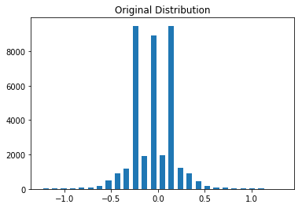
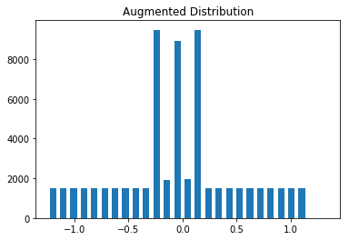
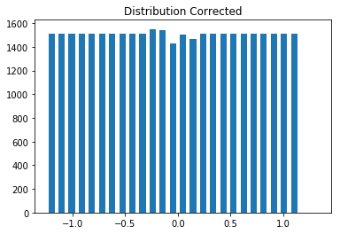
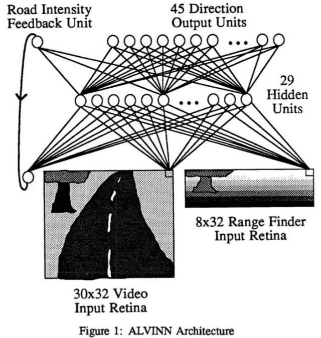

<center> <font size=7> Behavioral Cloning Project </font> </center>


<center> Shuai Wang </center>

<center>USTC, March 12, 2019


<center> <font color=blue> Copyright (c) 2019 Shuai Wang. All rights reserved. </font> </center>

<center> <i>Shuai Wang copyrights this specification. No part of this specification may be reproduced in any form or means, without the prior written consent of Shuai Wang. </i></center>

---


# 1. Overview

## 1.1 Background

### Open Source Self-Driving Car Project

**Project address:** https://github.com/udacity/self-driving-car 


This project is maintained by Udacity and the aim of this project is to create a complete autonomous self-driving car **using deep learning and using ROS as middleware for communication.** 

#### 1. Sensors and components used in the Udacity self-driving car:

- 2016 Lincoln MKZ : 

  This is the car that is going to be made autonomous. In other projects, we have saw the ROS interfacing of this car. We are using that project here too.

- Two Velodyne VLP-16 LiDARs

- Delphi radar

- Point Grey Blackfly cameras

- Xsens IMU

- Engine control unit ( ECU )


#### 2. dbw_mkz_ros package

This project uses the dbw_mkz_ros package to communicate from ROS to the Lincoln MKZ. In the previous section, we set up and worked with the dbw_mkz_ros package. 

- Here is the link to **obtain a dataset for training the steering model**: https://github.com/udacity/self-driving-car/tree/master/datasets . You will get a ROS launch file from this link to play with these bag files too.
- Here is the link to **get an already trained model** that can only be used for research purposes: https://github.com/udacity/self-driving-car/tree/master/steering-models . There is a ROS node for sending steering commands **from the trained model to the Lincoln MKZ.** Here, dbw_mkz_ros packages act as an intermediate layer between the trained model commands and the actual car.
- reference to implement the driving model using deep learning and the entire explanation for it are at https://github.com/thomasantony/sdc-live-trainer . 


## 1.2 Behavioral Cloning Project

In this project,  we use deep neural networks and **convolutional neural networks** to **clone driving behavior.** We train, validate and test a model using **Keras** for **outputting a steering angle** to an autonomous vehicle.  

We use image data and steering angles which are collected in the [Udacity simulator](https://github.com/udacity/self-driving-car-sim) to train a neural network and then use this model to drive the car autonomously **around the track in simulator.**


## 1.3 [Udacity Simulator](https://github.com/udacity/self-driving-car-sim)

This simulator was built for [Udacity's Self-Driving Car Nanodegree](https://udacity.com/drive), to teach students how to train cars how to navigate road courses using deep learning. See more [project details here](https://github.com/udacity/CarND-Behavioral-Cloning-P3).

All the assets in this repository require Unity. Please follow the instructions below for the full setup.

#### Available Game Builds (Precompiled builds of the simulator)

#### Term 1

Instructions: Download the zip file, extract it and run the executable file.

Version 2, 2/07/17 [Linux](https://s3-us-west-1.amazonaws.com/udacity-selfdrivingcar/Term1-Sim/term1-simulator-linux.zip) [Mac](https://s3-us-west-1.amazonaws.com/udacity-selfdrivingcar/Term1-Sim/term1-simulator-mac.zip) [Windows](https://s3-us-west-1.amazonaws.com/udacity-selfdrivingcar/Term1-Sim/term1-simulator-windows.zip)

Version 1, 12/09/16 [Linux](https://d17h27t6h515a5.cloudfront.net/topher/2016/November/5831f0f7_simulator-linux/simulator-linux.zip) [Mac](https://d17h27t6h515a5.cloudfront.net/topher/2016/November/5831f290_simulator-macos/simulator-macos.zip) [Windows 32](https://d17h27t6h515a5.cloudfront.net/topher/2016/November/5831f4b6_simulator-windows-32/simulator-windows-32.zip) [Windows 64](https://d17h27t6h515a5.cloudfront.net/topher/2016/November/5831f3a4_simulator-windows-64/simulator-windows-64.zip)

#### Term 2

Please see the [Releases](https://github.com/udacity/self-driving-car-sim/releases) page for the latest version of the Term 2 simulator (v1.45, 6/14/17).

Source code can be obtained therein or also on the [term2_collection branch](https://github.com/udacity/self-driving-car-sim/tree/term2_collection).

#### Term 3

Please see the [Releases](https://github.com/udacity/self-driving-car-sim/releases) page for the latest version of the Term 3 simulator (v1.2, 7/11/17).

Source code can be obtained therein or also on the [term3_collection branch](https://github.com/udacity/self-driving-car-sim/tree/term3_collection).

#### System Integration / Capstone

Please see the [CarND-Capstone Releases](https://github.com/udacity/CarND-Capstone/releases) page for the latest version of the Capstone simulator (v1.3, 12/7/17). Source code can be obtained therein.


### 1.4 Unity Simulator User Instructions (for advanced development)

1. Clone the repository to your local directory, please make sure to use [Git LFS](https://git-lfs.github.com/) to properly pull over large texture and model assets.
2. Install the free game making engine [Unity](https://unity3d.com/), if you dont already have it. Unity is necessary to load all the assets.
3. Load Unity, Pick load exiting project and choice the `self-driving-car-sim` folder.
4. Load up scenes by going to Project tab in the bottom left, and navigating to the folder Assets/1_SelfDrivingCar/Scenes. To load up one of the scenes, for example the Lake Track, double click the file LakeTrackTraining.unity. Once the scene is loaded up you can fly around it in the scene viewing window by holding mouse right click to turn, and mouse scroll to zoom.
5. Play a scene. Jump into game mode anytime by simply clicking the top play button arrow right above the viewing window.
6. View Scripts. Scripts are what make all the different mechanics of the simulator work and they are located in two different directories, the first is Assets/1_SelfDrivingCar/Scripts which mostly relate to the UI and socket connections. The second directory for scripts is Assets/Standard Assets/Vehicle/Car/Scripts and they control all the different interactions with the car.
7. Building a new track. You can easily build a new track by using the prebuilt road prefabs located in Assets/RoadKit/Prefabs click and drag the road prefab pieces onto the editor, you can snap road pieces together easily by using vertex snapping by holding down "v" and dragging a road piece close to another piece.


# 2. Preliminary

**The original project address:** https://github.com/udacity/CarND-Behavioral-Cloning-P3

### 2.1 Pipeline

- [x] Collecting related resources about this project by searching in google and github

  - github projects
  - Blogs 
- [x] Achieving a simple version by imitating solutions provided in other people's projects.

  - https://github.com/csharpseattle/CarND-Behavioral-Cloning
- [ ] Writing a project document
- [ ] Reading and organizing related papers and projects to improve the performence of the original methods or propose a new method.
  - End to End Learning for Self-Driving Cars (Write the network by hand)

  - github projects

    - https://github.com/upul/Behavioral-Cloning

    - https://zhuanlan.zhihu.com/p/33222613

    - https://github.com/navoshta/behavioral-cloning

    - https://github.com/jeremy-shannon/CarND-Behavioral-Cloning-Project

    - https://github.com/UjjwalSaxena/Behavior-Cloning-DataSet-Ujjwal

    - https://github.com/harveenchadha?tab=repositories

    - https://github.com/mcarilli?tab=repositories

    - https://github.com/darienmt/CarND-Behavioral-Cloning-P3
- [ ] Reading latest papers and learning from their network modules or architectures to further perfect this project.

  - DroNet:

### 2.2 Tips

- 


数据集格式（.csv 文件）：

Center Image Left Image Right Image Steering Throttle Brake Speed

dir

数据集读取：


Simple network:

```
from keras.models import Sequential
form keras.layers import Flatten, Dense

model = Sequential()
model.add(Flatten(input_shape=(160,320,3)))
model.add(Dense(1))

model.compile(loss='mse', optimizer='adam)
model.fit(X_train, y_train, validation_split=0.2, shuffle=True)

model.save(model.h5)
```

run:

```
python model.py
```


running model in simulator:

```
## clone repo: CarNd-Behavioral-Cloning-P3
## drive.py will load the trained model and make steering predictions
python dirve.py model.h5
## waiting for the simulator to start in autonomous mode
```


preprocessing data 

normalizing data & mean centering data

```
model.add(Lambda(lambda x: x/255.0) - 0.5, input_shape(160, 320, 3))
model.add(Flatten())
```


More powerful network

LeNet


Problem：

the car seems to pull too hard to the left

Reason:

The training track is a loop, and the car drives counter-clockwise. So most of the time, the model is learning to steer to the left. Then in the autonomous model, the model does steer to the left even in situations when  staying straight might be best.


solution - data augmentation  :

flip the images horizontally like a mirror. (invert steer angles)

change the brightness on the images

shift them horizontally or vertically


results:

we have more data

the data is more comprehensive

```python
augmented_images, augmented_measurements = [], []

for image, measurement in zip(images, measurements):
    augmented_images.append(image)
    augmented_measurements.append(measurement)
    augmented_images.append(cv2.flip(image,1))
    augmented_measurements.append(measurement*-1.0)
```


 cropping

use a build-in Keras layer to perform the cropping inside of the model

```
model.add(Cropping2D(cropping=((70,25), (0,0))))
```


使用左右侧图片，转向角使用实际转向角的修正

在容易失败的区域反复采集数据

 收集反向驾驶数据


# 3. Data set

## 3.1 Collecting data

**Data collection was done using the simulator in 'Training Mode.'**  

1. At first, I gathered 1438 images from a full lap around track.

I gathered 23607 images for the first track. More images were gatered in the turning of the track than in the usual driving.

> After much trial and error I found that it was not necessary to gather images from a full lap around each track. For the first track I drove just past the bridge to the first dirt patch and for the mountain track I drove only half-way around.  
>
> The couple of problem areas on each track were addressed by training the vehicle recovering from the sides of the road.  
>
> Successfully driving autonomously around the entire track while only training on a portion of it was an indication to me that the model generalized to all track conditions and did not overfit the training data.  
>
> In the end I gathered over 3500 images from each track for a total data set size of 7650 images.


## 3.2 Preprocessing Images

Images were preprocessed before feeding to the neural network. 

### 3.2.1 Color Space

There are three types of color space for image representation.



Please keep in mind that **training images are loaded in BGR colorspace using cv2** while `drive.py` **load images in RGB** to predict the steering angles.

Therefore, in the training stage, we will convert the BGR colorspace loaded by OpenCV to RGB before feeding the real image into the training network to ensure the consistency of the colorspace between the training stage and testing satge.


---

#### Other schemes:

>I tried different color spaces and found that the model generalized best using images in the BGR color space. 

Conversion to **BGR color space** solved both of these issues and required less training files overall. 

1. Training with the **YUV color space** gave erratic steering corrections resulting in too much side-to-side movement of the car.  (test)

2. In the **RGB color space** some areas of track required many more training images to navigate correctly, particularly the areas with dirt patches on the side of the road.  (test)

    

### 3.2.2 Image Cropping

```python
image = cv2.cvtColor(image, cv2.COLOR_BGR2RGB)

model = Sequential()

model.add(Cropping2D(cropping=((50, 20),(0,0)), input_shape=(160,320,3)))

# output the intermediate layer! 
## can be used to show learned features for any layer
layer_output = backend.function([model.layers[0].input], [model.layers[0].output])

# note that the shape of the image suited for the network!
cropped_image = layer_output([image[None,...]])[0][0]

# convert to uint8 for visualization
cropped_image = np.uint8(cropped_image)
```



I crop the unnecessary portions of the image (background of sky, trees, mountains, hood of car) **taking 50 pixels off the top of the image and 20 pixels off the bottom.**  

### 3.2.3 Image Resizing

The cropped image is then resized to **(128, 128)** for input into the model.  I found that resizing the images **decreased training time** with no effect on accuracy.

(update my image)


### 3.2.4 Data Augmentation

There are four kinds of methods for data augmentation.  Images could be augmented by 

- flipping horizontally, 
- blurring, 
- changing the overall brightness, 
- or applying shadows to a portion of the image.  

When reading original data from CSV file,  flipped_flag, shadow_flag, bright_flag, blur_flag will be assigned to each image. The image processing will be done when generating practical data sets.

> Randomly changing the images to augment the data set was not only was not necessary but when using the RGB color space I saw a loss of accuracy.  

#### 1. Flipping horizontally

By adding a flipped image for every original image the data set size was effectively doubled. 

When reading original data from the CSV file, the path of the flipped image is the same as the original image. However, a flipped flag (equals to 1) will be assigned to the flipped image and the flag of the original image is 0. Finally, the corresponding flipping operation will be done for each image according to this flag. Meanwhile, we set the negative value of the label which corresponds to the original image as the label of the flipped image.   


In the end, adding horizontally flipped images was the only augmentation that was necessary.  

---

#### Other Schemes:

#### Changing brightness




#### Bluring

```python
kernel_size = (np.random.randint(1,5)*2) +1 
blur = cv2.GaussianBlur(rgb, (kernel_size,kernel_size), 0)
```



#### Random shadow




See the functions `random_blur()`, `random_brightness()`, and `random_shadow()` in the file `data.py` for augmentation code. 

Visualization of data augmentation can be found in the Jupyter notebooks `Random_Brightness.ipynb` and `Random_Shadow.ipynb`.


### 3.2.5 Data Set Distribution

One improvement that was found to be particularly effective was to fix the poor distribution of the data.  A disproportionate number of steering angles in the data set are at or near zero.  To correct this:

-  steering angles are separated into 25 bins. 
- Bins with a count less than the mean are augmented 
- while bins with counts greater than the mean are randomly pruned to bring their counts down. 

Those operations equalize the distribution of steering angles across all bins.  

Code can be found in the function `fix_distribution()` in `data.py.`  Plotting can be seen in the jupyter notebook `Visualization.ipynb`




# 4. Model 

## 4.1 One Layer FC Neural Network

### [1] Dean A. Pomerleau. **ALVINN, an autonomous land vehicle in a neural network. Technical report**, Carnegie Mellon University, 1989. 

### 4.1.1 Introduction

> In many ways, DAVE-2 was inspired by the pioneering work of Pomerleau [1] who in 1989 built the Autonomous Land Vehicle in a Neural Network (ALVINN) system. It demonstrated that an end-to- end trained neural network can indeed steer a car on public roads.  ALVINN used a fully-connected network which is tiny by today’s standard.

1. Currently ALVINN takes images from a camera and a laser range finder as input and produces as output the direction the vehicle should travel in order to follow the road.
2. Training has been conducted using simulated road images.

### 4.1.2 Network Architecture



The input layer is divided into three sets of units: two "retinas" and a single intensity feedback unit. The two retinas correspond to the two forms of sensory input available on the NAVLAB vehicle; video and range information. 

- The first retina, consisting of 30x32 units, receives video camera input from a road scene. The activation level of each unit in this retina is proportional to the intensity in the blue color band of the corresponding patch of the image. **The blue band of the color image is used because it provides the highest contrast between the road and the non-road.** 

- The second retina, consisting of 8x32 units, receives input from a laser range finder. The activation level of each unit in this retina is proportional to the proximity of the corresponding area in the image. 

- The road intensity feedback unit indicates whether the road is lighter or darker than the non-road in the previous image. Each of these 1217 input units is fully connected to the hidden layer of 29 units, which is in tum fully connected to the output layer. (Using this extra information concerning the
  relative brightness of the road and the non-road, the network is better able to determine
  the correct direction for the vehicle to travel.)

- The output layer consists of 46 units, divided into two groups. The first set of 45 unitsis a linear representation of the tum curvature along which the vehicle should travel in order to head towards the road center. The middle unit represents the "travel straight ahead" condition while units to the left and right of the center represent successively sharper left and right turns. The network is trained with a desired output vector of all zeros except for a "hill" of activation centered on the unit representing the correct **turn curvature**, which is the curvature which would bring the vehicle to the road center 7
  meters ahead of its current position. More specifically, the desired activation levels for the nine units centered around the correct turn curvature unit are:

  ```
  0.10, 0.32, 0.61, 0.89, 1.00, 0.89, 0.61, 0.32 0.10
  ```

  During testing, the turn curvature dictated by the network is taken to be the curvature represented by the output unit with the highest activation level.

- The final output unit is a road intensity feedback unit which indicates whether the road is lighter or darker than the non-road in the current image. During testing, the activation of the output road intensity feedback unit is recirculated to the input layer in the style of Jordan [Jordan, 1988] to aid the network's processing by providing rudimentary infonnation concerning the relative intensities of the road and the non-road in the previous image.

### 4.1.3 Training and Performance

- Training on actual road images is logistically difficult, because in order to develop a
  general representation, the network must be presented with a large number of training
  exemplaIS depicting roads under a wide variety of conditions. Collection of such a
  data set would be difficult, and **changes in parameters such as camera orientation would**
  **require collecting an entirely new set of road images.**
- To avoid these difficulties we have developed a simulated road generator which creates road images to be used as training exemplars for the network. Figure 2 depicts the video images of one real and
  one artificial road. Although not shown in Figure 2, the road generator also creates
  corresponding simulated range finder images. At the relatively low resolution being used
  it is difficult to distinguish between real and simulated roads.
- There are difficulties involved with training **"on-the-fly"** with real images.
- The range data contains information concerning the position of obstacles in the scene, but nothing explicit about the location of the road. **do contribute to choosing the correct travel direction.**

### 4.1.4 Future Work

1. we would eventually like to integrate a map into the system to enable global point-to-point path planning.

### 4.1.5 My Implementation

I tried a fully connected neural network with one hidden layer (100 units). The loss is decreased while training. However, the output steering angles mostly are 0 during the testing stage even though after I fixed distribution of the data set.

```bash
Reading data from csv file...
Reading is done.
EPOCHS: 10
Training Set Size: 3451
Valization Set Size: 863
Batch Size: 256
/home/ubuntu16/Behavioral_Cloning/data.py:102: RuntimeWarning: divide by zero encountered in true_divide
  copy_times = np.float32((desired_per_bin-hist)/hist)
Training set size now: 3300
Using TensorFlow backend.
_________________________________________________________________
Layer (type)                 Output Shape              Param #   
=================================================================
cropping2d_1 (Cropping2D)    (None, 65, 320, 3)        0         
_________________________________________________________________
flatten_1 (Flatten)          (None, 62400)             0         
_________________________________________________________________
dense_1 (Dense)              (None, 100)               6240100   
_________________________________________________________________
dense_2 (Dense)              (None, 1)                 101       
=================================================================
Total params: 6,240,201
Trainable params: 6,240,201
Non-trainable params: 0
_________________________________________________________________
Training with 13 training steps, 4 validation steps.
Epoch 1/10
2019-03-18 23:13:12.027618: I tensorflow/core/platform/cpu_feature_guard.cc:141] Your CPU supports instructions that this TensorFlow binary was not compiled to use: AVX2 FMA
2019-03-18 23:13:12.034550: E tensorflow/stream_executor/cuda/cuda_driver.cc:300] failed call to cuInit: CUDA_ERROR_UNKNOWN: unknown error
2019-03-18 23:13:12.034586: I tensorflow/stream_executor/cuda/cuda_diagnostics.cc:163] retrieving CUDA diagnostic information for host: ubuntu16
2019-03-18 23:13:12.034595: I tensorflow/stream_executor/cuda/cuda_diagnostics.cc:170] hostname: ubuntu16
2019-03-18 23:13:12.034640: I tensorflow/stream_executor/cuda/cuda_diagnostics.cc:194] libcuda reported version is: 384.130.0
2019-03-18 23:13:12.034666: I tensorflow/stream_executor/cuda/cuda_diagnostics.cc:198] kernel reported version is: 384.130.0
2019-03-18 23:13:12.034675: I tensorflow/stream_executor/cuda/cuda_diagnostics.cc:305] kernel version seems to match DSO: 384.130.0
13/13 [==============================] - 7s 508ms/step - loss: 401.1512 - mean_absolute_error: 5.0288 - val_loss: 0.0400 - val_mean_absolute_error: 0.1528
Epoch 2/10
13/13 [==============================] - 6s 461ms/step - loss: 0.4054 - mean_absolute_error: 0.5425 - val_loss: 0.0477 - val_mean_absolute_error: 0.1667
Epoch 3/10
13/13 [==============================] - 6s 466ms/step - loss: 0.4084 - mean_absolute_error: 0.5424 - val_loss: 0.0377 - val_mean_absolute_error: 0.1480
Epoch 4/10
13/13 [==============================] - 6s 469ms/step - loss: 0.4128 - mean_absolute_error: 0.5453 - val_loss: 0.0467 - val_mean_absolute_error: 0.1633
Epoch 5/10
13/13 [==============================] - 6s 482ms/step - loss: 0.4126 - mean_absolute_error: 0.5477 - val_loss: 0.0412 - val_mean_absolute_error: 0.1572
Epoch 6/10
13/13 [==============================] - 6s 480ms/step - loss: 0.4038 - mean_absolute_error: 0.5398 - val_loss: 0.0442 - val_mean_absolute_error: 0.1579
Epoch 7/10
13/13 [==============================] - 6s 475ms/step - loss: 0.4143 - mean_absolute_error: 0.5481 - val_loss: 0.0462 - val_mean_absolute_error: 0.1630
Epoch 8/10
13/13 [==============================] - 6s 468ms/step - loss: 0.4159 - mean_absolute_error: 0.5476 - val_loss: 0.0398 - val_mean_absolute_error: 0.1517
Epoch 9/10
13/13 [==============================] - 6s 476ms/step - loss: 0.4160 - mean_absolute_error: 0.5482 - val_loss: 0.0469 - val_mean_absolute_error: 0.1622
Epoch 10/10
13/13 [==============================] - 6s 466ms/step - loss: 0.4085 - mean_absolute_error: 0.5454 - val_loss: 0.0412 - val_mean_absolute_error: 0.1538
```


## 4.2 NVIDIA Pilot Network [2]

[3] Bojarski, M.. (2016). **End to End Learning for Self-Driving Cars**, 1–9. https://doi.org/10.2307/2529309

### 4.2.0 Abstract

Compared to explicit decomposition of the problem, such as lane marking detection, path planning, and control, our end-to-end system optimizes all processing steps simultaneously. We argue that this will eventually lead to better perfor- mance and smaller systems. Better performance will result because the internal components self-optimize to maximize overall system performance, instead of op- timizing human-selected intermediate criteria, e. g., lane detection. Such criteria understandably are selected for ease of human interpretation which doesn’t auto- matically guarantee maximum system performance. Smaller networks are possi- ble because the system learns to solve the problem with the minimal number of processing steps. 

### 4.2.1 Introduction


> The groundwork for this project was done over 10 years ago in a Defense Advanced Research Projects Agency (DARPA) seedling project known as DARPA Autonomous Vehicle (DAVE) [2] in which a sub-scale radio control (RC) car drove through a junk-filled alley way. DAVE’s mean distance between crashes was about 20 meters in complex environments.
>
> [2] Net-Scale Technologies, Inc. Autonomous off-road vehicle control using end-to-end learning, July 2004. Final technical report. URL: http://net-scale.com/doc/net-scale-dave-report.pdf.

he primary motivation for this work is to avoid the need to recognize specific human-designated features, such as lane markings, guard rails, or other cars, and to avoid having to create a collection of “if, then, else” rules, based on observation of these features. 


## 4.3 Modified NVIDIA Network

The empirical process of finding the correct neural network can be a lesson in frustration.  I started with LeNet [1] and tried countless modifications.  Feeling the need for something slightly more powerful to increase nonlinearity and work for both tracks I moved on to a modified NVIDIA architecture[2].  Image data is preprocessed as described above before being normalized in the first layer.  The network consists of 5 Convolutional layers with max pooling and 5 fully connected layers.  Dropout layers were used in between the fully connected layers to reduce overfitting.  An Adam optimizer was used with a learning rate of 1e-4. Code for the model can be found in `model_definition.py`

The final network is as follows:

|         Layer          |  Output Shape  | Param # |
| :--------------------: | :------------: | ------: |
| Normalization (Lambda) | (128, 128, 3)  |       0 |
| 1st Convolutional/ReLU | (124, 124, 24) |    1824 |
|      Max Pooling       |  (62, 62, 24)  |       0 |
| 2nd Convolutional/ReLU |  (58, 58, 36)  |   21636 |
|      Max Pooling       |  (29, 29, 36)  |       0 |
| 3rd Convolutional/ReLU |  (25, 25, 48)  |   43248 |
|      Max Pooling       |  (12, 12, 48)  |       0 |
| 4th Convolutional/ReLU |  (10, 10, 64)  |   27712 |
| 5th Convolutional/ReLU |   (8, 8, 64)   |   36928 |
|        Flatten         |     (4096)     |       0 |
|        Dropout         |     (4096)     |       0 |
|  1st Fully Connected   |     (1164)     | 4768908 |
|        Dropout         |     (1164)     |       0 |
|  2nd Fully Connected   |     (100)      |  116500 |
|  3rd Fully Connected   |      (50)      |    5050 |
|  4th Fully Connected   |      (10)      |     510 |
|  5th Fully Connected   |      (1)       |      11 |

### Training

------

Training the network is done using the python script `model.py`.  By default the script runs for 10 epochs although the script will take a different number of epochs as a parameter.  The script by default allocates 80% of the data set to training and 20% to validation sets.

```
python model.py 20  # train for 20 epochs.
```

The script reads the image data from the CSV file, performs any augmentation and distribution balancing, and starts training on the data set.  Due to the possibility that the entire collection of image files might not fit into memory all at once the data set is separated into batches by a Keras generator.  The generator creates batches of `BATCH_SIZE` images, reading image data and augmenting the images on the fly. See the function `get_generator()`, line 383, of the file `data.py` for generator code.  Generators were used for both training and validation sets.

Validation accuracy was not a good indicator of the performance of the network.  It was better to watch for overfitting by comparing the training mean squared error (MSE) with the validation MSE.  A climbing validation MSE while the training MSE was still decreasing was a sign that the model was overfitting.  Dropout was used to combat this but I also limited the number of epochs to get the best performing model.


## Feature Representation

```python
model = Sequential()

model.add(Cropping2D(cropping=((50, 20),(0,0)), input_shape=(160,320,3)))

# output the intermediate layer! 
## can be used to show learned features for any layer
layer_output = backend.function([model.layers[0].input], [model.layers[0].output])

# note that the shape of the image suited for the network!
cropped_image = layer_output([image[None,...]])[0][0]

```


### Videos

`video1.mp4` is the recording of the vehicle going around the basic track.  `video2.mp4` is the recording of the vehicle going around the mountain track.


#### 1. An appropriate model architecture has been employed

My model consists of a convolution neural network with 3x3 filter sizes and depths between 32 and 128 (model.py lines 18-24) 

The model includes RELU layers to introduce nonlinearity (code line 20), and the data is normalized in the model using a Keras lambda layer (code line 18). 

#### 2. Attempts to reduce overfitting in the model

The model contains **dropout layers** in order to reduce overfitting (model.py lines 21). 

The model was trained and validated on different data sets to ensure that the model was not overfitting (code line 10-16). The model was tested by running it through the simulator and ensuring that the vehicle could stay on the track.

#### 3. Model parameter tuning

The model used an adam optimizer, so the learning rate was not tuned manually (model.py line 25).

#### 4. Appropriate training data

Training data was chosen to keep the vehicle driving on the road. I used a combination of center lane driving, recovering from the left and right sides of the road ... 

For details about how I created the training data, see the next section. 

### Model Architecture and Training Strategy

#### 1. Solution Design Approach

The overall strategy for deriving a model architecture was to ...

My first step was to use a convolution neural network model similar to the ... I thought this model might be appropriate because ...

In order to gauge how well the model was working, I split my image and steering angle data into a training and validation set. I found that my first model had a low mean squared error on the training set but a high mean squared error on the validation set. This implied that the model was overfitting. 

To combat the overfitting, I modified the model so that ...

Then I ... 

The final step was to run the simulator to see how well the car was driving around track one. There were a few spots where the vehicle fell off the track... to improve the driving behavior in these cases, I ....

At the end of the process, the vehicle is able to drive autonomously around the track without leaving the road.

#### 2. Final Model Architecture

The final model architecture (model.py lines 18-24) consisted of a convolution neural network with the following layers and layer sizes ...

Here is a visualization of the architecture (note: visualizing the architecture is optional according to the project rubric)

![alt text][image1]

#### 3. Creation of the Training Set & Training Process

To capture good driving behavior, I first recorded two laps on track one using center lane driving. Here is an example image of center lane driving:

![alt text][image2]

I then recorded the vehicle recovering from the left side and right sides of the road back to center so that the vehicle would learn to .... These images show what a recovery looks like starting from ... :

![alt text][image3]
![alt text][image4]
![alt text][image5]

Then I repeated this process on track two in order to get more data points.

To augment the data sat, I also flipped images and angles thinking that this would ... For example, here is an image that has then been flipped:

![alt text][image6]
![alt text][image7]

Etc ....

After the collection process, I had X number of data points. I then preprocessed this data by ...

I finally randomly shuffled the data set and put Y% of the data into a validation set. 

I used this training data for training the model. The validation set helped determine if the model was over or under fitting. The ideal number of epochs was Z as evidenced by ... I used an adam optimizer so that manually training the learning rate wasn't necessary.


# 一个低成本的无人驾驶方案

A Low Cost Road Following Task

将图像和超声波数据作为输入（可以当作一个一维图像显示），记录转向，加减速（超声波数据为0加速，有数据减速）和刹车（数据大刹车）

左右超声波数据用来辅助 转向